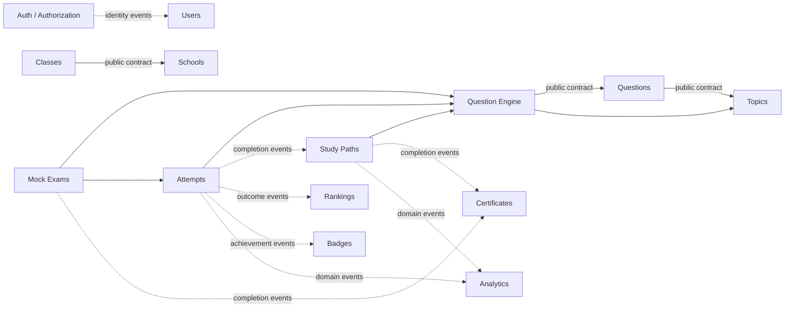

# MateMágico Champions - Arquitetura Fundacional

**Data**: 2026-09-29  
**Status**: Foundation Architecture v1.0  
**Versão**: 1.0.0  
**Propriedade**: Arquitecture Team

---

## 📋 Sumário Executivo

O MateMágico Champions é uma plataforma SaaS educacional escalável para treino de estudantes das Olimpíadas Brasileiras de Matemática (OBMEP). Esta arquitetura utiliza **Modular Monolith** com padrões DDD e Clean Architecture, permitindo crescimento de 10 mil para 100 mil alunos sem reescritas estruturais.

**Princípios Fundamentais:**

- Simplicidade em primeira ordem
- Escalabilidade horizontal planejada
- Manutenibilidade através de módulos bem definidos
- Documentação como código
- Automação de processos

---

## 1️⃣ ESTRUTURA DO MONOREPO

### 1.1 Árvore Completa de Diretórios

```
matemagico/
├── apps/
│   ├── web/                          # Next.js 15 - Application principal
│   │   ├── src/
│   │   │   ├── app/                  # App Router
│   │   │   ├── components/           # Componentes React
│   │   │   ├── hooks/                # Custom hooks
│   │   │   ├── lib/                  # Utilities
│   │   │   ├── features/             # Composição visual por jornada; sem ownership de domínio
│   │   │   ├── providers/            # Providers React de UI, escopo estreito
│   │   │   ├── styles/               # Global styles
│   │   │   └── types/                # TypeScript types
│   │   ├── public/
│   │   ├── .env.local.example
│   │   ├── next.config.js
│   │   ├── tsconfig.json
│   │   └── package.json
│   │
│   └── api/                          # Route Handlers (futuro microserviço)
│       ├── src/
│       │   ├── routes/
│       │   ├── handlers/
│       │   ├── middleware/
│       │   └── types/
│       └── package.json
│
├── packages/                         # Shared packages
│   ├── database/                     # Prisma + schemas
│   │   ├── prisma/
│   │   │   ├── schema.prisma
│   │   │   ├── migrations/
│   │   │   └── seeds/
│   │   ├── src/
│   │   │   ├── client.ts
│   │   │   └── index.ts
│   │   └── package.json
│   │
│   ├── shared-types/                 # Tipos compartilhados
│   │   ├── src/
│   │   │   ├── domain/
│   │   │   ├── api/
│   │   │   ├── entities/
│   │   │   └── index.ts
│   │   └── package.json
│   │
│   ├── ui/                           # Design system Shadcn/Radix, neutro de domínio
│   │   ├── src/
│   │   │   ├── components/
│   │   │   ├── hooks/
│   │   │   ├── theme/
│   │   │   └── index.ts
│   │   ├── tailwind.config.ts
│   │   └── package.json
│   │
│   ├── validation/                   # Schemas de validação (Zod/Yup)
│   │   ├── src/
│   │   │   ├── auth/
│   │   │   ├── forms/
│   │   │   ├── domain/
│   │   │   └── index.ts
│   │   └── package.json
│   │
│   ├── utils/                        # Utilities compartilhadas
│   │   ├── src/
│   │   │   ├── math/
│   │   │   ├── string/
│   │   │   ├── date/
│   │   │   ├── array/
│   │   │   └── index.ts
│   │   └── package.json
│   │
│   ├── logger/                       # Logging centralizado
│       ├── src/
│       │   ├── logger.ts
│       │   └── index.ts
│       └── package.json
│
│   ├── modules/                      # Bounded contexts; ownership conforme ADR-0002
│   │   ├── auth/                     # Inclui Authorization, memberships e grants
│   │   ├── users/
│   │   ├── schools/
│   │   ├── classes/
│   │   ├── topics/
│   │   ├── questions/
│   │   ├── question-engine/
│   │   ├── study-paths/
│   │   ├── attempts/
│   │   ├── mock-exams/
│   │   ├── championships/
│   │   ├── rankings/
│   │   ├── badges/
│   │   ├── certificates/
│   │   ├── analytics/
│   │   └── ai/                        # Futuro, opcional
│   │
│   └── events/                       # Envelope, outbox/inbox ports e adapters do Event Bus
│
├── docs/                             # Documentação técnica
│   ├── architecture/
│   │   ├── ADRs/
│   │   │   ├── ADR-0001-base-architecture.md
│   │   │   ├── ADR-0002-module-boundaries.md
│   │   │   └── ADR-TEMPLATE.md
│   │   ├── diagrams/
│   │   ├── patterns/
│   │   └── scalability.md
│   │
│   ├── domain/                       # Domain-driven design docs
│   │   ├── auth/
│   │   ├── users/
│   │   ├── schools/
│   │   ├── questions/
│   │   ├── championships/
│   │   └── glossary.md
│   │
│   ├── engineering/
│   │   ├── coding-standards.md
│   │   ├── testing-strategy.md
│   │   ├── deployment-guide.md
│   │   ├── ci-cd.md
│   │   └── monitoring.md
│   │
│   ├── product/
│   │   ├── features/
│   │   ├── roadmap.md
│   │   └── use-cases.md
│   │
│   ├── api/
│   │   ├── endpoints.md
│   │   ├── auth-flow.md
│   │   └── error-handling.md
│   │
│   └── README.md
│
├── scripts/                          # Automação
│   ├── setup.sh
│   ├── seed-database.sh
│   ├── migrate.sh
│   ├── generate-types.sh
│   └── deploy.sh
│
├── tests/                            # Tests (se separado)
│   ├── e2e/
│   ├── integration/
│   └── unit/
│
├── memory/                           # System memory (persistente)
│   ├── project-state.md
│   ├── decisions.md
│   ├── architecture-memory.md
│   ├── technical-debt.md
│   ├── changelog.md
│   └── next-steps.md
│
├── .github/
│   ├── workflows/
│   │   ├── ci.yml
│   │   ├── deploy.yml
│   │   └── test.yml
│   └── PULL_REQUEST_TEMPLATE.md
│
├── .env.example
├── .gitignore
├── turbo.json                        # Turbo repo config
├── pnpm-workspace.yaml               # PNPM workspaces
├── docker-compose.yml                # Dev environment
├── package.json
├── README.md
└── CONTRIBUTING.md
```

### 1.2 Justificativa de Estrutura

| Pasta               | Propósito                     | Escala                 |
| ------------------- | ----------------------------- | ---------------------- |
| `apps/web`          | Application Next.js principal | Cresce com features    |
| `apps/api`          | Route handlers segregados     | Futuro microserviço    |
| `packages/database` | Prisma centralizado           | Única fonte de verdade |
| `packages/shared-*` | Código reutilizável           | Evita duplicação       |
| `docs`              | Living documentation          | Cresce com decisões    |
| `memory`            | Persistência arquitetural     | Histórico de projeto   |
| `.github`           | Automação CI/CD               | Deployment repeatável  |

---

## 2️⃣ CONVENÇÕES DE PROJETO

### 2.1 Nomes de Arquivos

```
✅ CORRETO               ❌ INCORRETO

button.tsx              Button.tsx (se export default)
use-form.ts             useForm.ts
auth.service.ts         authService.ts
auth.types.ts           AuthTypes.ts
user.repository.ts      userRepository.ts
[id].page.tsx           page.tsx (no app router)
layout.tsx              Layout.tsx (no app router)
error.tsx               error-page.tsx (next.js convention)
loading.tsx             loader.tsx
not-found.tsx           404.tsx
middleware.ts           auth.middleware.ts (in root)
```

**Regras:**

- Componentes exportados como named: `component-name.tsx`
- Componentes default: `ComponentName.tsx`
- Custom hooks: `use-hook-name.ts`
- Services: `entity.service.ts`
- Types: `entity.types.ts`
- Repositories: `entity.repository.ts`
- Next.js files: exact names (app router convention)
- Kebab-case para arquivos, PascalCase para tipos/classes

### 2.2 Nomes de Pastas

```
estrutura/
├── modules/                    # Módulos de domínio
│   └── auth/
│       ├── components/         # Componentes do módulo
│       ├── hooks/              # Hooks específicos
│       ├── services/           # Lógica de negócio
│       ├── types/              # Types do módulo
│       ├── stores/             # State management
│       ├── utils/              # Utilities do módulo
│       └── schemas/            # Validações Zod
│
├── lib/                        # Code library (sem estado)
│   ├── api/                    # Cliente API
│   ├── auth/                   # Auth utilities
│   └── db/                     # DB queries
│
├── hooks/                      # Global custom hooks
├── components/                 # Global components
├── app/                        # Next.js App Router
└── styles/                     # Global styles
```

**Regras:**

- Pasta de módulo = domínio (ex: `auth`, `questions`)
- PascalCase para tipos/classes
- kebab-case para arquivos/pastas
- Uma responsabilidade por pasta
- `lib/` não tem estado (stateless)

### 2.3 Componentes React

```typescript
// ✅ CORRETO

// components/button.tsx
interface ButtonProps extends React.ButtonHTMLAttributes<HTMLButtonElement> {
  variant?: "primary" | "secondary";
  size?: "sm" | "md" | "lg";
}

export function Button({ variant = "primary", ...props }: ButtonProps) {
  return <button className={`btn btn-${variant}`} {...props} />;
}

// ❌ INCORRETO - não usar export default
export default function Button() {}
```

**Regras:**

- Usar named exports
- Props interface/type explícita
- Priorizar composition over inheritance
- Componentes sem lógica = "presentational"
- Componentes com hooks/estado = "container/smart"

### 2.4 Custom Hooks

```typescript
// ✅ CORRETO

// hooks/use-form.ts
export function useForm<T extends Record<string, any>>(
  initialValues: T,
  onSubmit: (values: T) => Promise<void>,
) {
  const [values, setValues] = useState(initialValues);
  // ...
}

// modules/auth/hooks/use-login.ts
export function useLogin() {
  // Lógica específica do módulo
}
```

**Regras:**

- Prefix `use-` obrigatório
- Global hooks em `hooks/`
- Module-specific hooks em `modules/{module}/hooks/`
- Retornar objeto com métodos nomeados (não tuplas)

### 2.5 Services e Repositories

```typescript
// ✅ PADRÃO SERVICE

// lib/api/user.service.ts
export const userService = {
  async fetchUser(id: string) {
    /* ... */
  },
  async updateUser(id: string, data: UserInput) {
    /* ... */
  },
  async deleteUser(id: string) {
    /* ... */
  },
};

// ✅ PADRÃO REPOSITORY (para DB)

// lib/db/user.repository.ts
export const userRepository = {
  async findById(id: string) {
    /* Prisma */
  },
  async findByEmail(email: string) {
    /* Prisma */
  },
  async create(data: UserCreateInput) {
    /* Prisma */
  },
  async update(id: string, data: UserUpdateInput) {
    /* Prisma */
  },
  async delete(id: string) {
    /* Prisma */
  },
};
```

**Regras:**

- Services = chamadas externas (API, 3rd party)
- Repositories = acesso a dados (Prisma)
- Métodos são sempre promises (async)
- Nomes de métodos descritivos

### 2.6 Schemas de Validação

```typescript
// ✅ PADRÃO ZOD

// packages/validation/src/auth/login.ts
import { z } from 'zod';

export const LoginSchema = z.object({
  email: z.string().email('Email inválido'),
  password: z.string().min(8, 'Mínimo 8 caracteres'),
});

export type LoginInput = z.infer<typeof LoginSchema>;

// ✅ CO-LOCALIZAÇÃO

// modules/questions/schemas/
// ├── create-question.ts
// ├── update-question.ts
// └── filter-question.ts
```

**Regras:**

- Zod para validação de runtime
- Schemas compartilhados em `packages/validation`
- Schemas module-specific em `modules/{module}/schemas`
- Sempre exportar tipo inferido

### 2.7 Tabelas de Banco (Prisma)

```prisma
// ✅ CONVENÇÃO NAMING

model User {
  id            String      @id @default(uuid())
  email         String      @unique
  name          String
  createdAt     DateTime    @default(now())
  updatedAt     DateTime    @updatedAt

  // Identidade global. Credenciais ficam em Auth; escola e papel ficam em memberships.
  @@fulltext([name, email])
}

model Question {
  id            String      @id @default(uuid())
  title         String
  description   String      @db.Text
  level         QuestionLevel
  createdBy     String
  createdAt     DateTime    @default(now())
  updatedAt     DateTime    @updatedAt

  // Taxonomia e autoria usam referencias por contrato/IDs; ver ADR-0003.

  @@index([level])
  @@index([createdBy])
  @@fulltext([title, description])
}
```

**Regras:**

- PascalCase para model names
- camelCase para field names
- Sempre `id` como primary key (UUID nativo PostgreSQL, conforme ADR-0003)
- `createdAt`, `updatedAt` sempre presentes
- Soft delete somente quando a politica de ciclo de vida do modulo o exigir (ADR-0003)
- Index em foreign keys e campos filtrados
- Soft relationships em comments

### 2.8 Database Migrations

```
prisma/migrations/
├── 20260929120000_initial_schema/
│   └── migration.sql
├── 20260930100000_add_questions_table/
│   └── migration.sql
└── 20261001140000_add_school_memberships/
    └── migration.sql
```

**Regras:**

- Timestamp no nome: `YYYYMMDDHHMMSS_description`
- Nomes descritivos e em inglês
- Uma migration = um conceito lógico
- Migrations aplicadas em producao sao forward-only; usar expand/contract, backup e correcao compensatoria (ADR-0003)

---

## 3️⃣ ORGANIZAÇÃO DE MÓDULOS

### 3.1 Módulos e Responsabilidades

O inventario normativo de bounded contexts, ownership, contratos e dependencias e o do [ADR-0002](docs/architecture/ADRs/ADR-0002-module-boundaries.md). Abaixo fica a lista consolidada; Auth inclui a capacidade de Authorization, sem criar um modulo independente de RBAC. AI e capacidade futura opcional.

```
Foundation: Auth/Authorization, Users
Institutional: Schools, Classes
Content: Topics, Questions
Pedagogical Core: Question Engine, Study Paths, Attempts, Mock Exams
Competition: Championships, Rankings, Badges, Certificates
Read Models: Analytics
Future Optional Capability: AI
```

As tabelas detalhadas e grafo legados abaixo foram escritos antes da aprovacao dos ADRs 0002–0004. Permanecem como historico de proposta e exemplos a reconciliar; **nao sao fonte normativa**. Dependencias e ownership devem ser lidos nos ADRs vinculados acima, nao inferidos de exemplos antigos.

### 3.2 Detalhamento de Módulos Críticos

#### **AUTH Module**

| Aspecto              | Detalhe                                                                                                                       |
| -------------------- | ----------------------------------------------------------------------------------------------------------------------------- |
| **Responsabilidade** | Auth.js adapters, credenciais/sessao e capability de Authorization (roles, permissions, school memberships) conforme ADR-0004 |
| **Dependências**     | Persistencia propria e providers Auth.js; sem leitura de perfil/escola no login                                               |
| **Limites**          | Nao possui UserProfile, School, Class ou enrollment de turma; credenciais e grants nao ficam no client                        |
| **Entities**         | AuthAccount, PasswordCredential, AuthSession revocation registry, SchoolMembership, RoleAssignment                            |
| **Core Features**    | Email/password via Credentials na V1; Google/Magic Link/MFA futuros sujeitos a decisao e gate de seguranca                    |

```
modules/auth/
├── domain/                  # regras de identidade/autorizacao sem framework
├── application/             # casos de uso e contratos publicos
├── ports/                   # contratos de persistencia/provider
└── infrastructure/          # Auth.js adapter e implementacoes server-only
```

---

#### **USERS Module**

| Aspecto              | Detalhe                                                                                             |
| -------------------- | --------------------------------------------------------------------------------------------------- |
| **Responsabilidade** | Identidade global de produto, perfil, preferencias e consentimentos                                 |
| **Dependências**     | Consome `UserRegistered` de Auth para provisionar User/Profile; sem dependencia sincrona de Schools |
| **Limites**          | Nao armazena senha/sessao, role global/escolar, membership, enrollment ou resultados academicos     |
| **Entities**         | User, UserProfile, UserPreferences, UserConsent                                                     |
| **Core Features**    | Criar/atualizar perfil global, estado da conta e pedidos de dados conforme politica de privacidade  |

```
modules/users/
├── components/              # ProfileCard, UserForm, etc
├── hooks/                   # useUser, useProfile
├── services/                # users.service.ts
├── types/                   # User, Profile, Preferences
├── schemas/                 # updateProfileSchema
└── repository/              # user.repository.ts
```

---

#### **QUESTIONS Module**

| Aspecto              | Detalhe                                              |
| -------------------- | ---------------------------------------------------- |
| **Responsabilidade** | Banco de questões, metadados, dificuldade            |
| **Dependências**     | Topics, Database                                     |
| **Limites**          | Não gera simulados (é responsabilidade do MockExams) |
| **Entities**         | Question, QuestionTag, QuestionAnswer                |
| **Core Features**    | CRUD questions, filtering, search, competencies      |

```
modules/questions/
├── components/              # QuestionCard, QuestionViewer
├── hooks/                   # useQuestion, useQuestions
├── services/                # questions.service.ts
├── types/                   # Question, Answer, Level
├── schemas/                 # createQuestionSchema
├── filters/                 # by level, topic, competency
└── repository/              # questions.repository.ts
```

---

#### **STUDY_PATHS Module**

| Aspecto              | Detalhe                                           |
| -------------------- | ------------------------------------------------- |
| **Responsabilidade** | Planos de estudo adaptativos por aluno            |
| **Dependências**     | Users, Questions, Topics, Attempts                |
| **Limites**          | Recomendação inicial simples (IA futura)          |
| **Entities**         | StudyPath, StudyPlan, PathProgress                |
| **Core Features**    | Criar path, atualizar progresso, sugerir próximos |

```
modules/study-paths/
├── components/              # StudyPlanCard, ProgressBar
├── hooks/                   # useStudyPath, useProgress
├── services/                # study-path.service.ts, adaptive.ts
├── types/                   # StudyPath, Progress
├── schemas/                 # createStudyPathSchema
└── algorithms/              # recommendation.ts
```

---

#### **MOCK_EXAMS Module**

| Aspecto              | Detalhe                                    |
| -------------------- | ------------------------------------------ |
| **Responsabilidade** | Simulados, avaliações, correção automática |
| **Dependências**     | Questions, Users, Attempts                 |
| **Limites**          | Não gera relatórios (Analytics faz)        |
| **Entities**         | MockExam, ExamAttempt, Question, Answer    |
| **Core Features**    | Criar exame, resolver, auto-correct, score |

```
modules/mock-exams/
├── components/              # ExamViewer, AnswerForm
├── hooks/                   # useExam, useAnswer
├── services/                # mock-exam.service.ts, corrector.ts
├── types/                   # MockExam, Attempt, Score
├── schemas/                 # createExamSchema
└── correction/              # auto-correct logic
```

---

#### **CHAMPIONSHIPS Module**

| Aspecto              | Detalhe                                                 |
| -------------------- | ------------------------------------------------------- |
| **Responsabilidade** | Campeonatos, eventos, brackets                          |
| **Dependências**     | Users, Questions, Schools, Rankings                     |
| **Limites**          | Não calcula rankings (Rankings module)                  |
| **Entities**         | Championship, Bracket, Match, Elimination               |
| **Core Features**    | CRUD championship, bracket generation, match management |

```
modules/championships/
├── components/              # ChampionshipCard, BracketView
├── hooks/                   # useChampionship, useBracket
├── services/                # championship.service.ts
├── types/                   # Championship, Bracket, Match
├── schemas/                 # createChampionshipSchema
└── engines/                 # bracket.engine.ts
```

---

#### **RANKINGS Module**

| Aspecto              | Detalhe                                       |
| -------------------- | --------------------------------------------- |
| **Responsabilidade** | Cálculo e exibição de rankings                |
| **Dependências**     | Users, Attempts, Championships                |
| **Limites**          | Não armazena dados históricos (Analytics faz) |
| **Entities**         | Ranking, UserScore, SchoolRanking             |
| **Core Features**    | Calcular rank, filtrar por escopo, histórico  |

```
modules/rankings/
├── components/              # RankingTable, UserRank
├── hooks/                   # useRanking, useUserRank
├── services/                # ranking.service.ts
├── types/                   # Ranking, Score, LeaderboardData
├── engines/                 # ranking.engine.ts (cálculos)
└── cache/                   # redis integration (futura)
```

---

#### **ANALYTICS Module**

| Aspecto              | Detalhe                                         |
| -------------------- | ----------------------------------------------- |
| **Responsabilidade** | Relatórios, dashboards, insights                |
| **Dependências**     | Attempts, Users, Questions, Schools             |
| **Limites**          | Não valida dados (apenas lê)                    |
| **Entities**         | Report, Dashboard, Metric                       |
| **Core Features**    | Gerar reports, dashboards pedagógicos, insights |

```
modules/analytics/
├── components/              # Dashboard, Chart, ReportCard
├── hooks/                   # useDashboard, useMetrics
├── services/                # analytics.service.ts
├── types/                   # Report, Metric, Dashboard
├── engines/                 # insights.ts (cálculos)
└── exports/                 # pdf.ts, csv.ts, json.ts
```

### 3.3 Dependências Entre Módulos (Grafo)

Vista resumida das dependencias normativas; detalhes, owners e excecoes estao no ADR-0002.



### 3.4 Matriz de Dependências

| Módulo               | Dependência síncrona normativa                      | Integração assíncrona principal              |
| -------------------- | --------------------------------------------------- | -------------------------------------------- |
| Auth / Authorization | Persistência e providers próprios                   | Identidade, membership e role events         |
| Users                | Nenhuma dependência síncrona de Auth                | `UserRegistered` para provisionar perfil     |
| Schools              | Nenhuma dependência de domínio                      | Estado institucional para consumidores       |
| Classes              | Schools por contrato quando necessário              | Eventos de escola e matrícula de turma       |
| Topics               | Nenhuma dependência de domínio                      | Atualizações para Questions/Engine           |
| Questions            | Topics por contrato quando necessário               | Publicação e versionamento de conteúdo       |
| Question Engine      | Questions, Topics; AI opcional por porta            | Sinais pedagógicos minimizados               |
| Study Paths          | Question Engine; AI opcional                        | Eventos de Attempts/Mock Exams               |
| Attempts             | Question Engine; contexto de atividade por contrato | Outcomes para Paths, Rankings e Analytics    |
| Mock Exams           | Question Engine e Attempts por contrato             | Eventos de ciclo de vida/conclusão           |
| Championships        | Contratos de elegibilidade quando necessário        | `AttemptCompleted` e eventos do campeonato   |
| Rankings             | Nenhuma dependência síncrona de domínio             | Attempts e Championships                     |
| Badges               | Nenhuma dependência síncrona de domínio             | Eventos elegíveis de aprendizagem/competição |
| Certificates         | Nenhuma dependência síncrona de domínio             | Eventos autoritativos de conclusão           |
| Analytics            | Nenhuma dependência síncrona no caminho de escrita  | Eventos autorizados dos domínios             |
| AI (futuro)          | Chamadas opcionais por portas                       | Trabalho assíncrono quando necessário        |

---

## 4️⃣ ESTRATÉGIA DE DOCUMENTAÇÃO

### 4.1 Estrutura de Documentação

```
docs/
│
├── 📖 README.md                      # Guia de documentação
│
├── 🏗️ architecture/
│   ├── ADRs/
│   │   ├── ADR-0001 (embutido nesta seção do ARCHITECTURE.md)
│   │   ├── ADR-0002-module-boundaries.md
│   │   ├── ADR-0003-database-strategy.md
│   │   ├── ADR-0004-authentication-authorization.md
│   │   ├── ADR-0005-frontend-architecture-state-management-bff.md
│   │   ├── ADR-0005-state-management-strategy.md (Superseded; histórico)
│   │   ├── ADR-0006 - Frontend Architecture and UI State Management.md (Superseded; histórico)
│   │   ├── ADR-0007 - Frontend State Management Strategy.md (Superseded; histórico)
│   │   ├── ADR-0008-.md (Superseded; histórico)
│   │   ├── ADR-0009 - Analytics, Telemetry and Educational Insights Strategy (Proposed; filename sem extensão)
│   │   ├── ADR-0010 - Frontend Architecture and UI Composition Strategy.md (Proposed; composição visual)
│   │   ├── ADR-DIAGNOSTIC-REPORT.md
│   │   ├── ADR-TEMPLATE.md
│   │   └── INDEX.md
│   │
│   ├── diagrams/
│   │   ├── system-architecture.md    # Mermaid diagrams
│   │   ├── module-dependencies.md
│   │   ├── data-flow.md
│   │   └── deployment-architecture.md
│   │
│   ├── patterns/
│   │   ├── module-structure.md
│   │   ├── error-handling.md
│   │   ├── logging-strategy.md
│   │   └── caching-strategy.md
│   │
│   └── scalability.md                # Plano de escalabilidade
│
├── 📚 domain/                        # Domain-Driven Design
│   ├── glossary.md                   # Ubiquitous language
│   │
│   ├── auth/
│   │   ├── README.md
│   │   ├── domain-model.md
│   │   ├── workflows.md
│   │   └── bounded-context.md
│   │
│   ├── users/
│   │   ├── README.md
│   │   ├── domain-model.md
│   │   └── bounded-context.md
│   │
│   ├── schools/
│   │   ├── README.md
│   │   ├── domain-model.md
│   │   └── bounded-context.md
│   │
│   ├── questions/
│   │   ├── README.md
│   │   ├── domain-model.md
│   │   ├── competencies.md
│   │   └── bounded-context.md
│   │
│   ├── study-paths/
│   │   ├── README.md
│   │   └── adaptive-algorithm.md
│   │
│   ├── mock-exams/
│   │   ├── README.md
│   │   ├── evaluation-rules.md
│   │   └── auto-correction.md
│   │
│   ├── championships/
│   │   ├── README.md
│   │   ├── bracket-system.md
│   │   └── rules-engine.md
│   │
│   ├── rankings/
│   │   ├── README.md
│   │   └── scoring-algorithm.md
│   │
│   └── analytics/
│       ├── README.md
│       ├── metrics-definition.md
│       └── reports-catalog.md
│
├── 🛠️ engineering/
│   ├── README.md                    # Engineering guidelines
│   │
│   ├── coding-standards.md
│   │   ├── TypeScript style guide
│   │   ├── React component patterns
│   │   ├── File organization
│   │   └── Naming conventions (redundant with this doc)
│   │
│   ├── testing-strategy.md
│   │   ├── Unit testing approach
│   │   ├── Integration testing setup
│   │   ├── E2E testing guidelines
│   │   └── Coverage targets
│   │
│   ├── deployment-guide.md
│   │   ├── Environment setup
│   │   ├── Build process
│   │   ├── Deployment steps
│   │   └── Rollback procedures
│   │
│   ├── ci-cd.md
│   │   ├── GitHub Actions setup
│   │   ├── Pipeline stages
│   │   ├── Approval gates
│   │   └── Monitoring CI health
│   │
│   ├── monitoring.md
│   │   ├── Logging strategy
│   │   ├── Metrics collection
│   │   ├── Alerting rules
│   │   └── Dashboard setup
│   │
│   ├── performance.md
│   │   ├── Database optimization
│   │   ├── Frontend optimization
│   │   ├── Caching strategy
│   │   └── Load testing
│   │
│   └── security.md
│       ├── OWASP compliance
│       ├── Data protection
│       ├── RBAC implementation
│       └── Secrets management
│
├── 📦 product/
│   ├── README.md
│   │
│   ├── features/
│   │   ├── authentication.md
│   │   ├── question-bank.md
│   │   ├── adaptive-learning.md
│   │   ├── mock-exams.md
│   │   ├── championships.md
│   │   ├── analytics-dashboards.md
│   │   └── gamification.md
│   │
│   ├── roadmap.md                   # Product roadmap
│   ├── use-cases.md                 # User stories, personas
│   └── release-notes.md             # Changelog
│
├── 🔌 api/
│   ├── README.md
│   │
│   ├── endpoints.md                 # API reference
│   ├── auth-flow.md                 # Authentication flow
│   ├── error-handling.md            # Error codes
│   ├── pagination.md                # Pagination strategy
│   ├── versioning.md                # API versioning
│   └── webhooks.md                  # Webhook documentation
│
└── 🤝 CONTRIBUTING.md               # Contribution guide
```

### 4.2 Tipos de Documentação

| Tipo               | Propósito               | Frequência             | Proprietário    |
| ------------------ | ----------------------- | ---------------------- | --------------- |
| **ADRs**           | Decisões arquiteturais  | Por decisão            | Arquiteto       |
| **Domain Docs**    | Modelos de domínio      | Por mudança de domínio | Product Manager |
| **Engineering**    | Padrões técnicos        | Por change             | Tech Lead       |
| **API Docs**       | Referência de endpoints | Sempre atualizado      | Backend Team    |
| **Product Docs**   | Features, roadmap       | Sprint planning        | Product Manager |
| **README (local)** | Setup/dev guide         | Por mudança            | Dev Team        |

### 4.3 Exemplo: Domain Document (Questions Module)

```markdown
# Questions Module - Domain Documentation

## Bounded Context

Questions é responsável por gerenciar o banco de questões de OBMEP.

## Domain Entities

- **Question**: Representa uma questão de OBMEP
- **Topic**: Tópico matemático (álgebra, geometria, etc)
- **Competency**: Competência avaliada
- **QuestionTag**: Metadados da questão

## Domain Rules

1. Cada questão tem um nível (Mirim, N1, N2, N3)
2. Cada questão tem 1+ competências
3. Questões não podem ser deletadas (soft delete)
4. Questões precisam ter resposta oficial

## Aggregates

- **QuestionAggregate**: Question + Answers + Topics

## Bounded Context Interfaces

- Consultar questões por critério
- Criar questão (apenas professor/admin)
- Validar resposta
```

---

## 5️⃣ SISTEMA DE MEMÓRIA PERSISTENTE

### 5.1 Estrutura de Memory Files

```
memory/
├── project-state.md              # Estado atual do projeto
├── decisions.md                  # Decisões tomadas (índice)
├── architecture-memory.md        # Memória arquitetural
├── technical-debt.md             # Débito técnico registrado
├── changelog.md                  # Histórico de mudanças
└── next-steps.md                 # Próximos passos planejados
```

### 5.2 Responsabilidade de Cada Arquivo

#### **project-state.md**

```markdown
# Project State - MateMágico Champions

**Last Update**: 2026-09-29  
**Status**: Foundation Architecture Complete

## Current Phase

Foundation Architecture Design

## Key Metrics

- Modules Designed: 13
- ADRs Written: 1
- Team Size: 1 (Architect)
- Next Milestone: Database Schema Design

## Active Initiatives

- [ ] Core architecture approved
- [ ] Database schema finalized
- [ ] CI/CD pipeline setup
- [ ] Dev environment standardization

## Blockers

None currently

## Recent Changes

- Completed ARCHITECTURE.md
- Defined module boundaries
- Established naming conventions
```

#### **decisions.md**

```markdown
# Key Decisions - MateMágico Champions

## ADR Index

- [[ADR-0001]] Base Architecture (Modular Monolith)
- [[ADR-0002]] Module Boundaries & Communication
- [[ADR-0003]] Database Strategy (PostgreSQL + Prisma)
- [[ADR-0004]] Authentication (Auth.js)
- [[ADR-0005]] Frontend Architecture, State Management and BFF (canonical proposal)

## Strategic Decisions

- **Monorepo Tool**: Turborepo + PNPM
- **Deployment Target**: Vercel (web) + Railway/Neon (DB)
- **Package Manager**: PNPM (faster, better disk usage)
- **Testing Framework**: Jest + Playwright

## Trade-offs Made

| Decision         | Pros                                         | Cons                | Why Chosen           |
| ---------------- | -------------------------------------------- | ------------------- | -------------------- |
| Monorepo         | Code sharing, unified CI                     | Setup complexity    | Scalability          |
| Modular Monolith | Separation of concerns, future microservices | Eventual complexity | Balance              |
| Prisma           | Type-safe, migrations, seed                  | ORM overhead        | Developer experience |
```

#### **architecture-memory.md**

```markdown
# Architecture Memory - MateMágico Champions

## Core Principles Established

1. **Simplicity First**: Every decision minimizes complexity
2. **Horizontal Scalability**: Each module can scale independently
3. **Module Autonomy**: Modules define clear boundaries
4. **Documentation as Code**: Architecture documented alongside code

## Architectural Patterns

- **Pattern**: Modular Monolith (layers + modules)
- **Domain Model**: DDD with Bounded Contexts
- **Communication**: Synchronous (internal), async via events (future)
- **Error Handling**: Typed errors, not exceptions

## Module Communication Strategy
```

Within Module: Direct imports OK
Across Modules: Through services only
Cross-boundary: Via types package

```

## Critical Paths
1. Auth → Users → Schools
2. Questions → StudyPaths → Attempts
3. Attempts → Analytics → Certificates

## Future Evolution Points
- Event-driven integration via contracts/outbox conforme ADR-0002; broker distribuido somente quando volume/SLO justificar
- Caching layer (tenant-aware, opt-in; provider and invalidation remain subject to ADR-0003/0005)
- Asynchronous processing (job queues)
- Microservices extraction (per module)
```

#### **technical-debt.md**

```markdown
# Technical Debt - MateMágico Champions

## Registered Debt Items

### T001: Error Handling Standardization

- **Status**: Design phase
- **Severity**: Medium
- **Description**: Need consistent error handling pattern
- **Created**: 2026-09-29
- **Planned Fix**: shared error contract and observability baseline before implementation

### T002: Monitoring & Observability

- **Status**: Not started
- **Severity**: High
- **Description**: No centralized logging/metrics yet
- **Created**: 2026-09-29
- **Planned Fix**: After MVP launch
- **Estimate**: 2 weeks

## Deferred Decisions

- [ ] Real-time ranking updates (websockets vs. polling)
- [ ] File upload strategy (local vs. S3)
- [ ] PDF generation library
```

#### **changelog.md**

```markdown
# Changelog - MateMágico Champions

## [1.0.0-architecture] - 2026-09-29

### Added

- Complete monorepo structure design
- 13 core modules architecture
- Naming conventions documentation
- ADR process established
- Memory system implemented

### Changed

- N/A (Initial release)

### Removed

- N/A (Initial release)

## Roadmap

- v1.1: Database schema complete (Q4 2026)
- v1.2: CI/CD pipelines (Q4 2026)
- v2.0: MVP features implementation (Q1 2027)
```

#### **next-steps.md**

```markdown
# Next Steps - MateMágico Champions

## Immediate (This Week)

- [ ] Review & approve architecture with stakeholders
- [ ] Get buy-in on module boundaries
- [ ] Confirm technology choices

## Short Term (Next 2 weeks)

- [ ] Design database schema (all entities)
- [ ] Create entity diagrams
- [ ] Write Prisma models
- [ ] Create database migrations structure

## Medium Term (Month 1)

- [ ] Set up Turborepo + PNPM
- [ ] Initialize GitHub CI/CD
- [ ] Create dev environment setup
- [ ] Establish linting & formatting rules

## Long Term (Month 2-3)

- [ ] Implement auth module
- [ ] Create user management features
- [ ] Build question bank UI
- [ ] Setup analytics foundation
```

---

## 6️⃣ ADR 0001 - ARQUITETURA BASE

### ADR-0001: Escolha da Arquitetura Base do MateMágico Champions

**Date**: 2026-09-29  
**Status**: Accepted  
**Deciders**: Architecture Team  
**Affects**: All future architectural decisions

---

### 1. Context

O MateMágico Champions é uma plataforma educacional SaaS que precisa escalar de startup (10K estudantes) para escala nacional (100K+ estudantes) sem reescrita arquitetural completa.

**Constraints:**

- Stack tech definida (Next.js, Prisma, PostgreSQL, Auth.js)
- Equipe pequena inicial (~3-5 devs)
- Necessidade de deploy rápido (Vercel)
- Futuras integrações com IA educacional
- Múltiplos domínios (auth, questões, exames, rankings)

**Requisitos Funcionais Relevantes:**

- Múltiplos níveis OBMEP (Mirim, N1, N2, N3)
- Múltiplas escolas e professores
- Adaptabilidade de conteúdo por aluno
- Geração de rankings em tempo real

**Requisitos Não-Funcionais:**

- Manutenibilidade: código deve ser legível e compreensível
- Extensibilidade: novos módulos sem impacto em módulos existentes
- Testabilidade: cada módulo testável isoladamente
- Performance: resposta < 200ms para 90% das queries
- Escalabilidade: meta de 100K alunos; concorrencia e capacidade devem ser validadas por load tests representativos

---

### 2. Decision

**Escolher Modular Monolith com padrões DDD e Clean Architecture**

**O quê significa:**

```
┌─────────────────────────────────────────────┐
│         Single Next.js Application          │
├─────────────────────────────────────────────┤
│  Module │ Module │ Module │ Module │ ...   │
│  (Auth) │(Users) │(Qs)    │(Exams) │       │
│                                             │
│  Each Module:                              │
│  - Own folders (components, services)       │
│  - Own types                                │
│  - Clear boundaries (via contracts)         │
│  - Minimal cross-module dependencies        │
└─────────────────────────────────────────────┘
```

**Justificativa:**

| Alternativa              | Por que Escolhemos              | Por que Não                      |
| ------------------------ | ------------------------------- | -------------------------------- |
| **Monolith Tradicional** | Simples inicialmente            | Sem escala, sem módulos          |
| **Modular Monolith**     | ✅ Escala + mantém simplicidade | -                                |
| **Microserviços Dia 1**  | Escalável desde início          | Overkill, complexidade prematura |
| **Serverless Functions** | Sem overhead infra              | Vendor lock-in, cold starts      |

---

### 3. Consequences

#### ✅ Positive

1. **Escalabilidade Gerenciada**: Crescimento 10K → 100K sem reescrita
2. **Simplicidade Inicial**: Fácil onboarding para novos desenvolvedores
3. **Evolução Natural**: Pode evoluir para microserviços conforme necessário
4. **Code Sharing**: Componentes, tipos, utilities compartilhados
5. **Single Deploy Pipeline**: Uma build, um deploy
6. **Custo Baixo**: Sem overhead de orquestração (k8s, etc)

#### ⚠️ Challenges

1. **Boundary Discipline**: Requer rigor para manter módulos separados
2. **Shared State Risk**: Acoplamento acidental entre módulos
3. **Deployment Granularity**: Mudança em um módulo = deploy de todos
4. **Schema Migrations**: Um erro de migration afeta todo sistema

#### 🔧 Mitigações

| Risco       | Mitigação                                                  |
| ----------- | ---------------------------------------------------------- |
| Acoplamento | Lint rules, dependency analyzer, code review               |
| Deploy risk | Automated tests, canary deployments, quick rollback        |
| Schema risk | Migration testing, backup strategy, migrations versionadas |

---

### 4. Risks

#### 🔴 High Severity

**R1: Eventual Monolith Complexity**

- **Problem**: Sem disciplina, módulos se acoplam e viram monolith caótico
- **Likelihood**: Medium (requer vigilância)
- **Impact**: Impacto alto no velocity após 50K+ linhas
- **Mitigation**: Code reviews rigorosas, dependency analyzer, ADRs de fronteira

**R2: Database Migration Bottleneck**

- **Problem**: Uma migration errada afeta todos usuários
- **Likelihood**: Low (tests + staging catches most)
- **Impact**: Downtime potencial
- **Mitigation**: Blue-green deployments, backward-compatible migrations

#### 🟡 Medium Severity

**R3: Performance Degradation**

- **Problem**: Monolith cresce, cold start do Next.js piora
- **Likelihood**: Medium (conforme cresce)
- **Impact**: Latência aumenta
- **Mitigation**: Code splitting, lazy loading, edge functions

**R4: Testing Complexity**

- **Problem**: Testes integrados ficam lentos com muitos módulos
- **Likelihood**: Medium
- **Impact**: CI pipeline lento
- **Mitigation**: Unit tests isolados, fixtures reusáveis, parallel testing

---

### 5. Alternativas Descartadas

#### **5.1 Monolith Tradicional (Sem Módulos)**

```
❌ Descartado porque:
- Sem separação de concerns
- Acoplamento crescente
- Difícil de estender
- Impossível extrair futuros microsserviços
```

#### **5.2 Microserviços desde Dia 1**

```
❌ Descartado porque:
- Complexidade prematura
- Overhead de orquestração
- Mais devops necessário
- Overkill para MVP
- Problemas de distribuição (CAP theorem)
```

#### **5.3 Serverless (AWS Lambda/Functions)**

```
❌ Descartado porque:
- Vendor lock-in (Vercel/AWS)
- Cold starts latência
- Dificuldade com long-running tasks
- Monitoramento complexo
```

#### **5.4 GraphQL Monolith**

```
❌ Descartado porque:
- Curva aprendizagem (N3 students podem ser 13 anos)
- Overkill para relatórios/analytics
- Performance resolver chains
- Mantém mesmo monolith problem
```

---

### 6. Implementation Timeline

| Fase                    | Timeline    | Deliverables                     |
| ----------------------- | ----------- | -------------------------------- |
| **Phase 1: Setup**      | Semana 1-2  | Monorepo skeleton, CI/CD base    |
| **Phase 2: Foundation** | Semana 3-4  | Database schema, auth module     |
| **Phase 3: MVP**        | Semana 5-8  | Core features (questões, exames) |
| **Phase 4: Scale**      | Semana 9-12 | Performance optimization         |
| **Phase 5+: Features**  | Ongoing     | Novos módulos, IA integration    |

---

### 7. Related ADRs

- ADR-0002: [Module Boundaries and Domain Communication](docs/architecture/ADRs/ADR-0002-module-boundaries.md)
- ADR-0003: [Database Strategy and Domain Data Model](docs/architecture/ADRs/ADR-0003-database-strategy.md)
- ADR-0004: [Authentication and Authorization Strategy](docs/architecture/ADRs/ADR-0004-authentication-authorization.md)
- ADR-0005: [Frontend Architecture, State Management and BFF Strategy](docs/architecture/ADRs/ADR-0005-frontend-architecture-state-management-bff.md)
- [[ADR-0009]]: Analytics, Telemetry and Educational Insights (Proposed)
- ADR-0010: [Frontend Architecture and UI Composition Strategy](docs/architecture/ADRs/ADR-0010 - Frontend Architecture and UI Composition Strategy.md) (Proposed; estado segue ADR-0005)

### Observabilidade e testes transversais

O baseline normativo comum esta definido em `docs/architecture/ADRs/ADR-TEMPLATE.md` e aplica-se a todos os modulos e ADRs: OpenTelemetry, Correlation ID, structured logging com redacao, Error Tracking sem credenciais/PII, Metrics e Tracing com owners por camada. Error Tracking usa somente a ferramenta ja listada na stack (Sentry), sujeita a politica de dados; nao introduzir vendor novo por esta decisao.

Todos os ADRs seguem a mesma matriz: Unit Tests (Domain/Application e funcoes puras), Integration Tests (Application/Infrastructure e persistencia), Contract Tests (public APIs/event schemas), E2E Tests (jornadas frontend ponta a ponta) e Load Tests (workloads representativos e SLO). Domain e Application possuem regras; Infrastructure possui adapters/DB; Frontend possui UI/jornadas; limites entre modulos sao cobertos por Contract Tests.

---

## 7️⃣ PADRÃO ARQUITETURAL

### 7.1 Visão Geral: DDD + Clean Architecture + Modular Monolith

```
                     CLEAN ARCHITECTURE LAYERS

    ┌─────────────────────────────────────────────────┐
    │         Presentation Layer (UI/Controllers)      │
    │   (Components React, Pages, Forms, etc)         │
    └──────────────────┬──────────────────────────────┘
                       │
    ┌──────────────────▼──────────────────────────────┐
    │        Application Service Layer                │
    │   (Use Cases, Business Logic Orchestration)     │
    └──────────────────┬──────────────────────────────┘
                       │
    ┌──────────────────▼──────────────────────────────┐
    │        Domain Layer (Domain Model)              │
    │   (Entities, Value Objects, Domain Services)   │
    └──────────────────┬──────────────────────────────┘
                       │
    ┌──────────────────▼──────────────────────────────┐
    │      Infrastructure Layer (Persistence)         │
    │   (Repositories, Database, External APIs)      │
    └─────────────────────────────────────────────────┘


                     MODULAR MONOLITH

    ┌─────────────────────────────────────────────────┐
    │           Shared Packages (types, utils)        │
    ├─────────────────────────────────────────────────┤
    │  Auth Module │ Users Module │ Questions Module  │
    │  ─────────   │ ────────────  │ ────────────────  │
    │  - Components│  - Components│  - Components     │
    │  - Services │  - Services  │  - Services       │
    │  - Types    │  - Types     │  - Types          │
    │  - Schemas  │  - Schemas   │  - Schemas        │
    │  - Repository│ - Repository│  - Repository     │
    └─────────────────────────────────────────────────┘
```

### 7.2 DDD - Domain Driven Design

**O que é:**
DDD é uma metodologia para modelar software alinhado com domínio de negócio.

**Conceitos Principais:**

| Conceito                | Descrição                               | Exemplo                                 |
| ----------------------- | --------------------------------------- | --------------------------------------- |
| **Bounded Context**     | Limites claros entre domínios           | "Auth" é diferente de "Users"           |
| **Ubiquitous Language** | Vocabulário comum time + domain experts | "Questão", "Simulado", "Nível OBMEP"    |
| **Aggregate**           | Cluster de entidades com identidade     | Question + Answers + Topics             |
| **Entity**              | Objeto com identidade única             | User, Question, MockExam                |
| **Value Object**        | Sem identidade, imutável                | Email, Score, Level                     |
| **Domain Service**      | Lógica sem estado                       | CorrectionService, RankingEngine        |
| **Repository**          | Ilusão de coleção de aggregates         | UserRepository, QuestionRepository      |
| **Domain Events**       | Algo importante aconteceu               | UserCreatedEvent, QuestionAnsweredEvent |

**Aplicação Prática no MateMágico:**

```typescript
// ✅ DDD Language

// Value Object (sem identidade, imutável)
class Score {
  constructor(
    readonly value: number,
    readonly outOf: number,
  ) {
    if (value > outOf) throw new Error('Invalid score');
  }
}

// Entity (com identidade)
class User {
  constructor(
    readonly id: UserId,
    readonly email: Email,
    readonly name: string,
  ) {}
}

// Aggregate Root (Guardian de suas partes)
class Question {
  constructor(
    readonly id: QuestionId,
    readonly title: string,
    readonly answers: QuestionAnswer[], // Part of aggregate
    readonly topics: Topic[],
  ) {}

  // Domain Logic (business rules)
  evaluateAnswer(submission: string): Score {
    // Apenas Question conhece como avaliar
    return this.calculateScore(submission);
  }
}

// Repository (Ilusão de coleção)
const questionRepository = {
  async findById(id: QuestionId): Promise<Question | null> {
    const data = await db.query(`SELECT * FROM questions WHERE id = ?`, id);
    return this.toPersistence(data); // Reconstrói aggregate
  },
};

// Domain Service (Orquestração entre aggregates)
const correctionService = {
  async correctMockExam(examId: MockExamId, answers: AnswerMap): Promise<Score> {
    const exam = await mockExamRepository.findById(examId);
    const questions = await questionRepository.findMany(exam.questionIds);

    let totalScore = 0;
    for (const [qId, answer] of answers) {
      const q = questions.find((q) => q.id === qId);
      const score = q.evaluateAnswer(answer);
      totalScore += score.value;
    }

    return new Score(totalScore, exam.totalPoints);
  },
};
```

**Vantagens:**

- ✅ Código alinhado com negócio
- ✅ Fácil comunicação time + stakeholders
- ✅ Lógica concentrada em Entities (não em Services)
- ✅ Testes de domínio isolados

**Desvantagens:**

- ❌ Curva aprendizagem
- ❌ Pode parecer "overkill" para CRUD simples
- ❌ Requer disciplina do time

---

### 7.3 Clean Architecture

**Princípio: Dependency Rule**

```
           OUTER            INNER

Frameworks & Drivers  ← ← ← Interfaces  ← ← ← Use Cases  ← ← ← Entities
(React, Next.js)            (Controllers)      (Business)      (Domain)

Entities NÃO conhecem Controllers.
Controllers NÃO conhecem Frameworks.
Assim invertemos controle de dependências (Dependency Inversion).
```

**Camadas:**

1. **Entities Layer** (Domain)
   - Lógica pura de negócio
   - Sem dependencies externas
   - Testável sem mocks
     `User` representa identidade global e perfil; nao conhece Role nem decide acesso a questoes. Auth/Authorization resolve sessao, membership, role e permissao por `schoolId`; o caso de uso do modulo Questions aplica a politica sobre o recurso e o ator autorizado.

2. **Use Cases Layer** (Application)
   - Orquestração de negócio
   - Implementa workflows
   - Usa Repositories e Domain Services
     Um caso de uso de submissao valida o command e o escopo com Auth/Authorization, chama o contrato publico de avaliacao do Question Engine, aplica invariantes do agregado Attempt e persiste somente por port de Attempts. Se um workflow precisar coordenar modulos, o owner do caso de uso e suas dependencias publicas/eventos sao definidos explicitamente no ADR-0002; nao se importam repositories de outros contextos.

3. **Interface Adapters Layer** (Presentation)
   - Controllers (endpoints)
   - Presenters (formatação de resposta)
   - Gateways (adaptadores para 3rd party)

   ```typescript
   // Controllers: Adaptam HTTP → Use Case
   export async function submitAnswerAction(formData: FormData) {
     const studentId = await getCurrentUserId(); // Auth
     const examId = formData.get('examId') as string;
     const answer = formData.get('answer') as string;

     const result = await submitMockExamAnswer(studentId as UserId, examId as MockExamId, answer);

     if (result.ok) {
       return { success: true, score: result.value.value };
     } else {
       return { success: false, error: result.error };
     }
   }
   ```

4. **Frameworks & Drivers Layer** (External)
   - Next.js, React, Prisma
   - Detalhes de implementação
   - Facilmente substituíveis

**Vantagens:**

- ✅ Independência de frameworks
- ✅ Testabilidade (lógica sem dependencies)
- ✅ Fácil evolução (trocar DB, UI, etc)

**Desvantagens:**

- ❌ Boilerplate inicial
- ❌ Mais camadas para navegar
- ❌ Pode parecer excessivo para endpoints simples

---

### 7.4 Modular Monolith

**Estrutura:**

```
modules/
├── auth/                    # Módulo de autenticação
│   ├── components/
│   ├── services/            # application + domain logic
│   ├── types/
│   ├── schemas/
│   └── index.ts             # Public API
│
├── users/
│   ├── components/
│   ├── services/
│   ├── types/
│   ├── repository/
│   └── index.ts
│
└── questions/
    ├── components/
    ├── services/            # domain logic
    ├── types/
    ├── schemas/
    └── index.ts
```

**Comunicação Entre Módulos:**

```
❌ ACOPLADO (Anti-pattern)
import { UserService } from "@/modules/users/services";

export class QuestionService {
  // Direto importa outro módulo
  async createQuestion(title: string, createdBy: UserId) {
    const user = await UserService.findById(createdBy);
    // ...
  }
}

✅ DESACOPLADO (Pattern correto)
// modules/questions/index.ts
export const questionService = {
  async createQuestion(input: CreateQuestionInput) {
    // Recebe user como input, não busca
    validateQuestionAuthor(input.createdBy);
    // ...
  }
};

// app/admin/questions/route.ts (Router/Controller)
const user = await userService.findById(userId);
const question = await questionService.createQuestion({
  ...formData,
  createdBy: user.id
});
```

**Regras:**

| Regra                         | Aplicação                                                                         |
| ----------------------------- | --------------------------------------------------------------------------------- |
| Ownership exclusivo           | Cada bounded context e autoridade de escrita de seus agregados/tabelas            |
| Imports por fronteira publica | Modulo consumidor nao importa entities/repositories internos de outro modulo      |
| Contratos tipados             | Chamadas sincronas usam application facade; side effects usam eventos versionados |
| Sem ciclos sincronos          | Grafo de chamadas contratuais permanece aciclico                                  |
| No shared business state      | Sem Context/Store mutavel compartilhado como estado de dominio entre modulos      |

**Vantagens:**

- ✅ Escalabilidade eventual (extrair para microserviço)
- ✅ Independência de módulos
- ✅ Fácil onboarding (novo dev pega 1 módulo)
- ✅ Testes isolados por módulo

**Desvantagens:**

- ❌ Requer disciplina (fácil quebrar regras)
- ❌ Overhead comunicação (vs tightly coupled)
- ❌ Necessita ferramentas de enforcement

---

### 7.5 Synthesis: Como os Padrões Trabalham Juntos

```
DDD              →  Modelar domínio corretamente
Clean Arch       →  Organizar em camadas sem acoplamento
Modular Monolith →  Estruturar múltiplos domínios

RESULTADO:
┌──────────────────────────────────────────┐
│  Module: Auth                            │
├──────────────────────────────────────────┤
│  ┌────────────────────────────────────┐  │
│  │  Presentation (Components/Pages)   │  │
│  └────────────┬───────────────────────┘  │
│               │ (Server Action/Form)     │
│  ┌────────────▼───────────────────────┐  │
│  │  Application (Use Cases/Services)  │  │
│  │  - Login usecase                   │  │
│  │  - Logout usecase                  │  │
│  └────────────┬───────────────────────┘  │
│               │ (orch. domain + repos)   │
│  ┌────────────▼───────────────────────┐  │
│  │  Domain (Entities/Value Objects)   │  │
│  │  - User entity                     │  │
│  │  - SessionToken value object       │  │
│  │  - Hash password logic             │  │
│  └────────────┬───────────────────────┘  │
│               │                          │
│  ┌────────────▼───────────────────────┐  │
│  │  Infrastructure (Repositories)     │  │
│  │  - UserRepository (Prisma)         │  │
│  │  - SessionRepository (Prisma)      │  │
│  └────────────────────────────────────┘  │
└──────────────────────────────────────────┘
      ↑              ↑              ↑
      Depende de   Conhece sobre   Isolado
      domínio      outros módulos? de outros
      de negócio   SÓ VIA TIPOS    módulos
```

---

## 8️⃣ DEPENDÊNCIAS RECOMENDADAS

### 8.1 Stack Obrigatório (Já Definido)

```json
{
  "dependencies": {
    "next": "^15.0.0",
    "react": "^19.0.0",
    "react-dom": "^19.0.0",
    "typescript": "^5.3.0"
  },
  "devDependencies": {
    "@types/node": "^20",
    "@types/react": "^19"
  }
}
```

### 8.2 UI & Styling

```json
{
  "dependencies": {
    "tailwindcss": "^3.3.0",
    "shadcn-ui": "^0.8.0",
    "clsx": "^2.0.0",
    "tailwind-merge": "^2.2.0"
  }
}
```

| Lib                | Por que                                | Alternativa       | Trade-off                           |
| ------------------ | -------------------------------------- | ----------------- | ----------------------------------- |
| **shadcn/ui**      | Componentes prémontados, customizáveis | Material-UI       | Menor ecosistema, mas mais flexível |
| **clsx**           | Conditional CSS classes                | Template literals | Readable, performant                |
| **tailwind-merge** | Merge TailwindCSS classes sem conflito | Manual            | Evita bugs CSS                      |

### 8.3 Forms & Validation

```json
{
  "dependencies": {
    "zod": "^3.22.0",
    "react-hook-form": "^7.49.0",
    "zustand": "^4.4.0"
  }
}
```

| Lib                 | Propósito                                | Razão                                                      |
| ------------------- | ---------------------------------------- | ---------------------------------------------------------- |
| **Zod**             | Validação runtime + type inference       | TypeScript-first, sem decoradores                          |
| **React Hook Form** | Gerenciamento de forms                   | Performante, minimal, sem dependencies                     |
| **Zustand**         | Estado efêmero de UI, opt-in por feature | Nao armazenar dominio, sessao ou autorizacao; ver ADR-0005 |

**Não incluir:**

- ❌ Redux (overkill para SaaS educacional)
- ❌ Formik (mais verboso que RHF)
- ❌ Yup (Zod é mais moderno)

### 8.4 Authentication

```json
{
  "dependencies": {
    "@auth/core": "^0.24.0",
    "next-auth": "versao compativel com Next.js 15, a fixar no lockfile"
  }
}
```

| Lib         | Propósito                    | Notas                                                                                 |
| ----------- | ---------------------------- | ------------------------------------------------------------------------------------- |
| **Auth.js** | Provider, callbacks e sessao | Usar apenas a estrategia suportada/aprovada em ADR-0004; nao implementar JWT paralelo |

### 8.5 Database & ORM

```json
{
  "dependencies": {
    "@prisma/client": "^5.0.0",
    "prisma": "^5.0.0"
  }
}
```

| Lib        | Razão                                           |
| ---------- | ----------------------------------------------- |
| **Prisma** | Type-safe, migrations automáticas, seed support |

---

### 8.6 Testing

```json
{
  "devDependencies": {
    "jest": "^29.7.0",
    "ts-jest": "^29.1.0",
    "@testing-library/react": "^14.1.0",
    "@testing-library/jest-dom": "^6.1.0",
    "playwright": "^1.40.0"
  }
}
```

| Lib                 | Tipo             | Razão                                              |
| ------------------- | ---------------- | -------------------------------------------------- |
| **Jest**            | Unit/Integration | Industry standard, TypeScript support              |
| **Testing Library** | React testing    | Best practices (test behavior, not implementation) |
| **Playwright**      | E2E              | Cross-browser, fast, headless ready                |

**Coverage Target:** 70% statements, 80% branches críticas

### 8.7 Logging & Monitoring

```json
{
  "dependencies": {
    "winston": "^3.11.0",
    "@sentry/nextjs": "^7.88.0"
  }
}
```

| Lib         | Propósito           | Alternativa                        |
| ----------- | ------------------- | ---------------------------------- |
| **Winston** | Logging estruturado | Pino (mais rápido, menos features) |
| **Sentry**  | Error tracking      | Datadog (mais caro, mais completo) |

### 8.8 PDF Generation

```json
{
  "dependencies": {
    "pdfkit": "^0.13.0",
    "html-pdf-node": "^1.0.0"
  }
}
```

| Lib               | Caso de Uso                         |
| ----------------- | ----------------------------------- |
| **PDFKit**        | Geração programática (relatórios)   |
| **html-pdf-node** | Converter HTML → PDF (certificados) |

### 8.9 File Upload

```json
{
  "dependencies": {
    "@supabase/storage-js": "^2.5.0"
  }
}
```

| Solução              | Razão                           |
| -------------------- | ------------------------------- |
| **Supabase Storage** | S3-compatible, fácil integração |

### 8.10 Analytics

```json
{
  "dependencies": {
    "posthog": "^1.87.0"
  }
}
```

| Lib         | Razão                                       |
| ----------- | ------------------------------------------- |
| **PostHog** | Self-hosted option, event tracking completo |

### 8.11 Utilities

```json
{
  "dependencies": {
    "date-fns": "^3.0.0",
    "uuid": "^9.0.0",
    "lodash-es": "^4.17.0"
  }
}
```

| Lib           | Razão                                       |
| ------------- | ------------------------------------------- |
| **date-fns**  | Date handling modular (vs moment)           |
| **uuid**      | UUID nativo do PostgreSQL conforme ADR-0003 |
| **lodash-es** | Array/object utilities (tree-shakeable)     |

### 8.12 HTTP Client

```json
{
  "dependencies": {
    "axios": "^1.6.0"
  }
}
```

**Nota:** Usar fetch API nativo quando possível. Axios apenas se retry/interceptors necessários.

---

### 8.13 Dependências Compartilhadas (Packages)

```json
{
  "workspaces": ["apps/*", "packages/*"],
  "dependencies": {
    "turbo": "^1.10.0"
  },
  "devDependencies": {
    "@types/node": "^20",
    "typescript": "^5.3.0",
    "pnpm": "^8.0.0",
    "prettier": "^3.1.0",
    "eslint": "^8.55.0",
    "eslint-config-next": "^15.0.0"
  }
}
```

---

### 8.14 Resumo de Dependências por Categoria

| Categoria        | Principal                               | Alternativa                                            | Motivo                                                      |
| ---------------- | --------------------------------------- | ------------------------------------------------------ | ----------------------------------------------------------- |
| **UI**           | shadcn/ui                               | Material-UI                                            | Customizável                                                |
| **Forms**        | React Hook Form                         | Formik                                                 | Performante                                                 |
| **Validation**   | Zod                                     | Yup                                                    | TypeScript-first                                            |
| **UI State**     | React local; Zustand opt-in por feature | Context para valor estavel de subtree                  | Estado global de dominio proibido; ver ADR-0005             |
| **Server State** | Server Components/Actions               | TanStack Query opt-in para sincronizacao client-driven | Servidor/modulo owner continua fonte canonica; ver ADR-0005 |
| **Auth**         | Auth.js                                 | NextAuth.js                                            | Rebranded, same lib                                         |
| **DB**           | Prisma                                  | Drizzle                                                | Type-safe ORM                                               |
| **Tests**        | Jest + Playwright                       | Vitest + Cypress                                       | Community standard                                          |
| **Logging**      | Winston                                 | Pino                                                   | Structured                                                  |
| **Monitoring**   | Sentry                                  | Datadog                                                | Error tracking                                              |
| **PDF**          | pdfkit                                  | puppeteer                                              | Programmatic                                                |
| **Storage**      | Supabase                                | AWS S3                                                 | Ease of use                                                 |

---

## 9️⃣ PLANO DE ESCALABILIDADE

### 9.1 Curvas de Crescimento Esperadas

```
        USERS CHART

100K    │                                    ✓ Target
        │                               ╱╲
        │                          ╱╲╱  ╲
50K     │                   ╱╲╱╲╱    ╲
        │             ╱╲╱╱          ╲
10K     │      ╱╱──╱╱              ╲─ Stable
        │─────╱
        └──┬──┬──┬──┬──┬──┬──┬──┬──┬──┬──
          M1 M3 M6 M9 M12 M18 M24 M30 M36 (months)
```

### 9.2 Fases de Escalabilidade

#### **Phase 0-1: MVP (0-10K students)**

**Timeline**: Months 1-3  
**Metrics Target**:

- p95 latency: < 500ms
- Error rate: < 0.5%
- Uptime: 99.5%

**Architecture**:

```
┌─────────────────────────────┐
│   Next.js on Vercel        │
├─────────────────────────────┤
│   PostgreSQL (Neon/Railway) │
└─────────────────────────────┘
```

**Constraints**:

- ✅ Single Next.js server
- ✅ Shared Prisma connection pool
- ✅ In-memory rankings (no cache)
- ✅ Simple database indexes

**When to Scale Up**:

- Response time > 200ms on 90% operations
- Database connections > 70% pool
- Error rate creeping up

---

#### **Phase 1-2: Growth (10K-50K students)**

**Timeline**: Months 4-9  
**Metrics Target**:

- p95 latency: < 200ms
- Error rate: < 0.1%
- Uptime: 99.9%

**Changes**:

1. **Add Caching Layer**

   ```
   ┌──────────────┐
   │ Next.js      │
   │ + Redis      │ ← Rank cache, session cache
   └──────────────┘
   ```

2. **Database Optimization**
   - More strategic indexes
   - Query optimization
   - Connection pooling (PgBouncer)

3. **Search Optimization**
   - PostgreSQL full-text search for questions
   - Alternative: Elasticsearch (if volume high)

4. **Code Splitting**
   - Route-based code splitting
   - Dynamic imports for heavy modules

**Example: Caching Ranking**

```typescript
// modules/rankings/services/ranking.service.ts
const CACHE_TTL = 5 * 60; // 5 minutes

export const rankingService = {
  async getLeaderboard(schoolId: string): Promise<Ranking[]> {
    // Check cache first
    const cached = await redis.get(`leaderboard:${schoolId}`);
    if (cached) return JSON.parse(cached);

    // Calculate from DB
    const rankings = await rankingRepository.findBySchool(schoolId);

    // Cache for 5 minutes
    await redis.setex(`leaderboard:${schoolId}`, CACHE_TTL, JSON.stringify(rankings));

    return rankings;
  },
};
```

---

#### **Phase 2-3: Scale (50K-100K students)**

**Timeline**: Months 10-18  
**Metrics Target**:

- p95 latency: < 150ms
- Error rate: < 0.05%
- Uptime: 99.99%

**Major Changes**:

1. **Asynchronous Processing**

   ```
   ┌────────────┐
   │ Next.js    │
   ├────────────┤
   │ Job Queue  │ ← Bull/RabbitMQ
   │ - Report gen
   │ - Email send
   │ - Rank calc
   └────────────┘
   ```

2. **Particionamento e réplicas** (condicionados a medicao; ADR-0003)

- Particionamento técnico por tempo nas tabelas append-heavy, nunca banco/schema por escola.
- Read replicas somente para leitura tolerante a atraso; sharding por `schoolId` nao e estrategia aprovada e exigiria nova decisao arquitetural.

3. **Analytics Separation**
   - Separate analytics database (OLAP)
   - ETL pipeline from OLTP

4. **Microservices Extraction** (optional)
   ```
   ┌──────────┐  ┌──────────┐  ┌──────────┐
   │ Auth     │  │ Questions│  │ Analytics│
   │ Service  │  │ Service  │  │ Service  │
   └──────────┘  └──────────┘  └──────────┘
        ↑              ↑              ↑
        └──────────────┼──────────────┘
                   Event Bus
   ```

**Example: Async Report Generation**

```typescript
// modules/analytics/services/report.service.ts
export const reportService = {
  async requestReport(userId: string, type: 'PDF' | 'CSV') {
    // Enqueue job
    const jobId = await reportQueue.add('generate-report', {
      userId,
      type,
      timestamp: new Date(),
    });

    // Return immediately
    return { jobId, status: 'pending' };
  },
};

// Background job
reportQueue.process(async (job) => {
  const { userId, type } = job.data;
  const data = await gatherReportData(userId);

  if (type === 'PDF') {
    const pdf = await generatePDF(data);
    await sendEmail(userId, pdf);
  }

  return { success: true };
});
```

---

### 9.3 Scaling Decision Tree

```
                    Is Performance OK?
                          │
                    ┌─────┴─────┐
                   NO            YES
                    │             │
              ┌─────▼──────┐   Continue
              │What's slow?│
              └─────┬──────┘
         ┌──────────┼──────────┐
         │          │          │
      DB Slow   API Slow   Frontend Slow
         │          │          │
      Index?    Cache?      Bundle?
      Pool?    Async?       Code split?
```

---

### 9.4 Performance Budgets

| Component      | Budget | Action If Exceeded    |
| -------------- | ------ | --------------------- |
| Initial JS     | 50KB   | Code split, lazy load |
| Database Query | 100ms  | Add index, cache      |
| API Response   | 200ms  | Async processing      |
| Page Paint     | 2s     | Optimize images, code |

---

### 9.5 Monitoring Metrics

**Infrastructure:**

- CPU usage
- Memory usage
- Disk I/O
- Network bandwidth

**Application:**

- Request latency (p50, p95, p99)
- Error rate by endpoint
- Database query time
- Cache hit rate

**Business:**

- Active users
- Sessions per day
- Submission rate
- Revenue/retention

---

### 9.6 Migration Path (Without Rewrite)

```
Current: Modular Monolith
    │
    ├─→ Add Redis cache (Phase 1)
    │
    ├─→ Add job queue (Phase 2)
    │
    ├─→ Add read replicas (Phase 2)
    │
    ├─→ Extract analytics microservice (Phase 3) *
    │
    ├─→ Extract ranking service (Phase 3) *
    │
    └─→ Full microservices (if needed) *

* Can be done gradually without rewriting existing modules
```

**Key: Modular Monolith enables this path without rewrite.**

---

## 🔟 CRITÉRIOS DE ACEITE

### 10.1 Checklist de Aprovação

- [ ] **Monorepo Structure**
  - [ ] Skeleton criado com apps/ + packages/
  - [ ] Turbo.json configurado
  - [ ] PNPM workspaces definidos
  - [ ] Root package.json atualizado

- [ ] **Convenções Documentadas**
  - [ ] Naming conventions aprovadas
  - [ ] File structure patterns definidos
  - [ ] Component patterns documentados
  - [ ] Service/Repository patterns aprovados

- [ ] **Módulos Definidos**
  - [x] Bounded contexts e ownership consolidados no ADR-0002
  - [ ] Responsabilidades claras para cada
  - [ ] Dependências mapeadas
  - [ ] Limites defin​idos

- [ ] **Documentação Arquitetural**
  - [ ] Architecture.md completo
  - [ ] Diagrams Mermaid validadas
  - [ ] Domain docs template criado
  - [ ] Engineering guidelines definidas

- [ ] **ADRs Iniciados**
  - [ ] ADR-0001 finalizado (esta versão)
  - [ ] ADR-0002 rascunho (module boundaries)
  - [ ] ADR-0003 rascunho (database strategy)
  - [ ] ADR template criado

- [ ] **Memory System Setup**
  - [ ] Pasta memory/ criada
  - [ ] Todos os 6 files de memory criados
  - [ ] Conteúdo inicial populado
  - [ ] Link de atualização definido

- [ ] **Padrões Arquiteturais Alinhados**
  - [ ] DDD principles understood
  - [ ] Clean Architecture layers definidas
  - [ ] Modular Monolith approach aprovado
  - [ ] Trade-offs documentados

- [ ] **Dependencies Validated**
  - [ ] Stack obrigatório confirmado
  - [ ] Alternativas consideradas
  - [ ] Justificativas documentadas
  - [ ] Versions pinned (no "^" desnecessário)

- [ ] **Scalability Plan Approved**
  - [ ] 3 fases definidas (10K, 50K, 100K)
  - [ ] Metrics targets acordados
  - [ ] Decision tree criado
  - [ ] Monitoring strategy defined

- [ ] **Team Alignment**
  - [ ] Arquitetura apresentada ao time
  - [ ] Questões respondidas
  - [ ] Concerns mitigados
  - [ ] Buy-in obtido

---

### 10.2 Definition of Done (por artefato)

#### ADR Completo

- [ ] Context claro e testável
- [ ] Decision específica (não vaga)
- [ ] Consequências positive e negative
- [ ] Riscos e mitigações
- [ ] Alternativas descartadas
- [ ] Timeline de implementação

#### Module Definition

- [ ] Responsabilidade em 1 frase
- [ ] Entities/Values Objects identificados
- [ ] Dependencies listadas e justificadas
- [ ] Public API definida
- [ ] Exemplo de use case

#### Documentation

- [ ] Markdown bem-formatado
- [ ] Diagrams Mermaid renderizáveis
- [ ] Links internos funcionam ([[links]])
- [ ] Exemplos são reais (não pseudocódigo)
- [ ] Atualizado com data

---

### 10.3 Métricas de Sucesso

| Métrica                   | Target   | Medição            |
| ------------------------- | -------- | ------------------ |
| **Arquitetura Clareza**   | 90%      | Pesquisa do time   |
| **Módulo Coverage**       | 100%     | Checklist          |
| **Docs Completeness**     | 95%      | Review             |
| **ADR Rigor**             | 100%     | Definition of Done |
| **Escalabilidade Viável** | Validado | Revisão técnica    |

---

### 10.4 Sign-Off

```
Arquitetura Fundacional do MateMágico Champions
Versão: 1.0.0
Data: 2026-09-29

APROVADO POR:
☐ Product Manager
☐ Tech Lead
☐ Architecture Lead
☐ CTO/VP Engineering

NOTAS:
_________________________________
_________________________________
_________________________________
```

---

## 🎯 PRÓXIMOS PASSOS IMEDIATOS

1. **Revisão Stakeholder** (Esta semana)
   - Apresentar arquitetura
   - Validar decisões
   - Obter sign-off

2. **ADRs Adicionais** (Next 3 days)
   - ADR-0002: Module Boundaries
   - ADR-0003: Database Strategy
   - ADR-0004: Authentication Flow

3. **Database Schema Design** (Next 5 days)
   - Modelar todas as entidades
   - Criar Prisma schema
   - Setup migrations structure

4. **Monorepo Setup** (Next 7 days)
   - Initialize Turborepo
   - Setup PNPM workspaces
   - Create GitHub CI/CD skeleton

---

## 📚 Referências & Inspiração

- **DDD**: "Domain-Driven Design" - Eric Evans
- **Clean Architecture**: "Clean Architecture" - Robert C. Martin
- **Modular Monoliths**: "Fundamentals of Software Architecture" - Mark Richards
- **Patterns**: Martin Fowler's Architecture Blog
- **Case Studies**: Shopify, Airbnb, Uber scaling journeys

---

**END OF ARCHITECTURE DOCUMENT**

_Last Updated: 2026-09-29_  
_Version: 1.0.0_  
_Status: Foundation Architecture Complete_
