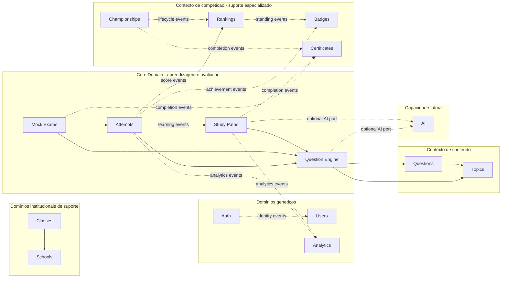
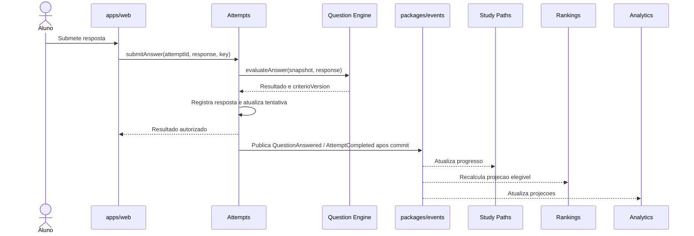

# ADR-0002 - Module Boundaries and Domain Communication

**Date**: 2026-09-29  
**Status**: Proposed (aguardando revisao e aprovacao dos stakeholders)  
**Deciders**: Architecture Lead, Tech Lead e Product (a confirmar)  
**Affects**: Todos os modulos de dominio, `apps/web`, `packages/events`, `packages/shared-types` e `packages/database`

---

## 1. Contexto

O MateMagico Champions foi definido como um Modular Monolith com DDD e Clean Architecture, inicialmente implantado como uma aplicacao, mas com meta de atender multiplas escolas e crescer de 10 mil para 100 mil alunos. A arquitetura fundacional enumera 13 modulos iniciais; tambem menciona Certificates em partes do mapa e nao separa formalmente o Question Engine. Este ADR normaliza esses limites e incorpora AI como capacidade futura, sem afirmar que os modulos ou contratos ja estejam implementados.

Hoje a documentacao permite simultaneamente imports diretos entre modulos e a regra de nao cruzar modulos, e a matriz de dependencias inclui ciclos potenciais (por exemplo, Schools/Classes e Championships/Rankings). O objetivo aqui e estabelecer uma direcao unica: dependencias explicitas, orientadas a contratos, com propriedade de dados e comunicacao assincrona definidos.

### Restricoes

- Preservar um unico produto e unidade de deploy enquanto Modular Monolith for suficiente.
- Manter Clean Architecture dentro de cada modulo: dominio e casos de uso nao dependem de Next.js, Prisma, Auth.js ou fornecedor de IA.
- Preparar isolamento logico por escola: `schoolId` e o identificador oficial do tenant escolar; “tenant” e apenas o conceito de negocio. Nao presumir escala sem medicao.
- Nao permitir estado global de negocio, acesso de escrita a dados de outro modulo ou dependencias circulares.
- Os nomes de APIs e eventos neste documento sao contratos conceituais, nao implementacoes nem endpoints HTTP.

### Requisitos

- Definir bounded contexts e classificacao de dominios.
- Definir responsabilidades, propriedade de dados, eventos e contratos publicos para cada modulo.
- Tornar permitidas e proibidas as dependencias entre os modulos obrigatorios.
- Projetar um event bus interno que possa comecar em processo e evoluir sem expor detalhes de infraestrutura ao dominio.
- Permitir substituicao de provedores de IA sem acoplamento a OpenAI, Claude ou outro fornecedor.
- Permitir extracao gradual de capacidades apenas quando houver motivacao operacional comprovada.

---

## 2. Decisao

**DECLARACAO DA DECISAO**: O sistema sera organizado em bounded contexts com propriedade exclusiva de dados por modulo. Comunicacao sincrona entre modulos ocorrera somente por contratos publicos de aplicacao; comunicacao assincrona ocorrera por eventos de dominio/integracao publicados no `packages/events`. Imports de implementacao, acesso direto a repositorios/tabelas alheios e dependencias circulares sao proibidos.

### 2.1 Mapa de bounded contexts



As setas solidas representam dependencias sincronas entre contratos/fachadas (nao acesso a implementacoes). As setas pontilhadas representam publicacao/consumo de eventos ou chamada a uma porta substituivel; Analytics e consumidores equivalentes devem preferir eventos a consultas sincronas recorrentes. O diagrama mostra relacoes conceituais, nao uma ordem obrigatoria de implantacao.

| Classificacao            | Bounded context / modulos                                                    | Justificativa                                                                                                                            |
| ------------------------ | ---------------------------------------------------------------------------- | ---------------------------------------------------------------------------------------------------------------------------------------- |
| Core Domain              | Aprendizagem e avaliacao: Question Engine, Study Paths, Attempts, Mock Exams | E onde a adaptacao pedagogica, a pratica e a avaliacao entregam a diferenciacao central do produto.                                      |
| Supporting Domain        | Conteudo: Questions, Topics                                                  | O conteudo matematico e curado e necessario ao core, mas nao executa sozinho o fluxo adaptativo de aprendizagem.                         |
| Supporting Domain        | Institucional: Schools, Classes                                              | Habilita SaaS multi-escola, organizacao de turmas, escopo de acesso e relatorios institucionais.                                         |
| Supporting Domain        | Competicao: Championships, Rankings, Badges, Certificates                    | Aumenta engajamento e reconhecimento, usando resultados do core sem controlar aprendizagem ou respostas.                                 |
| Supporting Domain futuro | AI                                                                           | Pode enriquecer recomendacao, tutoria e feedback; deve ser opcional e substituivel, nunca fonte de verdade academica.                    |
| Generic Domain           | Auth, Users                                                                  | Identidade, sessao e perfil sao capacidades comuns, com regras de produto mantidas pequenas e isoladas.                                  |
| Generic/Supporting       | Analytics                                                                    | Projecoes, consultas e relatorios sao capacidades transversais; a interpretacao pedagogica continua pertencendo aos contextos de origem. |

### 2.2 Regras estruturais

1. **Propriedade de dados**: cada modulo e a unica autoridade de escrita sobre seus agregados e tabelas. Um modulo nao le dados internos nem grava tabelas de outro modulo.
2. **Banco fisico compartilhado inicialmente**: `packages/database` pode prover conexao, transacoes e convencoes de persistencia, mas nao deve tornar-se dono do modelo de negocio. Schema/tabelas, repositorios e migracoes permanecem atribuiveis ao modulo proprietario. Uma chamada do modulo A nao pode contornar o contrato de B via Prisma.
3. **Fachada publica**: importacoes entre modulos, quando necessarias para uma resposta sincrona, apontam somente para a superficie publica de aplicacao do modulo. Nao se importam entidades, repositorios, services internos, componentes, stores ou barrels internos de outro modulo.
4. **Eventos para efeitos secundarios**: notificacoes, analytics, rankings e conquistas reagem a eventos apos commit. Consumidores sao idempotentes e toleram entrega duplicada e fora de ordem.
5. **Sem ciclo**: o grafo de dependencias sincronas precisa ser aciclico. A direcao nao e invertida para satisfazer conveniencia de UI ou persistencia.
6. **Identidade e tenant**: contratos recebem identificadores e contexto explicitos (`actorId`, `schoolId`, `membershipId`, quando aplicavel), nao objetos de dominio emprestados. `schoolId` e o identificador oficial do tenant escolar; `tenant` nao e nome de campo. Cada consumidor valida sua autorizacao e seu escopo; um evento nao concede permissao.
7. **Shared packages pequenos**: tipos compartilhados limitam-se a primitivas/contratos estaveis e metadados de transporte. Regras de negocio e modelos de entidades ficam no modulo dono.
8. **Presentacao nao coordena dominio**: `apps/web` e adaptador de entrada; Server Actions/Route Handlers validam entrada, constroem contexto e chamam casos de uso, sem orquestrar regras entre repositorios.

### 2.3 Module responsibilities

As listas de eventos abaixo indicam os principais contratos, nao um inventario exaustivo. O produtor e o unico autorizado a declarar o fato ocorrido; eventos consumidos nao transferem propriedade.

| Modulo               | Responsabilidade; pode fazer                                                                                                               | Nao pode fazer                                                                                                                                    | Dados sob controle                                                                                                                                          | Produz                                                                                                                                                                                 | Consome                                                                                                                              |
| -------------------- | ------------------------------------------------------------------------------------------------------------------------------------------ | ------------------------------------------------------------------------------------------------------------------------------------------------- | ----------------------------------------------------------------------------------------------------------------------------------------------------------- | -------------------------------------------------------------------------------------------------------------------------------------------------------------------------------------- | ------------------------------------------------------------------------------------------------------------------------------------ |
| Auth / Authorization | Autenticar credenciais/provedores, manter sessao, publicar identidade autenticada, memberships e grants; avaliar permissoes via contratos. | Ser dono do perfil de produto, da instituicao ou das matriculas em turmas; consultar modulos de produto durante login por conveniencia.           | Credenciais, auth accounts, sessoes, `SchoolMembership`, roles/permissions e atribuicoes globais/escolares. Membership de acesso nao e enrollment de turma. | `UserRegistered` (identidade/registro de credencial), `UserLoggedIn`, `UserLoggedOut`, `AuthenticationFailed`, `MembershipCreated`, `MembershipRemoved`, `RoleGranted`, `RoleRevoked`. | `UserDeactivated`/`UserReactivated` para revogacao de credenciais e sessoes.                                                         |
| Users                | Manter identidade de produto, perfil, preferencias, consentimentos e estado global de conta.                                               | Verificar credenciais/sessao, possuir memberships ou armazenar resultados academicos.                                                             | `User`, perfil, preferencias, consentimentos e estado global de conta; nao guarda credenciais nem grants.                                                   | `UserCreated` (apos provisionamento de `UserRegistered`), `UserProfileUpdated`, `UserDeactivated`, `UserReactivated`.                                                                  | `UserRegistered` do Auth para provisionar User/Profile; eventos de seguranca conforme contrato.                                      |
| Schools              | Administrar instituicao, configuracao, estado e o identificador `schoolId` do tenant escolar.                                              | Gerenciar memberships, turmas, questoes, tentativas ou rankings; depender de Classes.                                                             | Escola e configuracoes institucionais.                                                                                                                      | `SchoolCreated`, `SchoolUpdated`, `SchoolDeactivated`.                                                                                                                                 | Nenhum evento de perfil e necessario para possuir ou provisionar a escola; Auth/Authorization e Classes consomem eventos da escola.  |
| Classes              | Organizar turmas, matriculas de turma e atribuicoes docentes dentro de uma escola.                                                         | Ser dono da escola, perfil ou membership de acesso; escrever Users/Auth/Schools; criar dependencias inversas em Schools.                          | Turma, enrollment e atribuicao a classe, sempre com `schoolId`.                                                                                             | `ClassCreated`, `ClassUpdated`, `StudentEnrolled`, `StudentUnenrolled`.                                                                                                                | `SchoolCreated/Updated/Deactivated`; identidades referenciadas por `userId` validadas via contrato autorizado.                       |
| Topics               | Classificar conceitos matematicos e prerequisitos.                                                                                         | Possuir questoes, selecionar itens de avaliacao ou conhecer competicao/analytics.                                                                 | Taxonomia, prerequisitos e estado dos topicos.                                                                                                              | `TopicCreated`, `TopicUpdated`, `TopicRetired`.                                                                                                                                        | Nenhum evento de negocio obrigatorio.                                                                                                |
| Questions            | Curar enunciados, alternativas, gabarito, explicacao, nivel e metadados de questao.                                                        | Fazer selecao adaptativa, registrar tentativas, calcular ranking ou importar regras de escola.                                                    | Questao, versoes, respostas corretas, explicacoes, metadados e ligacoes a IDs de Topics.                                                                    | `QuestionCreated`, `QuestionUpdated`, `QuestionPublished`, `QuestionRetired`.                                                                                                          | `TopicRetired/Updated` quando for necessario validar referencias; nao depende de Rankings.                                           |
| Question Engine      | Selecionar questoes, montar conjuntos, aplicar politicas de selecao e avaliar respostas usando snapshots versionados.                      | Ser dono do conteudo original, do historico de tentativa, da matricula, do ranking ou da sessao de autenticacao.                                  | Politicas/configuracao do motor, versoes de selecao e snapshots de execucao.                                                                                | `QuestionSetGenerated`, `AnswerEvaluated` quando apropriado ao contrato.                                                                                                               | Fachadas de Questions/Topics; sinais anonimizados/agregados de Attempts ou AI somente por portas explicitas.                         |
| Study Paths          | Orquestrar objetivos e progresso pedagogico, recomendar proximas atividades e concluir percursos.                                          | Alterar gabaritos, gravar tentativas ou recalcular ranking diretamente.                                                                           | Percurso, etapas, progresso, configuracao e recomendacoes aceitas.                                                                                          | `StudyPathStarted`, `StudyPathUpdated`, `StudyPathCompleted`.                                                                                                                          | `AttemptCompleted`, `MockExamCompleted`, contratos do Question Engine, AI opcional.                                                  |
| Attempts             | Registrar inicio/submissao/resultado imutavel de respostas e tentativas.                                                                   | Alterar questoes/gabaritos, calcular standings persistidos em Rankings ou depender de Analytics.                                                  | Tentativa, respostas fornecidas, resultado, origem da atividade, timestamp e `schoolId` quando escolar.                                                     | `AttemptStarted`, `QuestionAnswered`, `AttemptCompleted`.                                                                                                                              | Contrato de avaliacao do Question Engine e, quando aplicavel, contexto de avaliacao fornecido por Mock Exams/Study Paths.            |
| Mock Exams           | Definir configuracao do simulado, montar uma sessao/exame, controlar disponibilidade e ciclo de conclusao.                                 | Ser dono de questoes, respostas ou historico detalhado de tentativas.                                                                             | Configuracao, sessoes, snapshots de exame, prazos e estado do simulado.                                                                                     | `MockExamCreated`, `MockExamStarted`, `MockExamCompleted`.                                                                                                                             | Contrato do Question Engine; `AttemptCompleted` para reconciliar conclusao e pontuacao.                                              |
| Championships        | Definir competicao, inscricao/elegibilidade, regras e ciclo de vida.                                                                       | Autenticar usuario, manter escola, escrever tentativas ou ordenar leaderboard.                                                                    | Campeonato, regras, inscricoes e estado do ciclo.                                                                                                           | `ChampionshipCreated`, `ParticipantRegistered`, `ChampionshipFinished`.                                                                                                                | Contratos de Users/Schools/Classes apenas para verificacao contextual; `AttemptCompleted` para resultados elegiveis.                 |
| Rankings             | Projetar classificacoes a partir de fatos elegiveis, com escopo e regra de desempate explicitados.                                         | Aceitar escrita de Attempts/Championships, decidir elegibilidade de origem ou ser lido como autoridade sobre tentativas.                          | Projecoes/materializacoes de ranking e cursores de processamento.                                                                                           | `RankingUpdated`, `ParticipantRankChanged`.                                                                                                                                            | `AttemptCompleted`, `ParticipantRegistered`, `ChampionshipFinished` e mudancas de elegibilidade publicadas.                          |
| Badges               | Avaliar regras de conquista e emitir reconhecimentos.                                                                                      | Consultar/alterar Schools, gravar Attempts ou ser fonte de ranking.                                                                               | Definicoes de badge, regras e conquistas concedidas.                                                                                                        | `BadgeEarned`, `BadgeRevoked` quando politica permitir.                                                                                                                                | `AttemptCompleted`, `StudyPathCompleted`, `MockExamCompleted`, `ChampionshipFinished`, `RankingUpdated` se a regra exigir colocacao. |
| Certificates         | Emitir, invalidar e verificar certificados de conquistas concluídas.                                                                       | Gerar a verdade de conclusao via Analytics, editar historico academico ou depender de Schools.                                                    | Registro, identificador, emissao, validade e evidencia do certificado.                                                                                      | `CertificateGenerated`, `CertificateRevoked`.                                                                                                                                          | `StudyPathCompleted`, `MockExamCompleted`, `ChampionshipFinished` e, se regra explicita, `BadgeEarned`.                              |
| Analytics            | Construir projecoes de leitura, metricas e relatorios a partir de eventos e fornecer agregacoes autorizadas.                               | Ser fonte de verdade, bloquear fluxo transacional, gravar nos dominios produtores ou exigir que eles dependam de Analytics.                       | Projecoes, agregacoes, definicoes de metricas, cursores e retencao analitica.                                                                               | `ReportRequested`, `ReportGenerated` (eventos operacionais, quando necessarios).                                                                                                       | Eventos de negocio autorizados dos modulos; pode consultar APIs de leitura publicas apenas em casos pontuais.                        |
| AI (futuro)          | Oferecer capacidades pedagogicas por portas independentes de fornecedor, com politicas de seguranca, custo e explicabilidade.              | Ser fonte de verdade, decidir nota/resultado oficial, receber dados identificaveis sem necessidade ou tornar o core indisponivel quando opcional. | Configuracao de modelos, politicas, versoes de prompt/avaliador, limites e metadados de chamada.                                                            | `RecommendationGenerated`, `TutorFeedbackGenerated`, `AIProviderFailed` (sem dados pessoais sensiveis).                                                                                | Contexto minimo autorizado por chamadas explicitas e, se justificado, projecoes de eventos minimizados.                              |

### 2.4 Matriz de dependencias

**Criticidade** indica impacto no fluxo de negocio se o contrato estiver indisponivel, nao prioridade de implementacao. “Eventos” representa consumo sem dependencia de runtime produtor-consumidor; as dependencias da coluna “Depende de” sao sincr onas e devem apontar para fachadas publicas.

| Modulo               | Depende de (sincrono)                                                                                 | Nao pode depender de                                                             | Criticidade      |
| -------------------- | ----------------------------------------------------------------------------------------------------- | -------------------------------------------------------------------------------- | ---------------- |
| Auth / Authorization | Adaptadores de identidade e persistencia propria; owns memberships, role grants e permissions         | Users internals, Schools/Classes internals, Championships, Analytics             | Critica          |
| Users                | Auth identity event para provisionar User/Profile; sem chamada sincrona no fluxo de leitura do perfil | Auth internals, Schools, Classes, Attempts, Rankings, Championships              | Alta             |
| Schools              | Nenhum modulo de dominio; publica estado institucional por contrato/evento                            | Classes, Users por armazenamento direto, Auth/Authorization internals, Analytics | Alta             |
| Classes              | Schools por contrato/evento para estado institucional                                                 | Auth/Authorization internals, Users/Schools repositories, Questions, Rankings    | Alta             |
| Topics               | Nenhum modulo de dominio                                                                              | Questions como proprietario da taxonomia, Engine, Analytics                      | Media            |
| Questions            | Topics para validacao/publicacao por contrato                                                         | Engine, Attempts, Rankings, Schools                                              | Alta             |
| Question Engine      | Questions, Topics; AI opcional por porta                                                              | Attempts internals, Mock Exams internals, Analytics, Auth                        | Critica          |
| Study Paths          | Question Engine; AI opcional                                                                          | Repositorios de Attempts, Rankings, Schools                                      | Alta             |
| Attempts             | Question Engine para avaliacao; origem de atividade via contrato                                      | Analytics, Rankings, acesso direto a Questions/Mock Exams DB                     | Critica          |
| Mock Exams           | Question Engine; Attempts para criar/encerrar atividade quando necessario                             | Rankings, Analytics, Schools internals                                           | Alta             |
| Championships        | Nenhum no caminho principal; Users/Schools/Classes por contrato para validacao de elegibilidade       | Auth, Rankings, Analytics, escrita em Attempts                                   | Alta             |
| Rankings             | Nenhum modulo sincrono; apenas eventos                                                                | Attempts/Championships internals, Schools, Analytics                             | Media            |
| Badges               | Nenhum modulo sincrono; apenas eventos                                                                | Schools, Attempts internals, Rankings internals                                  | Baixa            |
| Certificates         | Nenhum modulo sincrono; apenas eventos de conclusao                                                   | Analytics, Schools, Attempts internals                                           | Baixa            |
| Analytics            | Nenhum modulo sincrono no caminho de escrita; contratos de leitura pontuais permitidos                | Escrita em qualquer dominio; dependencias obrigatorias para producer             | Media            |
| AI (futuro)          | Adaptadores de fornecedor e interfaces chamadas pelo core                                             | Auth internals, acesso a DB de dominio, decisao oficial de resultado             | Baixa (opcional) |

#### Dependencias perigosas a eliminar da arquitetura fundacional

- `Classes -> Schools` e `Schools -> Classes`: manter somente `Classes -> Schools`; Schools nao conhece turmas.
- `Championships -> Rankings` e `Rankings -> Championships`: remover a consulta inversa; Rankings consome eventos de campeonato, e Championships nao espera o leaderboard.
- `Certificates -> Analytics`: remover. A elegibilidade vem de eventos autoritativos de conclusao, nunca de um relatorio/projecao.
- `Questions -> Topics` pode existir apenas por contrato durante validacao/publicacao; Topics nao importa Questions. Para leitura de alto volume, preferir IDs/versionamento em snapshot.
- `Analytics -> Attempts/Users/Questions/Schools`: substituir leituras recorrentes de tabelas por eventos/projecoes. Consultas sincronas ficam limitadas a casos em que latencia e frescor sejam requisitos explicitos.
- Auth nao deve carregar perfil completo nem navegar para Schools/Championships durante login. Autenticacao estabelece identidade; autorizacao contextual ocorre no caso de uso que conhece o recurso.

### 2.5 Regras de comunicacao

#### Permitida

| Origem -> destino                                     | Modo                                                                            | Motivo / limite                                                                                                                                                                |
| ----------------------------------------------------- | ------------------------------------------------------------------------------- | ------------------------------------------------------------------------------------------------------------------------------------------------------------------------------ |
| Question Engine -> Questions e Topics                 | Sincrono por fachada publica                                                    | Recuperar conteudo/versionamento necessario para selecao; somente leitura no processo de selecao.                                                                              |
| Study Paths -> Question Engine                        | Sincrono por fachada publica                                                    | Solicitar proxima atividade/conjunto de questoes conforme objetivo pedagogico.                                                                                                 |
| Mock Exams -> Question Engine                         | Sincrono por fachada publica                                                    | Montar snapshot de exame segundo blueprint e versao de conteudo.                                                                                                               |
| Attempts -> Question Engine                           | Sincrono por fachada publica                                                    | Avaliar a resposta submetida contra a versao/snapshot correta.                                                                                                                 |
| Mock Exams/Study Paths -> Attempts                    | Sincrono por contrato quando inicia atividade; eventos para conclusao           | Criar sessao de tentativa sem gravar no armazenamento de Attempts.                                                                                                             |
| Analytics <- eventos de dominio                       | Assincrono                                                                      | Montar projecoes sem acoplar transacoes de origem ao tempo de consulta.                                                                                                        |
| Rankings <- Attempts/Championships                    | Assincrono                                                                      | Calcular leaderboard eventualmente consistente com regra/cursor proprio.                                                                                                       |
| Badges <- Attempts/Paths/Exams/Championships/Rankings | Assincrono                                                                      | Avaliar conquistas como reacao a fatos consumados.                                                                                                                             |
| Certificates <- eventos de conclusao                  | Assincrono                                                                      | Emitir com base em evidencia autoritativa e reprocessavel.                                                                                                                     |
| AI <-> core pedagogico                                | Sincrono opcional via portas; assincrono para trabalhos demorados               | Recomendacao/feedback e substituivel, com timeout, limite de custo, fallback e dados minimizados.                                                                              |
| Classes -> Schools                                    | Sincrono por contrato, apenas quando validar estado institucional for requisito | Validar `schoolId`/estado da escola sem ler tabelas alheias; identidade individual usa `userId` e validacao de autorizacao apropriada, nao leitura de perfil por conveniencia. |

#### Proibida

| Regra                                                                                | Justificativa                                                                                                                 |
| ------------------------------------------------------------------------------------ | ----------------------------------------------------------------------------------------------------------------------------- |
| Questions -> Rankings, Badges ou Analytics                                           | Conteudo nao conhece uso, pontuacao ou visualizacao; isso inverteria o fluxo e criaria acoplamento de produto.                |
| Auth -> Championships (ou qualquer dominio de produto)                               | Login nao deve adquirir regras de negocio nem depender da disponibilidade de competicoes.                                     |
| Badges -> Schools                                                                    | A conquista depende de fatos de aprendizagem/competicao; contexto escolar deve vir escopado no evento, sem consulta de volta. |
| Schools -> Classes                                                                   | Evita ciclo e permite que a instituicao evolua sem conhecer organizacoes pedagogicas.                                         |
| Rankings -> Attempts/Championships via banco ou service interno                      | Ranking e uma projecao; a autoridade dos fatos permanece nos produtores.                                                      |
| Certificates -> Analytics                                                            | Relatorios podem atrasar, ser reconstruidos ou mudar; nao sao evidencia para emitir certificado.                              |
| Qualquer modulo -> repositorio, entidade ou tabela interna de outro modulo           | Contorna validacao, autorizacao e propriedade de dados, tornando a extracao inviavel.                                         |
| UI/API -> multiplos repositorios de dominio para compor um fluxo de negocio          | A orquestracao deve residir num caso de uso/modulo coordenador, nao em Server Actions ou componentes.                         |
| Modulo de dominio -> estado global mutavel compartilhado (Context/Zustand singleton) | Estado de UI pode ser compartilhado dentro da aplicacao, mas nao substitui contratos nem estado autoritativo do dominio.      |

Chamadas sincr onas sao adequadas para decisao/retorno imediato dentro de um caso de uso. Eventos sao adequados para efeitos secundarios, projecoes e consumidores independentes. Nao se deve transformar toda interacao em evento: isso esconderia dependencias necessarias e complicaria consistencia onde o usuario espera resposta imediata.

### 2.6 Contratos publicos de aplicacao

Os nomes abaixo descrevem capacidades e resultado conceitual. Nao prescrevem linguagem, implementacao, endpoint, formato de transporte ou API HTTP. Cada contrato deve declarar erros de negocio, requisitos de autorizacao, escopo de tenant, idempotencia e semantica de consistencia antes de ser implementado.

| Modulo               | Contratos publicos propostos                                                                                                                                                                                                                     |
| -------------------- | ------------------------------------------------------------------------------------------------------------------------------------------------------------------------------------------------------------------------------------------------ |
| Auth / Authorization | `authenticate(credentials, clientContext)`; `getSession(sessionId)`; `revokeSession(sessionId)`; `registerIdentity(registration)`; `createMembership(actorContext, schoolId, userId, roles)`; `grantRole(actorContext, scope, roleId, targetId)` |
| Users                | `getProfile(userId)`; `updateProfile(userId, changes)`; `deactivateUser(userId, reason)`                                                                                                                                                         |
| Schools              | `createSchool(command)`; `getSchool(schoolId)`; `updateSchool(schoolId, changes)`; `resolveTenantContext(schoolId, actorId)`                                                                                                                     |
| Classes              | `createClass(schoolId, command)`; `enrollStudent(schoolId, classId, studentId)`; `removeStudent(schoolId, classId, studentId)`; `getClassRoster(schoolId, classId)`                                                                              |
| Topics               | `getTopic(topicId, version?)`; `listTopics(filter)`; `validateTopicReferences(topicIds)`                                                                                                                                                         |
| Questions            | `getPublishedQuestion(questionId, version?)`; `searchPublishedQuestions(criteria)`; `publishQuestion(command)`; `getQuestionSnapshot(questionId, version)`                                                                                       |
| Question Engine      | `selectQuestions(selectionCriteria)`; `buildExam(blueprint)`; `evaluateAnswer(questionSnapshot, response)`; `recommendQuestion(learnerContext)`                                                                                                  |
| Study Paths          | `startStudyPath(schoolId, learnerId, objective)`; `getNextActivity(pathId)`; `getProgress(pathId)`; `completeStudyPath(pathId)`                                                                                                                  |
| Attempts             | `startAttempt(activityContext)`; `submitAnswer(attemptId, response, idempotencyKey)`; `completeAttempt(attemptId)`; `getAttemptResult(attemptId)`                                                                                                |
| Mock Exams           | `createMockExam(command)`; `startMockExam(examId, actorContext)`; `getExamSession(sessionId)`; `completeMockExam(sessionId)`                                                                                                                     |
| Championships        | `createChampionship(command)`; `registerParticipant(championshipId, participantContext)`; `getChampionship(championshipId)`; `finishChampionship(championshipId)`                                                                                |
| Rankings             | `getLeaderboard(scope, period, page)`; `getParticipantStanding(scope, participantId)`                                                                                                                                                            |
| Badges               | `listBadgeDefinitions(criteria)`; `getEarnedBadges(participantId, schoolId?)`; `evaluateBadgeRules(eventReference)` (interno a consumidor autorizado, nao exposto a UI)                                                                          |
| Certificates         | `getCertificate(certificateId)`; `verifyCertificate(publicReference)`; `listCertificates(participantId)`; `revokeCertificate(certificateId, reason)`                                                                                             |
| Analytics            | `getLearningSummary(scope, period)`; `requestReport(reportCriteria)`; `getReportStatus(reportId)`; `getReport(reportId)`                                                                                                                         |
| AI (futuro)          | `recommend(input, policy)`; `tutor(input, policy)`; `provideFeedback(input, policy)`; `estimateDifficulty(input, policy)`; `adviseStudyPlan(input, policy)`                                                                                      |

Os contratos de Rankings, Badges, Certificates e Analytics podem responder com estado eventualmente consistente e devem expor, quando relevante, instante/versao de atualizacao. A UI nao deve inferir sucesso de um fluxo transacional a partir da atualizacao imediata de uma projecao.

### 2.7 Catalogo de eventos e Event Storming

Eventos descrevem fatos passados, usam nomes estaveis em ingles no passado, incluem `eventId`, `eventType`, `schemaVersion`, `occurredAt`, `schoolId` quando o fato pertence a um tenant escolar, `correlationId`, `causationId` e referencia minima ao ator/agregado. “Tenant” e conceito; `schoolId` e o identificador. Payloads abaixo sao conceituais. Nao transportar senha, token, resposta correta desnecessaria ou dado pessoal sensivel em eventos.

| Evento                                                                                                                                                                  | Produtor                              | Consumidores principais                                                               | Payload conceitual                                                                                                   |
| ----------------------------------------------------------------------------------------------------------------------------------------------------------------------- | ------------------------------------- | ------------------------------------------------------------------------------------- | -------------------------------------------------------------------------------------------------------------------- |
| `UserRegistered`                                                                                                                                                        | Auth                                  | Users para provisionamento; Analytics agregado somente com base legal                 | userId, identityId, occurredAt, origem; sem credencial ou segredo                                                    |
| `UserLoggedIn`                                                                                                                                                          | Auth                                  | Analytics/seguranca, com retencao minima                                              | userId, sessionRef nao secreto, occurredAt, clientCategory                                                           |
| `UserLoggedOut`                                                                                                                                                         | Auth                                  | Analytics/seguranca                                                                   | userId, occurredAt, motivo categorizado                                                                              |
| `UserCreated`                                                                                                                                                           | Users (apos `UserRegistered` de Auth) | Consumers autorizados, Analytics agregado se permitido                                | userId, occurredAt, origem, estado inicial; sem email/senha no evento analitico                                      |
| `UserInvited`                                                                                                                                                           | Auth / Authorization                  | Audit, Notifications                                                                  | actorId, inviteId, schoolId, roleIds allowlisted, expiresAt; sem token/email bruto                                   |
| `UserActivated`                                                                                                                                                         | Users (apos `EmailVerified` de Auth)  | Audit, Analytics agregado permitido                                                   | userId, occurredAt, metodo de verificacao                                                                            |
| `UserProfileUpdated`                                                                                                                                                    | Users                                 | Analytics; consumidores com projecao propria                                          | userId, campos alterados (nomes, nao valores sensiveis), versao                                                      |
| `UserDeactivated`                                                                                                                                                       | Users                                 | Auth/Authorization para revogacao; Classes, Rankings, Certificates segundo politica   | userId, motivo categorizado, effectiveAt                                                                             |
| `UserReactivated`                                                                                                                                                       | Users                                 | Auth/Authorization, Audit                                                             | actorId, userId, effectiveAt, approvalRef quando requerido                                                           |
| `PasswordChanged`                                                                                                                                                       | Auth                                  | Audit, revogacao de sessoes, alerta ao usuario                                        | userId, occurredAt, sessionCountRevoked; sem hash/segredo                                                            |
| `MembershipCreated` / `MembershipRemoved`                                                                                                                               | Auth / Authorization                  | Audit, invalidacao de autorizacao/cache, consumidores autorizados                     | actorId, userId, membershipId, schoolId, estado/motivo, effectiveAt                                                  |
| `RoleGranted` / `RoleRevoked`                                                                                                                                           | Auth / Authorization                  | Audit, invalidacao de autorizacao/cache                                               | actorId, targetUserId, roleId, scope, schoolId/membershipId se escolar, validity, approverRef                        |
| `EmailVerified`, `PasswordResetRequested`, `PasswordResetCompleted`, `SessionRevoked`, `MFAEnrolled`, `MFARecoveryUsed`, `PrivilegedAccessUsed`, `AuthenticationFailed` | Auth                                  | Security Audit; Analytics somente agregado/minimizado e permitido                     | userRef/requestRef, schoolId se contexto escolar, ocorrido, resultado/categoria; nunca token, segredo ou email bruto |
| `UserSuspended` / `UserReactivated`                                                                                                                                     | Users                                 | Auth/Authorization revoga ou restaura acesso; Audit                                   | actorId, userId, escopo global, motivo categorizado, effectiveAt, approvalRef quando requerido                       |
| `SchoolCreated`                                                                                                                                                         | Schools                               | Classes, Analytics                                                                    | schoolId, configuracao publica minima                                                                                |
| `SchoolUpdated`                                                                                                                                                         | Schools                               | Classes, Analytics                                                                    | schoolId, versao e campos relevantes                                                                                 |
| `SchoolDeactivated`                                                                                                                                                     | Schools                               | Classes, Analytics e consumidores com dados escopados                                 | schoolId, efetivadoEm                                                                                                |
| `ClassCreated`                                                                                                                                                          | Classes                               | Analytics                                                                             | schoolId, classId, metadados minimos                                                                                 |
| `StudentEnrolled`                                                                                                                                                       | Classes                               | Analytics, Study Paths quando regras por turma forem habilitadas                      | schoolId, classId, studentId, enrolledAt                                                                             |
| `StudentUnenrolled`                                                                                                                                                     | Classes                               | Analytics e consumidores com projecao de matricula                                    | schoolId, classId, studentId, efetivadoEm                                                                            |
| `TopicCreated` / `TopicUpdated` / `TopicRetired`                                                                                                                        | Topics                                | Questions, Engine, Analytics por necessidade                                          | topicId, versao, estado, prerequisitos IDs                                                                           |
| `QuestionCreated` / `QuestionUpdated` / `QuestionPublished` / `QuestionRetired`                                                                                         | Questions                             | Question Engine, Analytics                                                            | questionId, versao, topicIds, nivel, estado; sem gabarito quando nao necessario                                      |
| `QuestionSetGenerated`                                                                                                                                                  | Question Engine                       | Attempts, Study Paths, Mock Exams                                                     | setId/snapshotRef, criterio resumido, versoes, origem                                                                |
| `StudyPathStarted`                                                                                                                                                      | Study Paths                           | Analytics, Badges                                                                     | pathId, learnerId, schoolId, objetivo, versao                                                                        |
| `StudyPathUpdated`                                                                                                                                                      | Study Paths                           | Analytics                                                                             | pathId, learnerId, estado/progresso agregado, versao                                                                 |
| `StudyPathCompleted`                                                                                                                                                    | Study Paths                           | Badges, Certificates, Analytics                                                       | pathId, learnerId, schoolId, concluidoEm, evidenciaRef                                                               |
| `MockExamCreated`                                                                                                                                                       | Mock Exams                            | Analytics                                                                             | examId, schoolId quando escolar, blueprintVersion, disponibilidade                                                   |
| `MockExamStarted`                                                                                                                                                       | Mock Exams                            | Attempts, Analytics                                                                   | examId, sessionId, learnerId, schoolId, snapshotRef, iniciadoEm                                                      |
| `MockExamCompleted`                                                                                                                                                     | Mock Exams                            | Badges, Certificates, Analytics                                                       | examId, sessionId, learnerId, schoolId, resultadoRef, concluidoEm                                                    |
| `AttemptStarted`                                                                                                                                                        | Attempts                              | Analytics; Study Paths opcional                                                       | attemptId, learnerId, schoolId quando escolar, activityRef, iniciadoEm                                               |
| `QuestionAnswered`                                                                                                                                                      | Attempts                              | Analytics, Study Paths, Badges (se regra exigir)                                      | attemptId, questionRef/version, learnerId, correctness categorizada, duracao; sem texto da resposta por padrao       |
| `AttemptCompleted`                                                                                                                                                      | Attempts                              | Study Paths, Mock Exams, Championships, Rankings, Badges, Analytics                   | attemptId, learnerId, schoolId quando escolar, activityRef, score/resultado, questionRefs, concluidoEm               |
| `AnswerEvaluated`                                                                                                                                                       | Question Engine                       | Attempts (retorno sincrono ou evento conforme contrato); Analytics sem resposta bruta | questionRef/version, resultado categorizado, criterioVersion                                                         |
| `ChampionshipCreated`                                                                                                                                                   | Championships                         | Rankings, Analytics                                                                   | championshipId, schoolId quando campeonato escolar, regrasVersion, janela, escopo                                    |
| `ParticipantRegistered`                                                                                                                                                 | Championships                         | Rankings, Analytics                                                                   | championshipId, participantId, schoolId quando aplicavel, elegibilidadeRef                                           |
| `ChampionshipFinished`                                                                                                                                                  | Championships                         | Rankings, Badges, Certificates, Analytics                                             | championshipId, schoolId quando campeonato escolar, finalizadoEm, resultadosRef                                      |
| `RankingUpdated` / `ParticipantRankChanged`                                                                                                                             | Rankings                              | Badges, Analytics                                                                     | scope, participantId, posicao e periodo, versao da projecao                                                          |
| `BadgeEarned` / `BadgeRevoked`                                                                                                                                          | Badges                                | Certificates se permitido, Analytics                                                  | badgeId, participantId, schoolId quando escolar, evidenciaRef, ocorridoEm                                            |
| `CertificateGenerated` / `CertificateRevoked`                                                                                                                           | Certificates                          | Analytics, notificacao futura                                                         | certificateId, participantId, schoolId quando escolar, tipo, evidenciaRef, status                                    |
| `ReportRequested` / `ReportGenerated`                                                                                                                                   | Analytics                             | Analytics (processamento/status), notificacao futura                                  | reportId, solicitanteRef, escopo autorizado, estado                                                                  |
| `RecommendationGenerated` / `TutorFeedbackGenerated` / `AIProviderFailed`                                                                                               | AI                                    | Study Paths, Question Engine, Analytics minimizado                                    | requestRef, capability, provider-neutral modelRef, policyVersion, resultadoRef/erro categorizado                     |

#### Event Storming: submissao de resposta e efeitos



O retorno da submissao nao espera Analytics, Rankings, Badges ou AI. A publicacao apos commit deve usar outbox ou mecanismo equivalente quando a perda de evento entre persistencia e dispatch for inaceitavel. Para alto volume, consumidores processam em background, particionados por tenant/agregado conforme ordenacao necessaria.

### 2.8 `packages/events`: event bus interno

**Responsabilidade**: fornecer o contrato de publicacao e assinatura de eventos, metadados comuns, versionamento, roteamento e observabilidade, mantendo produtores e consumidores independentes do broker concreto. No inicio pode haver adaptador em processo; a interface nao deve presumir entrega exatamente uma vez.

**Interfaces conceituais**:

- `DomainEvent`: envelope tipado com identificador, tipo, versao, instante, tenant opcional, agregado, correlacao/causalidade e payload imutavel.
- `EventPublisher`: aceita evento/fato publicado pelo modulo dono, validando envelope e evitando acoplamento a transporte.
- `EventHandler<T>`: consumidor idempotente que recebe evento, aplica politica propria e registra resultado/cursor.
- `EventSubscription`: associa tipos/versoes suportados a handlers, com estrategia de retry e fila de falhas definida pelo adaptador.
- `OutboxPort` (quando habilitada): registra evento na mesma unidade transacional do agregado produtor; dispatcher entrega apos commit.
- `EventRegistry`: catalogo de tipos, versoes, compatibilidade e consumidores autorizados, mantido como documentacao/contrato versionado.

**Fluxo**:

1. Um caso de uso valida comando e autorizacao dentro do modulo produtor.
2. O agregado aplica a regra, persiste somente no armazenamento que o modulo possui e registra o evento/outbox na mesma transacao quando requerido.
3. O dispatcher entrega o evento ao bus; o bus inclui correlation/causation e metrica, sem expor dados sensiveis em logs.
4. Cada consumidor valida versao, tenant e duplicidade; processa usando apenas seus dados e contratos permitidos; registra cursor/resultado para retentativa.
5. Falhas transientes usam retry com backoff; falhas permanentes vao para dead-letter/replay operacional com alertas e trilha de auditoria.
6. Reprocessamento e suportado, idempotente e nao deve emitir efeitos duplicados nao controlados.

**Garantias e limites**:

- Entrega no minimo uma vez; consumidores idempotentes sao obrigatorios.
- Ordenacao so e garantida por chave/particao explicitamente definida, nao globalmente.
- Evolucao aditiva de payload e preferida; mudanca sem compatibilidade introduz nova versao e janela de migracao.
- Eventos representam fatos consumados, nao comandos remotos. Nao publicar `DoSomething` como evento de dominio.
- Eventos nao substituem autorizacao sincrona de comandos.
- `packages/events` nao contem regras de negocio, estado global de dominio ou acesso ao banco dos modulos.

### 2.9 Estrategia para AI

AI e um modulo futuro, inicialmente uma porta de aplicacao e adaptadores externos, nao um dominio que controla conteudo ou nota. Os contratos `RecommendationProvider`, `TutorProvider`, `FeedbackProvider`, `DifficultyEstimator` e `StudyAdvisor` descrevem capacidades provider-neutral. Cada chamada informa politica de uso, idioma, nivel, tenant permitido, limites e referencias de conteudo; respostas incluem versao de politica/modelo, evidencia/referencias quando aplicavel, confianca e indicacao de revisao humana quando necessaria.

- Provedores concretos ficam em adaptadores de saida substituiveis; nenhuma entidade/caso de uso do core importa SDK de fornecedor.
- Dados sao minimizados, desidentificados sempre que possivel e enviados somente com base legal/consentimento aplicavel. Segredos, identificadores diretos e respostas abertas nao sao enviados por padrao.
- `AIProviderFailed` e timeout nao bloqueiam pratica, avaliacao objetiva nem consulta a conteudo. O chamador usa fallback deterministico, resposta indisponivel ou fila conforme o caso.
- AI nao altera gabarito oficial, resultado de tentativa, elegibilidade ou certificado. Recomendacoes so viram estado de Study Paths quando aceitas por politica/caso de uso.
- Registrar custo, latencia, taxa de falha, qualidade e drift sem armazenar prompts/respostas sensiveis indefinidamente.
- Conteudo gerado deve ser apresentado como sugestao, com protecoes de seguranca, citacao do conteudo-fonte interno e revisao humana nos fluxos de publicacao.

### 2.10 Estrategia de extracao para microservicos

As fases abaixo sao uma ordem de opcao, nao um compromisso temporal. A extracao exige volume/isolamento operacional demonstrado, fronteira de dados clara, observabilidade, SLO, ownership e contrato estavel. O alvo de 100 mil alunos, sozinho, nao justifica microservicos.

| Fase | Candidato                                   | Beneficio esperado                                                                                                | Custo / risco                                                                                                   | Prioridade e gatilho                                                                                                                    |
| ---- | ------------------------------------------- | ----------------------------------------------------------------------------------------------------------------- | --------------------------------------------------------------------------------------------------------------- | --------------------------------------------------------------------------------------------------------------------------------------- |
| 1    | Analytics (leitura, relatorios, ETL)        | Isolar consultas pesadas, escalar consumidores e usar armazenamento analitico sem afetar transacoes pedagogicas.  | Pipeline/outbox, consistencia eventual, governanca/retencao de dados e operacao adicional.                      | Primeira opcao quando relatorios degradarem OLTP ou exigirem cadencia/armazenamento independente.                                       |
| 2    | AI                                          | Isolar credenciais, custo, limites de concorrencia, fornecedores e processamento demorado.                        | Latencia/rede, privacidade, custo variavel, fallback e monitoracao de qualidade.                                | Quando houver uso real e necessidade de escalar/proteger fornecedores independentemente; ate la, adaptador modular no monolito.         |
| 2    | Rankings / Badges (consumidores de eventos) | Escalar recalculo e projeoes eventualmente consistentes de forma independente em periodos de pico.                | Rebuild de projecoes, ordenacao, idempotencia e maior complexidade de operacao.                                 | Quando picos de competicao saturarem recursos ou SLOs do core. Manter juntos inicialmente se o volume nao justificar.                   |
| 3    | Question Engine / Attempts                  | Escalar avaliacao e submissao, isolar perfil de carga e evoluir runtime de pratica/exame.                         | Contratos de snapshot, consistencia, latencia sincrona, disponibilidade critica e migracao de dados historicos. | Somente apos medir gargalos sustentados e provar independencia de dados/sessao. Extrair juntos ou em fronteiras justificadas por carga. |
| 3    | Championships / Mock Exams                  | Isolar operacao de eventos competitivos ou janelas de exames com requisitos de disponibilidade e burst distintos. | Orquestracao entre sessao, tentativas, elegibilidade e regras; risco de falha distribuida em fluxo critico.     | Somente quando times/SLAs e padroes de carga distintos justificarem fronteiras de deploy.                                               |

Auth, Users, Schools, Classes, Questions e Topics permanecem no monolito ate que haja motivo independente (regulacao, ownership, escala ou integracao externa). Extracao nao altera ownership: cada servico continua proprietario exclusivo dos seus dados; consultas entre servicos passam por contratos/eventos, nao por banco compartilhado.

### 2.11 Atualizacoes necessarias na arquitetura atual

#### Modulos e inconsistencias

- Formalizar `Question Engine` como modulo separado de `Questions`: um possui conteudo e gabarito versionado; o outro aplica selecao, composicao e avaliacao.
- Manter `Topics` separado, com autoridade exclusiva sobre taxonomia; Questions guarda referencias/versoes, nao duplica definicoes.
- Formalizar `Certificates`, que ja aparece em grafo e matriz de `ARCHITECTURE.md`, mas nao consta na lista original de 13 modulos.
- Adicionar `AI` como capacidade futura e opcional, nao como dependencia obrigatoria do core.
- Alinhar o total: 16 modulos documentados neste ADR; qualquer resumo de “13 modulos” deve ser revisado para refletir a lista adotada quando esta decisao for aprovada.

#### Mudancas recomendadas na arvore

```text
apps/web/src/
  app/                         # adaptadores de entrada, sem regra de dominio
  modules/                     # somente composicao de UI por feature, se mantido

packages/
  modules/
    auth/
    users/
    schools/
    classes/
    topics/
    questions/
    question-engine/
    study-paths/
    attempts/
    mock-exams/
    championships/
    rankings/
    badges/
    certificates/
    analytics/
    ai/                         # futuro; nao habilitar sem caso de uso
  events/                       # envelope, publisher/handler ports e adaptadores
  database/                     # conexao/tooling; sem ownership de dominio
  shared-types/                 # somente primitivas e contratos realmente comuns
  logger/
  utils/
```

A arvore e uma direcao de organizacao, nao uma solicitacao para criar os diretorios agora. Cada `packages/modules/<module>` deve manter `domain`, `application`, `ports` e `infrastructure` internos; somente a fachada de aplicacao, tipos de contrato e eventos publicaveis integram a superficie consumivel. Componentes especificos podem permanecer em `apps/web` organizados por feature, mas UI nao exporta API de dominio.

#### Lista de acoes arquiteturais

1. Aprovar este ADR com Architecture, Tech e Product; entao mudar status para Accepted e registrar a aprovacao.
2. Atualizar o indice real de ADRs e referencias em `ARCHITECTURE.md`, `memory/decisions.md` e `memory/project-state.md` apos aprovacao, removendo referencias a grafo/ciclos antigos.
3. Substituir a matriz atual em `ARCHITECTURE.md` por dependencias sincronas permitidas e fluxos assincronos, deixando claro que eventos nao sao imports.
4. Definir estrategia de ownership de tabelas e convencao de tenancy (`schoolId` e identificador oficial; “tenant” apenas conceito), isolamento, autorizacao e indices no ADR-0003 antes do schema/migrations.
5. Definir envelope/versionamento/retencao de eventos, outbox, retries e dead-letter em especificacao de implementacao antes de habilitar consumidores criticos.
6. Estabelecer convencoes de contratos publicos: compatibilidade, erros, idempotencia, autorizacao, consistencia e logging de dados minimizados.
7. Adicionar validacao arquitetural automatizada de imports para impedir imports internos cruzados e ciclos; manter testes de contrato para fachadas e eventos.
8. Definir ownership de Questions/Topics, Question Engine/Attempts e Mock Exams/Attempts em documentos de dominio antes de paralelizar implementacao.
9. Criar AI somente quando caso de uso, privacidade, limites de custo, fallback e avaliacao de qualidade estiverem aprovados.
10. Fazer teste de carga representativo (tenant pequeno/grande, picos de prova, escrita de tentativas, consumidores atrasados) antes de declarar suporte validado para 100 mil alunos.

### Por que esta escolha

Fachadas publicas permitem respostas imediatas e localizam dependencias necessarias; eventos separam efeitos secundarios e consumidores de leitura, sem transformar cada chamada em uma transacao distribuida. Ownership por modulo e necessario tanto para testar isoladamente quanto para eventualmente extrair um servico. O banco fisico compartilhado e mantido no inicio para simplicidade operacional, enquanto as regras impedem que esse compartilhamento se converta em compartilhamento de dominio.

| Opcao                                            | Vantagens                                            | Custos                                                               | Decisao     |
| ------------------------------------------------ | ---------------------------------------------------- | -------------------------------------------------------------------- | ----------- |
| Modular Monolith com fachadas e eventos internos | Deploy simples, limites explicitos, evolucao gradual | Disciplina de contratos e eventual consistencia em consumidores      | Selecionada |
| Imports livres entre modulos                     | Rapido no curto prazo                                | Ciclos, acesso a dados alheios, extração cara                        | Rejeitada   |
| Microservicos desde o inicio                     | Deploy/escala independentes por servico              | Operacao, rede, observabilidade e transacoes distribuidas prematuras | Rejeitada   |

---

## 3. Consequencias

### Positivas

1. Cada modelo de negocio tem dono, facilitando testes, mudancas independentes e revisao de acesso.
2. Analytics, rankings, badges e certificados deixam de participar de transacoes pedagogicas criticas.
3. Contratos e eventos estaveis permitem evolucao de transporte e extracao seletiva sem importar implementacoes.
4. Isolamento por tenant e minimizacao de dados tornam-se requisitos de cada fronteira, nao detalhes ad hoc da UI.

### Negativas

1. Fachadas e eventos exigem catalogo, versionamento, observabilidade e testes de contrato.
2. Rankings/Analytics e parte das conquistas podem ser eventualmente consistentes; UI deve comunicar frescor quando importante.
3. Banco compartilhado exige disciplina e validacao de imports/queries para que limites logicos sejam respeitados.
4. O mapa de 16 modulos e mais preciso, mas aumenta superficie de documentacao; subdividir nao deve significar criar pacote/deploy independente sem autonomia real.

### Trade-offs aceitos

| Trade-off                                 | Aceito porque                                        | Monitorar                                                                |
| ----------------------------------------- | ---------------------------------------------------- | ------------------------------------------------------------------------ |
| Evento duplicado e processamento eventual | Desacopla consumidores e protege fluxo transacional  | atraso, duplicidade, backlog e dead-letter                               |
| Fachada sincrona entre modulos            | Resposta imediata quando regra depende de decisao    | latencia, disponibilidade e grafo aciclico                               |
| Banco unico no inicio                     | Menor custo operacional antes de haver escala medida | contencao, limites de conexao, queries cruzadas e violacoes de ownership |
| AI opcional e nao autoritativa            | Mantem o core utilizavel sem fornecedor externo      | fallback, custo, latencia, seguranca e qualidade                         |

---

## 4. Riscos

| ID  | Risco                                                                      | Severidade | Probabilidade | Mitigacao                                                                             |
| --- | -------------------------------------------------------------------------- | ---------- | ------------- | ------------------------------------------------------------------------------------- |
| R1  | Import interno ou query cross-module reintroduzir acoplamento silencioso   | Alta       | Media         | Regras automatizadas de dependencia, revisao de PR e testes de contrato.              |
| R2  | Evento perdido entre commit e publicacao                                   | Alta       | Media         | Outbox transacional para fluxos criticos, reconciliacao e alertas de lag.             |
| R3  | Consumidor nao idempotente duplicar badge/certificado/pontuacao            | Alta       | Media         | Inbox/idempotency key, constraint de negocio, replay testado.                         |
| R4  | Vazamento de dados entre tenants em contrato, evento ou projecao           | Critica    | Media         | Tenant explicito, autorizacao no produtor e consumidor, testes negativos e auditoria. |
| R5  | Alteracao de payload quebrar consumidor antigo                             | Alta       | Media         | Schema versionado, compatibilidade, rollout expand/contract e registry.               |
| R6  | AI enviar dado excessivo ou produzir feedback pedagogicamente incorreto    | Alta       | Media         | Minimizacao, politicas, avaliacao, limites e supervisao humana nos usos sensiveis.    |
| R7  | Meta de 100 mil alunos ser tratada como capacidade garantida sem evidencia | Alta       | Media         | Carga representativa, SLOs, telemetria e relatorio antes de declaracao de capacidade. |

### Sinais de revisao

- p95/p99 de submissao de resposta piora por consumidores assincronos ou consultas cross-module.
- Lag do consumidor excede o SLO acordado para progresso, ranking ou relatorios; dead-letter cresce sem recuperacao.
- Qualquer ciclo no grafo sincrono, import interno entre modulos ou consulta a tabela sem ownership e falha de arquitetura.
- Erro de autorizacao/isolamento entre tenants: incidente critico, exige suspender o fluxo afetado e revisar contratos.
- Custo ou latencia de AI compromete SLO de uma jornada que deveria ser funcional sem AI.

---

## 5. Alternativas consideradas

### Imports diretos entre modulos

**Descricao**: permitir que qualquer modulo importe services, repositories e entidades internas de qualquer outro modulo.

**Vantagens**: menor custo inicial e menos contratos aparentes.

**Desvantagens**: grafo impl icito, ciclos, acesso indevido a dados e extracao futura cara.

**Motivo da rejeicao**: contradiz ownership e torna impossivel saber quais mudancas quebram consumidores.

### Microservicos imediatos

**Descricao**: implantar cada contexto como servico independente desde o primeiro release.

**Vantagens**: isolamento de deploy e escala por servico desde cedo.

**Desvantagens**: custo operacional, rede, observabilidade e consistencia distribuida antes de validar volume e autonomia de equipe.

**Motivo da rejeicao**: Modular Monolith atende a fase atual; fronteiras preservadas permitem extracao posterior com sinais reais.

### Event-driven para toda comunicacao

**Descricao**: representar inclusive consultas e comandos interativos como eventos assincronos.

**Vantagens**: baixo acoplamento temporal.

**Desvantagens**: latencia, consistencia eventual em fluxos que exigem resposta imediata e maior dificuldade de rastreamento.

**Motivo da rejeicao**: usar eventos para fatos e efeitos secundarios; usar fachadas para decisao sincrona explicita.

---

## 6. Implementacao (documental, nao codigo)

### Sequencia

1. Revisar e aprovar fronteiras, ownership e criticidade com representantes de produto/engenharia.
2. Alinhar `ARCHITECTURE.md` e os arquivos de memoria com este ADR; manter diferencas identificadas ate a aprovacao.
3. Detalhar ADR-0003 para ownership fisico, tenant, transacoes e retencao antes de definir schema.
4. Ao iniciar implementacao, estabelecer regra de imports, contratos e testes arquiteturais antes de criar consumidores assincronos.
5. Instrumentar latencia e lag; executar teste de carga representativo; so entao decidir cache, broker ou extracao.

### Componentes afetados

- `apps/web`: adaptadores de entrada e composicao, sem acesso direto a repositorios de dominio.
- `packages/modules/*`: ownership e fachadas de aplicacao.
- `packages/events`: contratos/adaptadores de eventos, outbox e observabilidade conforme risco.
- `packages/database`: persistencia compartilhada tecnicamente, sem modelo global de dominio.
- `packages/shared-types`: tipos comuns minimos, sem espelhar todas as entidades.
- `docs/architecture`, `docs/domain` e `memory`: alinhamento documental apos aprovacao.

### Observabilidade

Este ADR adota o baseline comum de `ADR-TEMPLATE.md`: OpenTelemetry para instrumentacao, Correlation ID propagado por request/evento, structured logging com redacao, error tracking sem segredos, metricas de latencia/erro/throughput/queue lag e tracing atraves de application contracts, repositories e consumers. `packages/events` registra `correlationId`/`causationId`; cada modulo e owner das metricas e spans da sua fronteira. Nao incluir PII ou `schoolId` como label de alta cardinalidade sem aprovacao.

### Estrategia de testes

Aplicar a matriz comum de `ADR-TEMPLATE.md`: Unit Tests para dominio/application, Integration Tests para repositories e outbox/inbox, Contract Tests para public APIs/event schemas, E2E Tests para fluxos intermodulo e Load Tests para consumers/queue lag sob tenants assimetricos. Testes de architecture fitness devem provar ausencia de imports internos e ciclos.

### Migracao

Nao ha migracao de codigo neste ADR. Em implementacao futura, converter um fluxo por vez: identificar owner, publicar fachada/eventos, substituir leitura/escrita cruzada por contrato, validar paridade e so entao remover caminho antigo. Rollback deve reativar consumidor/fluxo anterior sem duplicar efeitos; eventos ja consumidos devem poder ser deduplicados/reconciliados.

### Estimativa

Fora de escopo neste ADR. A estimativa depende do inventario de codigo, decisao de banco e aprovacao do modelo de eventos; nao ha implementacao existente confirmada neste workspace.

---

## 7. ADRs relacionados

- ADR-0001 - Arquitetura base (Modular Monolith, DDD e Clean Architecture), descrita em `ARCHITECTURE.md`.
- ADR-0003 - Estrategia de banco de dados (ownership fisico, tenancy, transacoes e outbox), ainda a produzir.
- ADR-0004 - Fluxo de autenticacao/autorizacao, ainda a produzir.
- ADR-0005 - Estado de UI, que nao altera ownership de estado de dominio, ainda a produzir.

---

## 8. Referencias

- `ARCHITECTURE.md` - arquitetura fundacional, estrutura, grafo e matriz existentes.
- `memory/architecture-memory.md` - principios de comunicacao e estrategia atual.
- `memory/decisions.md` - indice de decisoes e lista de modulos existente.
- `docs/architecture/ADRs/ADR-TEMPLATE.md` - formato ADR do repositorio.
- Prompt 002 - ADR-0002 Module Boundaries and Domain Communication.

---

## 9. Aprovacao

- [ ] Architecture Lead
- [ ] Tech Lead
- [ ] Product Manager
- [ ] CTO / patrocinador do produto

A decisao permanece **Proposed** ate revisao e aprovacao. A lista de aprovadores e funcional; nomes ainda nao foram definidos na documentacao atual.

---

## 10. Reconsideracao futura

Revisar este ADR quando:

- houver evidencias de carga representativa para 100 mil alunos ou novo requisito de isolamento/regulacao;
- um modulo precisar de deploy/escalabilidade independente com SLO e equipe proprietaria;
- o modelo multi-tenant, identidade, privacidade ou retencao mudar;
- eventos/outbox aumentarem latencia/custo de forma incompatível com o SLO;
- a classificacao de dominios ou a lista de modulos mudar substancialmente.

**Data de revisao**: apos aprovacao do ADR-0003 e antes da primeira implementacao de persistencia de dominio.
