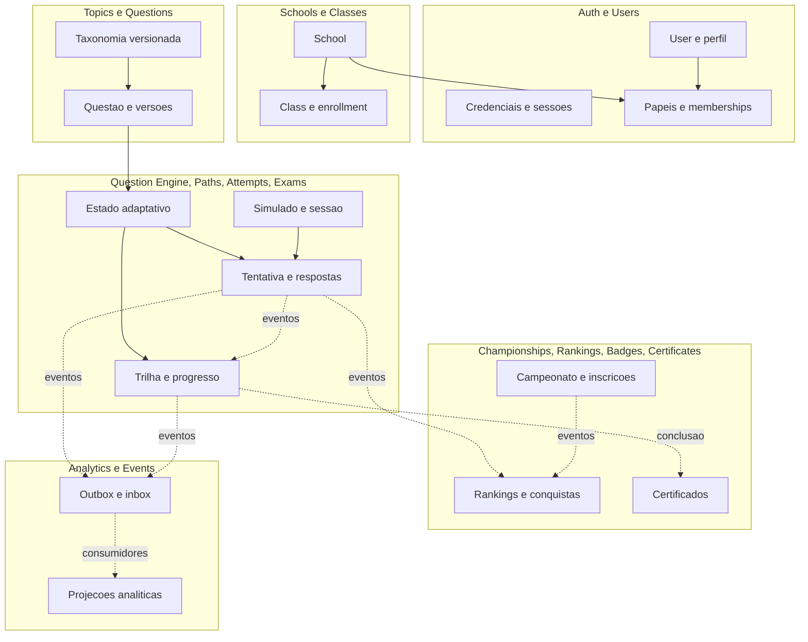

# ADR-0003 - Database Strategy and Domain Data Model

**Date**: 2026-09-29  
**Status**: Proposed (aguardando revisao e aprovacao)  
**Deciders**: Architecture Lead, Tech Lead, Data/Backend Lead e Product (a confirmar)  
**Affects**: Todos os bounded contexts, `packages/database`, `packages/events`, `packages/analytics` e futuras integracoes de dados

---

## 1. Contexto

O MateMagico Champions precisa estabelecer o modelo de dados antes de criar o schema Prisma. A arquitetura fundacional ja fixa PostgreSQL, Prisma e Modular Monolith, mas ainda contem exemplos de schema que colocam uma escola e um unico papel diretamente em `User`, relacoes de dominio cruzadas e a expectativa de que toda migration seja reversivel. Essas escolhas nao atendem com seguranca a usuarios que atuam em mais de uma escola, a administradores globais, nem aos limites de dados formalizados no ADR-0002.

Este ADR define ownership e modelo conceitual, nao o schema fisico final. A estrategia e multi-escola logica em um banco PostgreSQL e schema compartilhado, com `schoolId` como chave primaria de isolamento de dados institucionais. Nao serao usados banco por escola, schema PostgreSQL por escola ou isolamento fisico por tenant.

### Restricoes

- PostgreSQL e Prisma sao escolhas obrigatorias do projeto.
- O deploy inicial segue Modular Monolith e cada modulo continua dono de seus dados, mesmo no banco fisico compartilhado.
- Dados institucionais carregam `schoolId` explicito e nao nulo; catalogos globais de plataforma sao marcados como globais, nao como registros de tenant com `schoolId` nulo ambiguo.
- Uma conta pode ter associacoes com varias escolas; papeis escolares sao contextuais. Administracao global nao depende de uma escola.
- Nao gerar nem aprovar neste documento codigo Prisma, SQL, migrations, APIs ou implementacao.
- Analytics e projecoes nao sao fonte de verdade transacional.
- Dados de criancas/adolescentes exigem minimizacao, controle de acesso, retencao e revisao legal compatíveis com a LGPD e politicas educacionais aplicaveis.

### Requisitos

- Identificar ownership de entidades, agregados, relacionamentos e tabelas conceituais.
- Representar taxonomia OBMEP com historico/versionamento suficiente para reproduzir uma selecao e resultado antigos.
- Suportar RBAC global e escolar, turmas, matriculas, pratica, simulados, campeonatos, reconhecimento e analytics.
- Definir eventos, auditoria, notificacoes, migrations, seeds, indices, soft delete e escalabilidade.
- Preservar integridade de tenant inclusive em joins, comandos, eventos, exportacoes e cache.

---

## 2. Decisao

**DECLARACAO DA DECISAO**: PostgreSQL sera o armazenamento transacional principal e Prisma o ORM de persistencia. Todos os dados pertencem a um bounded context; dados institucionais sao isolados logicamente por `schoolId` obrigatorio. Contas globais e papeis escolares serao modelados por atribuicoes de papel com escopo, nao por uma coluna unica `User.role`/`User.schoolId`. Analytics sera inicialmente composto por projecoes em PostgreSQL, separado logicamente do OLTP e extraivel para plataforma analitica quando medicao justificar. O armazenamento de eventos sera outbox/inbox e trilha operacional, nao event sourcing.

### 2.1 Visao geral da estrategia

**PostgreSQL** e escolhido pela consistencia transacional, constraints relacionais, indices compostos, JSONB para extensoes limitadas, particionamento declarativo, replicacao e maturidade operacional. O modelo principal e relacional e normalizado; JSONB nao substitui entidades, relacionamentos, constraints ou campos consultados com frequencia.

**Prisma** e escolhido por tipagem de acesso, relacoes explicitas, produtividade e fluxo integrado de migrations. Prisma e adaptador de infraestrutura: nao define ownership de dominio e nao deve vazar para entidades/casos de uso. Recursos de PostgreSQL sem representacao completa no Prisma podem ser adicionados por migration revisada, com teste de drift entre schema declarativo e banco.

**Estrategia de crescimento**: primeiro otimizar consultas e indices medidos; depois adicionar cache e processamento assincrono; por fim separar workloads de leitura/analytics e particionar tabelas volumosas com evidencia. 100 mil alunos e uma meta de validacao, nao capacidade presumida.

**Estrategia de migracao**: mudancas incrementais, compatibilidade expand/contract, migrations versionadas e aplicadas uma vez por pipeline controlado. Migrations de producao sao forward-only; rollback ocorre por correcao compensatoria, restauracao planejada ou deploy da versao anterior quando compatível, nunca por assumir que DDL e dados podem ser revertidos sem perda.

### 2.2 Bounded Context Data Map e ownership

Cada contexto e autoridade exclusiva para escrita no seu conjunto. Um mesmo banco fisico nao autoriza imports de repositorios ou escrita cruzada. FK fisica entre tabelas de modulos diferentes sera excecao justificada: quando usada, nao transfere ownership nem permite cascata de negocio. O consumidor mantem referencia por identificador e valida via contrato/evento, conforme ADR-0002.

| Contexto / modulo    | Entidades e tabelas conceituais de propriedade                                                                                                                                                                                                                                                                                                                       | Escopo de escola                                                                                                                                                                      |
| -------------------- | -------------------------------------------------------------------------------------------------------------------------------------------------------------------------------------------------------------------------------------------------------------------------------------------------------------------------------------------------------------------- | ------------------------------------------------------------------------------------------------------------------------------------------------------------------------------------- |
| Auth / Authorization | `auth_accounts`, `auth_sessions` (JWT revocation registry na V1), `password_credentials`, `email_verification_tokens`, `password_reset_tokens`, `mfa_factors`, `school_memberships`, `membership_role_assignments`, `global_role_assignments`, `roles`, `permissions`, `role_permissions`, `school_invitations`, `audit_logs` de seguranca e `login_security_events` | Identidades/credenciais sao globais; membership, grant escolar e convite levam `schoolId`. Auth owns membership de acesso; nao owns escola, perfil de produto nem matricula em turma. |
| Users                | `users`, `user_profiles`, `user_preferences`, `user_consents`, `user_data_requests`                                                                                                                                                                                                                                                                                  | Perfil global; consentimento pode ser contextual por finalidade/escola quando aplicavel.                                                                                              |
| Schools              | `schools`, `school_settings`, `school_domains`                                                                                                                                                                                                                                                                                                                       | Cada registro de escola representa tenant; configuracoes sao escopadas a `schoolId`.                                                                                                  |
| Classes              | `classes`, `class_enrollments`, `class_teaching_assignments`, `class_subjects` (se habilitada)                                                                                                                                                                                                                                                                       | Sempre escopados a `schoolId`; enrollment/atribuicao de turma e distinta de `school_memberships` de Auth/Authorization.                                                               |
| Topics / taxonomia   | `education_levels`, `topics`, `competencies`, `skills`, `olympiad_editions`, `olympiad_phases`, `sources`, `difficulty_scales`, `topic_prerequisites`                                                                                                                                                                                                                | Taxonomia oficial e catalogo global; extensoes escolares devem ter namespace/owner explicito e nao alterar registro global.                                                           |
| Questions            | `questions`, `question_versions`, `question_options`, `question_assets`, `question_topic_links`, `question_competency_links`, `question_skill_links`, `question_source_links`, `question_publications`                                                                                                                                                               | Banco curado e global por padrao; questao privada/personalizada pode ter `schoolId` obrigatorio e escopo de publicacao explicito.                                                     |
| Question Engine      | `recommendation_rules`, `adaptive_profiles`, `learning_patterns`, `skill_mastery`, `error_patterns`                                                                                                                                                                                                                                                                  | Estado de aluno sempre `schoolId` + `userId`; regras podem ser globais ou escopadas explicitamente, sem `schoolId` ambiguo. Consome metricas de questao de Analytics.                 |
| Study Paths          | `study_path_templates`, `study_paths`, `study_path_steps`, `study_path_progress`                                                                                                                                                                                                                                                                                     | Templates globais ou de escola; percurso/progresso de aluno exige `schoolId`.                                                                                                         |
| Attempts             | `attempts`, `attempt_answers`, `attempt_evidence` (se necessario)                                                                                                                                                                                                                                                                                                    | Toda tentativa institucional exige `schoolId`, incluindo atividade individual associada a contexto escolar.                                                                           |
| Mock Exams           | `mock_exams`, `mock_exam_versions`, `mock_exam_items`, `mock_exam_sessions`                                                                                                                                                                                                                                                                                          | Configuracao pode ser global ou escolar com owner explicito; sessoes sempre levam `schoolId`.                                                                                         |
| Championships        | `championships`, `championship_versions`, `championship_entries`, `championship_eligible_attempts`                                                                                                                                                                                                                                                                   | Competicao pode ter escopo global ou de escola declarado; participante e resultado guardam escopo efetivo.                                                                            |
| Rankings             | `ranking_definitions`, `ranking_snapshots`, `ranking_entries`, `ranking_projection_cursors`                                                                                                                                                                                                                                                                          | Cada ranking declara escopo (global, escola, campeonato) e periodo; entradas preservam escopo e versao.                                                                               |
| Badges               | `badge_definitions`, `badge_awards`, `badge_evidence`                                                                                                                                                                                                                                                                                                                | Definicao global/escolar declarada; concessao ao aluno leva `schoolId` e evidencia.                                                                                                   |
| Certificates         | `certificates`, `certificate_evidence`, `certificate_revocations`                                                                                                                                                                                                                                                                                                    | Emissao guarda `schoolId` quando ligada a atividade escolar; certificado global explicita escopo global.                                                                              |
| Analytics            | `student_progress`, `daily_metrics`, `question_metrics`/`question_statistics`, `topic_metrics`, `learning_metrics`, `school_metrics`, `report_jobs`                                                                                                                                                                                                                  | Cada projecao preserva `schoolId` quando a metrica e institucional; nenhum agregado mistura escolas sem dimensao global explicita e autorizacao.                                      |
| Events / integration | `domain_events` (outbox/archive), `event_inbox`, `event_subscriptions`, `consumer_checkpoints`, `notifications`, `notification_deliveries`                                                                                                                                                                                                                           | Evento/entrega carrega `schoolId` quando o fato pertence a escola; nunca usar tenant inferido pelo consumidor.                                                                        |

#### Ownership map



Setas continuas indicam relacao de referencia/contrato dentro do fluxo; pontilhadas indicam propagacao assincrona. A figura nao define FKs fisicas entre schemas/modulos.

### 2.3 Aggregate Roots DDD

Agregados sao limites de consistencia transacional, nao sinonimos de tabelas. Colecoes extensas ou de alto volume (respostas, historico de eventos, ranking) nao devem ser carregadas nem atualizadas como uma unica unidade em memoria. A tabela abaixo registra fronteiras conceituais para o primeiro modelo.

| Aggregate Root                        | Responsabilidade                               | Invariantes principais                                                                                                                                | Entidades internas / referencias                                                        |
| ------------------------------------- | ---------------------------------------------- | ----------------------------------------------------------------------------------------------------------------------------------------------------- | --------------------------------------------------------------------------------------- |
| User                                  | Identidade de produto e perfil                 | identificador unico; perfil nao guarda credencial; desativacao impede novos acessos conforme politica                                                 | UserProfile, UserPreferences, UserConsent; referencias a Auth e memberships             |
| School                                | Identidade e ciclo de vida do tenant           | estado habilitado controla operacoes; configuracao pertence a uma unica escola; escola nao controla classes                                           | SchoolSettings, SchoolDomain                                                            |
| SchoolMembership (Auth/Authorization) | Conceder vinculo de acesso entre User e School | unicidade por user/school ativa conforme politica; grants sao separados e nunca atravessam schoolId                                                   | MembershipRoleAssignment; referencias por ID a User e School                            |
| Class (Classes)                       | Organizar grupos/turmas dentro de uma escola   | class.schoolId deve igualar enrollment/teaching assignment; matricula ativa unica por estudante/turma                                                 | ClassEnrollment, ClassTeachingAssignment, opcionalmente ClassSubject                    |
| Topic                                 | Taxonomia e prerequisitos                      | sem ciclos em prerequisitos; codigo/versao estavel; aposentadoria nao altera historico de questoes                                                    | TopicPrerequisite, referencias a Competency/Skill                                       |
| Question                              | Conteudo e versao publicada                    | versao publicada e imutavel; questao publicada tem metadados requeridos e resposta/criterio de correcao; retirement nao reescreve tentativas passadas | QuestionVersion, QuestionOption, QuestionAsset, links taxonomicos e de fonte            |
| RecommendationRuleSet                 | Politicas de selecao/adaptacao                 | regra publicada e versionada; pesos/limites validos; cada avaliacao registra versao aplicada                                                          | RecommendationRule, criteria, versao e escopos                                          |
| AdaptiveProfile                       | Estado pedagogico por estudante e escola       | unicidade por learner + school + perfil; atualizacao deriva de fatos identificaveis e pode ser reconstruida                                           | LearningPattern, SkillMastery, ErrorPattern; estatisticas sao projeoes fora do agregado |
| StudyPathTemplate                     | Definicao reutilizavel de trilha               | passos referenciam conteudo/skills validos e versao publicada e imutavel                                                                              | TemplateStep, regras e referencias de taxonomia                                         |
| StudyPath                             | Execucao individual de trilha                  | sempre associado a schoolId; transicoes de estado validas; conclusao e evidencia versionada                                                           | StudyPathStep, progresso; referencias a User e template                                 |
| Attempt                               | Uma execucao de atividade avaliativa           | imutavel apos finalizacao exceto anotacao auditada; resposta avaliada contra snapshot de questao/criterio; idempotencia de submissao                  | AttemptAnswer; referencias a question/version, activity, learner, school                |
| MockExam                              | Blueprint/versionamento de simulado            | versao publicada fixa ordem/criterios e snapshots; janela e duracao coerentes                                                                         | MockExamVersion, MockExamItem; sessions sao agregados separados                         |
| MockExamSession                       | Execucao de aluno em simulado                  | pertence a uma escola; estados e tempo de conclusao validos; resultado referencia tentativas                                                          | referencias a MockExamVersion, User, Attempts                                           |
| Championship                          | Competicao, regras e ciclo de vida             | regra/versionamento congelado ao iniciar; janela e elegibilidade consistentes; finalizacao nao reescreve evidencia                                    | ChampionshipVersion, participantes/entries, referencias a tentativas elegiveis          |
| RankingDefinition                     | Definicao de escopo, periodo e ordenacao       | chave de escopo unica; desempate deterministico; regra versionada                                                                                     | criterio e politica; snapshots/entries sao read models imutaveis por versao             |
| BadgeDefinition / BadgeAward          | Regras e concessoes                            | concessao idempotente por aluno/definicao/escopo; evidencia rastreavel; revogacao registrada                                                          | BadgeRule; BadgeEvidence por referencia a eventos                                       |
| Certificate                           | Evidencia emitida e verificavel                | identificador publico nao enumeravel; evidencia imutavel; revogacao registrada sem apagar emissao                                                     | CertificateEvidence, CertificateRevocation                                              |
| Notification                          | Mensagem enderecada e estado de entrega        | estado de entrega separado de preferencia; deduplicacao por chave; sem conteudo sensivel em payload desnecessario                                     | NotificationDelivery, referencia a User e tenant opcional                               |

`QuestionStatistics`, `StudentProgress`, `RankingEntry` e demais metricas sao projecoes e nao agregados canonicos. O estado do adaptativo pode ser materializado para velocidade, mas os eventos/attempts autorizados sao evidencia de origem e o perfil deve ser reconstruivel ou reconciliavel.

### 2.4 Modelo conceitual completo (ERD)

O ERD e logico, nao uma declaracao de FKs nem de cardinalidades finais para Prisma. Relações entre domínios usam referencias por contrato; a implementacao pode manter apenas IDs em vez de constraints cross-module. Entidades de analytics/eventos sao projetadas, nao inclusas no grafo transacional principal.

```mermaid
erDiagram
    USER ||--|| USER_PROFILE : has
    USER ||--o{ AUTH_ACCOUNT : authenticates_with
    USER ||--o{ AUTH_SESSION : opens
    USER ||--o{ SCHOOL_MEMBERSHIP : joins
    SCHOOL ||--o{ SCHOOL_MEMBERSHIP : grants_context
    ROLE ||--o{ SCHOOL_MEMBERSHIP : assigned_as
    ROLE ||--o{ GLOBAL_ROLE_ASSIGNMENT : assigned_as
    USER ||--o{ GLOBAL_ROLE_ASSIGNMENT : receives
    ROLE ||--o{ ROLE_PERMISSION : includes
    PERMISSION ||--o{ ROLE_PERMISSION : granted_by
    SCHOOL ||--o{ CLASS : contains
    CLASS ||--o{ ENROLLMENT : has
    USER ||--o{ ENROLLMENT : participates
    SCHOOL ||--o{ ENROLLMENT : scopes
    TOPIC ||--o{ TOPIC : parent_of
    TOPIC ||--o{ TOPIC_PREREQUISITE : prerequisite_for
    EDUCATION_LEVEL ||--o{ TOPIC : classifies
    COMPETENCY ||--o{ SKILL : decomposes_into
    COMPETENCY ||--o{ COMPETENCY_TOPIC_LINK : maps_to
    TOPIC ||--o{ COMPETENCY_TOPIC_LINK : supports
    SKILL ||--o{ SKILL_TOPIC_LINK : maps_to
    TOPIC ||--o{ SKILL_TOPIC_LINK : supports
    OLYMPIAD_EDITION ||--o{ OLYMPIAD_PHASE : defines
    OLYMPIAD_EDITION ||--o{ SOURCE : publishes
    QUESTION ||--|{ QUESTION_VERSION : versions
    QUESTION_VERSION ||--o{ QUESTION_OPTION : offers
    QUESTION_VERSION ||--o{ QUESTION_TOPIC_LINK : tagged_with
    TOPIC ||--o{ QUESTION_TOPIC_LINK : classifies
    QUESTION_VERSION ||--o{ QUESTION_COMPETENCY_LINK : assesses
    COMPETENCY ||--o{ QUESTION_COMPETENCY_LINK : assessed_by
    QUESTION_VERSION ||--o{ QUESTION_SKILL_LINK : targets
    SKILL ||--o{ QUESTION_SKILL_LINK : targeted_by
    SOURCE ||--o{ QUESTION_SOURCE_LINK : documents
    OLYMPIAD_PHASE ||--o{ QUESTION_SOURCE_LINK : identifies_phase
    QUESTION_VERSION ||--o{ QUESTION_SOURCE_LINK : sourced_by
    EDUCATION_LEVEL ||--o{ QUESTION_VERSION : classifies
    DIFFICULTY_SCALE ||--o{ QUESTION_VERSION : estimates
    USER ||--o{ ADAPTIVE_PROFILE : has
    SCHOOL ||--o{ ADAPTIVE_PROFILE : scopes
    ADAPTIVE_PROFILE ||--o{ SKILL_MASTERY : tracks
    SKILL ||--o{ SKILL_MASTERY : mastered_in
    ADAPTIVE_PROFILE ||--o{ LEARNING_PATTERN : detects
    ADAPTIVE_PROFILE ||--o{ ERROR_PATTERN : detects
    STUDY_PATH_TEMPLATE ||--o{ TEMPLATE_STEP : defines
    STUDY_PATH_TEMPLATE ||--o{ STUDY_PATH : instantiates
    USER ||--o{ STUDY_PATH : follows
    SCHOOL ||--o{ STUDY_PATH : scopes
    STUDY_PATH ||--o{ STUDY_PATH_STEP : contains
    QUESTION_VERSION ||--o{ TEMPLATE_STEP : recommends
    USER ||--o{ ATTEMPT : makes
    SCHOOL ||--o{ ATTEMPT : scopes
    ATTEMPT ||--o{ ATTEMPT_ANSWER : contains
    QUESTION_VERSION ||--o{ ATTEMPT_ANSWER : answered_as
    MOCK_EXAM ||--|{ MOCK_EXAM_VERSION : versions
    MOCK_EXAM_VERSION ||--|{ MOCK_EXAM_ITEM : contains
    QUESTION_VERSION ||--o{ MOCK_EXAM_ITEM : snapshots
    MOCK_EXAM_VERSION ||--o{ MOCK_EXAM_SESSION : starts
    USER ||--o{ MOCK_EXAM_SESSION : takes
    SCHOOL ||--o{ MOCK_EXAM_SESSION : scopes
    MOCK_EXAM_SESSION ||--o{ ATTEMPT : records
    CHAMPIONSHIP ||--|{ CHAMPIONSHIP_VERSION : versions
    CHAMPIONSHIP ||--o{ CHAMPIONSHIP_ENTRY : registers
    USER ||--o{ CHAMPIONSHIP_ENTRY : enters
    SCHOOL ||--o{ CHAMPIONSHIP_ENTRY : scopes
    ATTEMPT ||--o{ ELIGIBLE_ATTEMPT : qualifies
    CHAMPIONSHIP ||--o{ ELIGIBLE_ATTEMPT : accepts
    RANKING_DEFINITION ||--o{ RANKING_SNAPSHOT : produces
    RANKING_SNAPSHOT ||--o{ RANKING_ENTRY : contains
    USER ||--o{ RANKING_ENTRY : appears_in
    BADGE_DEFINITION ||--o{ BADGE_AWARD : awards
    USER ||--o{ BADGE_AWARD : earns
    SCHOOL ||--o{ BADGE_AWARD : scopes
    BADGE_AWARD ||--o{ BADGE_EVIDENCE : supported_by
    USER ||--o{ CERTIFICATE : receives
    SCHOOL ||--o{ CERTIFICATE : scopes
    CERTIFICATE ||--|{ CERTIFICATE_EVIDENCE : proves
    USER ||--o{ STUDENT_PROGRESS : summarized_in
    SCHOOL ||--o{ STUDENT_PROGRESS : scopes
    QUESTION_VERSION ||--o{ QUESTION_METRIC : measured_in
    TOPIC ||--o{ TOPIC_METRIC : measured_in
    SCHOOL ||--o{ SCHOOL_METRIC : aggregates
    USER ||--o{ DAILY_METRIC : aggregates
    SCHOOL ||--o{ DAILY_METRIC : scopes
    USER ||--o{ LEARNING_METRIC : contributes
    SCHOOL ||--o{ LEARNING_METRIC : scopes
    USER ||--o{ AUDIT_LOG : acts_in
    SCHOOL ||--o{ AUDIT_LOG : scopes
    DOMAIN_EVENT ||--o{ EVENT_INBOX : delivered_to
    EVENT_SUBSCRIPTION ||--o{ EVENT_INBOX : processes
    USER ||--o{ NOTIFICATION : receives
    NOTIFICATION ||--o{ NOTIFICATION_DELIVERY : attempts
```

Notas: o ERD omite dimensoes temporais e varias tabelas ponte auxiliares para permanecer legivel. `SCHOOL` e `schoolId` sao o contexto institucional; nenhuma escola possui banco/schema proprio. Papel de sistema, papel global e papel escolar sao atribuicoes distintas. Questao e versao sao separadas para manter reproducibilidade.

### 2.5 Taxonomia oficial OBMEP

Taxonomia tem identificadores estaveis, codigo externo quando conhecido, versoes/validade e fonte de importacao. A plataforma nao deve inventar uma hierarquia oficial quando o edital/documento da edicao nao a define; diferencas entre anos sao registradas por edicao e alias/mapeamento, preservando conteudo historico.

| Conceito    | Entidade                                   | Relacionamento e regra                                                                                                                                                 |
| ----------- | ------------------------------------------ | ---------------------------------------------------------------------------------------------------------------------------------------------------------------------- |
| Nivel       | `education_levels`                         | Categorias de participacao/ano escolar (por exemplo, niveis definidos pela OBMEP); ordem e descricao vem de referencia oficial versionada, nao de enum fixo no codigo. |
| Tema        | `topics` raiz                              | Taxonomia matematica (ex.: geometria, aritmetica); hierarquia via pai/filhos com ciclos proibidos.                                                                     |
| Subtema     | `topics` filho                             | Mesmo tipo de entidade com `parentTopicId`; profundidade pode crescer sem criar tabela por nivel hierarquico.                                                          |
| Competencia | `competencies`                             | Capacidade curricular/olimpica; pode se relacionar a varios topicos, com tabela de ligacao e vigencia.                                                                 |
| Habilidade  | `skills`                                   | Acao observavel decompondo competencia; uma habilidade pode cruzar topicos, e sua definicao tem fonte/versao.                                                          |
| Ano         | `olympiad_editions`                        | Ano da edicao e atributos publicados (calendario, nome oficial); nao confundir com ano escolar do aluno.                                                               |
| Fase        | `olympiad_phases`                          | Fase associada a edicao/nivel segundo regra oficial; codigos e datas validados por fonte.                                                                              |
| Fonte       | `sources`                                  | Documento, prova, gabarito ou referencia editorial com edicao, fase, URL/identificador, licenca/proveniencia e checksum quando aplicavel.                              |
| Dificuldade | `difficulty_scales` + avaliacao por versao | Escala (ordinal/probabilistica) identificada e versionada; separar dificuldade editorial, estimada pelo motor e observada empiricamente.                               |

`question_versions` liga questao a um ou mais topics, competencies e skills via tabelas ponte; tambem liga nivel, edicao, fase, fonte e dificuldade/estimativa. N:N evita forcar uma questao a um unico tema ou habilidade. `question_source_links` registra pagina/questao original e direitos/proveniencia. Edicao OBMEP e metadado da fonte; uma questao de treino original pode nao ter edicao/fase oficial.

### 2.6 Question Engine: modelo adaptativo

| Entidade conceitual                                 | Owner           | Funcao e cautelas                                                                                                                                                                           |
| --------------------------------------------------- | --------------- | ------------------------------------------------------------------------------------------------------------------------------------------------------------------------------------------- |
| `recommendation_rules` / `recommendation_rule_sets` | Question Engine | Regras versionadas de elegibilidade, balanceamento, nivel, diversidade e limites; podem ter escopo global/escolar explicito. Uma versao usada em sessao nao e editada retroativamente.      |
| `adaptive_profiles`                                 | Question Engine | Estado materializado por `schoolId + userId + profileVersion`; guarda janela temporal/versao do algoritmo e referencia a ultima evidencia processada. Nao replica PII.                      |
| `learning_patterns`                                 | Question Engine | Padroes derivados (consistencia, ritmo, topicos em evolucao), com intervalo de evidencia, confianca e versao do calculo; e descartavel/recalculavel.                                        |
| `question_statistics`                               | Analytics       | Estatisticas empiricas de exibicao, acerto e discriminacao por versao/contexto; Analytics e autoridade unica, e o Engine consome snapshot de leitura.                                       |
| `skill_mastery`                                     | Question Engine | Estimativa de dominio por aluno, escola e habilidade, com score/confidence, evidencia e algoritmoVersion; nao e nota oficial nem verdade imutavel.                                          |
| `error_patterns`                                    | Question Engine | Categorias de erro detectadas a partir de resposta/feedback, nunca diagnostico sensivel; armazenar apenas necessario, com politica de acesso/retencao e possibilidade de apagar/anonimizar. |

As respostas brutas pertencem a Attempts. O Engine recebe o minimo necessario e fornece criterio/resultado; nao mantem copia de resposta aberta. `question_statistics` e uma projecao de Analytics, nao uma segunda tabela autoritativa do Engine. Analytics publica `QuestionMetricSnapshot` e Engine consome uma visao local/cacheada com versao e instante de atualizacao.

### 2.7 Analytics: operacao versus leitura analitica

| Entidade / tabela de projecao | Granularidade e conteudo                                                                                                          |
| ----------------------------- | --------------------------------------------------------------------------------------------------------------------------------- |
| `student_progress`            | Estado resumido por `schoolId`, student, periodo/caminho e versao de projecao; cursores e `asOf` explicitos.                      |
| `daily_metrics`               | Agregados diarios por escola, atividade, dimensao e dia; nao guardar eventos individuais aqui.                                    |
| `question_metrics`            | Visualizacoes, respostas/percentual de acerto e tempo agregado por versao de questao, janela e escopo autorizado.                 |
| `topic_metrics`               | Progresso e pratica agregados por topico/subtopico, escola e periodo.                                                             |
| `learning_metrics`            | Funis, conclusao, recorrencia e indicadores definidos com semantica/documentacao de denominador.                                  |
| `school_metrics`              | Visao institucional agregada por escola/turma/periodo; controle RBAC e supressao de celulas pequenas para evitar reidentificacao. |

**Operacional/OLTP**: agregados canonicos de Auth, Users, Schools, Classes, Questions, Study Paths, Attempts, Mock Exams e Competitions. Otimizado para transacao curta, consistencia e escrita. A integridade nao depende do sucesso de Analytics.

**Analitico/read model**: eventos autorizados alimentam projecoes atualizaveis/reconstruiveis. No inicio podem residir no mesmo PostgreSQL em tabelas/schema logico separado e workloads limitados; nao se deve executar relatorios pesados nas tabelas transacionais. Projecoes carregam `schoolId`, janela, definicao/versao de metrica, instante de atualizacao e cursor de origem. Resultados cross-school requerem permissao global e agregacao que reduza risco de reidentificacao.

### 2.8 Eventos, auditoria e notificacoes

| Entidade conceitual                         | Papel                                                                                                                                                                                                                                                                                                                                                   |
| ------------------------------------------- | ------------------------------------------------------------------------------------------------------------------------------------------------------------------------------------------------------------------------------------------------------------------------------------------------------------------------------------------------------- |
| `domain_events`                             | Envelope imutavel/outbox criado pelo modulo produtor na mesma transacao do fato critico; guarda eventId, eventType, schemaVersion, aggregateRef, schoolId opcional apenas para fato realmente global, occurredAt, correlationId, causationId, payload minimizado, status de dispatch e publishedAt. Nao e event store completo nem substitui agregados. |
| `event_inbox`                               | Deduplicacao e resultado de consumo por consumidor/eventId, com tentativas/erro categorizado; payload pode ser referenciado em vez de duplicado.                                                                                                                                                                                                        |
| `event_subscriptions`                       | Registro/configuracao de consumidores, tipos/versoes suportados, estado, estrategia e owner operacional. Credenciais de transporte nao ficam em tabela de negocio.                                                                                                                                                                                      |
| `consumer_checkpoints`                      | Cursor/offset por consumidor e particao/chave ordenada; nao implica ordenacao global.                                                                                                                                                                                                                                                                   |
| `audit_logs`                                | Trilha append-only de ator, acao, recurso, schoolId, instante, resultado e correlationId. Nao reutilizar eventos de dominio como auditoria de acesso; nao armazenar segredos/valores sensiveis.                                                                                                                                                         |
| `notifications` / `notification_deliveries` | Mensagem, canal e estado por destinatario; preferencia/consentimento e entrega separadas; idempotencia e tentativas observaveis.                                                                                                                                                                                                                        |

**Retencao proposta, sujeita a aprovacao legal e de produto**:

- Outbox de evento publicado: manter online por 30 dias para diagnostico/replay operacional; apos, arquivar somente se houver necessidade analitica/auditoria e com payload minimizado, ou eliminar conforme politica aprovada.
- Inbox/checkpoints: reter enquanto necessarios para deduplicacao/replay; limpar somente apos janela maxima de redelivery e reconciliacao documentadas.
- Auditoria de seguranca/acoes administrativas: baseline proposto de 12 meses online; definir prazo final com assessoria juridica e requisitos de protecao de menores, sem guardar IP/user-agent ou PII alem do necessario.
- Notificacoes: baseline de 90 dias para conteudo/entrega, mantendo preferencias e consentimento conforme finalidade; payload sensivel nao deve ser copiado para analytics.
- Tentativas e evidencias academicas: retencao definida por finalidade educacional, contrato, idade e politica de exclusao; anonimizar/agregar para preservar metricas quando identificadores nao forem mais necessarios.

Todo prazo e politica precisa de revisao juridica e controles de acesso antes de producao. Event payload nao pode ser tratado como arquivo permanente de dados pessoais; operacao de exclusao/anonimizacao precisa considerar outbox, arquivo, analytics e backups conforme plano documentado.

### 2.9 Estrategia Prisma

#### Convencoes

- Nome conceitual de modelo em PascalCase singular; campo camelCase; tabela fisica snake_case por mapeamento quando aprovado para legibilidade/interoperabilidade.
- PK/FK usam UUID nativo do PostgreSQL (Prisma `String` mapeado a UUID); preferir geracao ordenavel temporal apenas apos validar suporte/runtime, com UUIDv4 como alternativa. Esta decisao substitui o exemplo legado de CUID textual; documentar migracao/compatibilidade antes do primeiro schema.
- Campos comuns: `createdAt` e `updatedAt` para dados mutaveis; registros imutaveis usam `occurredAt`/`createdAt` conforme semantica, sem `updatedAt` artificial.
- `schoolId` obrigatorio em registros tenant-owned, indexado e incluido em chaves unicas/consultas. Global catalog data nao recebe schoolId nulo como proxy de globalidade; scope global/escola explicito e constraints adequadas.
- Relacionamentos e cardinalidades devem ser explicitos; tabelas N:N de negocio usam modelos associativos nomeados quando guardam vigencia, fonte, papel ou metadado. FK e constraint de unicidade sao declaradas no ownership do modulo.
- Indices com base em consultas reais: FK filtrada, combinacao iniciada por `schoolId`, filtros/ordem/periodo e unicidade funcional. Evitar indexar todos os campos; medir custo de escrita e plano de execucao.
- Enums para estados estaveis, pequenos e fechados; tabelas de referencia/versionadas para taxonomias oficiais, papeis extensivos e valores que mudam por edicao. Nao codificar catalogos OBMEP como enums.
- Datas em UTC; intervalos e calendario de campeonato preservam timezone/regra local explicitos. Valores monetarios/custos, se adicionados, usam tipo decimal e moeda, nao float.
- Conteudo de questao e gabarito tem versao/snapshot imutavel; JSONB reservado a payload extensivel e versionado, nunca substitui filtros relacionais nem formato de resposta oficial.
- Uma unica politica de nomes e ownership deve refletir-se no schema Prisma modular ou no schema agregado de deploy, sem exportar entidades Prisma aos modulos consumidores.

#### Isolamento logico por escola

1. `schoolId` e obtido do contexto autenticado/autorizado, nunca confiado do body/URL sem verificacao.
2. Cada comando/consulta tenant-scoped filtra pelo `schoolId` e confirma acesso via membership/papel vigente.
3. Indices compostos e unicidades tenant-scoped incluem `schoolId` (ex.: slug/email externo unico por escola, se necessario). IDs globais nao substituem autorizacao de tenant.
4. Enrollments, attempts, study paths, exam sessions, awards, certificates e metricas por escola carregam `schoolId` diretamente, mesmo quando derivavel por join, para auditoria, consulta, integridade e particionamento; validacao garante coerencia com entidades pai.
5. `schoolId` ausente e permitido somente em registros realmente globais do catalogo/plataforma; escopo nao e inferido a partir de null. Para contexto global de administracao, permissao global e auditada separadamente.
6. Redis/cache, arquivos, eventos, busca e exportacoes tambem particionam chaves/ACL por escola. Exclusao do filtro tenant em qualquer caminho e incidente de seguranca.
7. PostgreSQL Row-Level Security pode ser avaliado como defesa adicional, mas nao substitui autorizacao da aplicacao e requer prova de compatibilidade com pool/conexao Prisma. Nao sera pressuposto na primeira entrega.

#### Soft delete e ciclo de vida

Nao aplicar soft delete universal. `deletedAt` so e usado quando restauracao/auditoria operacional for requisito explícito; a consulta normal precisa excluir tais registros e unicidades devem considerar a politica de reativacao. Em geral:

- User: desativacao/bloqueio de conta; pedido de eliminacao segue politica de anonimização/expurgo, preservando so registros cuja retencao tenha base aprovada.
- School/Class/Membership: estado ativo/inativo/encerrado e datas; nao apagar historico que sustenta evidencias academicas ou auditoria.
- Question/Topic/Taxonomia: retirar/aposentar e versionar; nao apagar versao referenciada por tentativa/certificado.
- Attempt/Event/Audit/Certificate: imutaveis ou append-only; correcao por anotacao/revogacao compensatoria, nunca alteracao silenciosa.
- Dados temporarios/cache/projecoes: podem ser reconstruidos e limpos por job versionado, sem afetar fonte canonica.

Anonimizacao, retencao de dados de menores e direito de eliminacao exigem mapeamento de copias em eventos, exportacoes, analytics e backups. O nome `deletedAt` nao constitui por si so politica legal ou garantia de remocao.

#### Migrations

- Uma migration representa uma mudanca pequena e coerente, revisada em PR; naming timestamp mais descricao curta em ingles conforme convenção do repositorio.
- Migrations sao forward-only e executadas por uma identidade controlada de deploy, com backup verificado, lock/timeout e plano para operacoes longas. Nao editar migration ja aplicada em ambiente compartilhado.
- Alteracao incompatível segue expand/contract: adicionar estrutura, deploy compatível, backfill em lotes idempotentes, validar, trocar leitura/escrita e remover estrutura antiga em release posterior.
- Migrations de tabela grande evitam backfill bloqueante e indices pesados em transacao longa; usar estrategia PostgreSQL apropriada, revisada e testada com volume representativo.
- CI valida schema/migration drift, aplica migrations em banco efemero e testa constraints e dados representativos. Producao exige plano de rollback operacional, que pode ser restauracao/forward fix, nao promessa de reversibilidade SQL.
- Alteracoes de taxonomia/importacao mantem fonte e versao; migration estrutural nao deve embutir dados editaveis de negocio sem seed/import governado.

#### Seeds e importacao

- Seeds de desenvolvimento/teste sao deterministas, repetiveis e nunca carregam PII ou credenciais de producao.
- Referencias de taxonomia OBMEP sao datasets versionados com proveniencia, validacao de diff e aprovacao editorial; import e idempotente por codigo/fonte/edicao.
- Roles/permissions minimos e configuracao global inicial sao provisionados por seed/bootstrap controlado e auditavel; nao redefinir dados customizados de escola em cada deploy.
- Dados de producao nao sao criados implicitamente por seed geral. Contas admin/bootstrap usam processo separado, segredo externo, rotacao e trilha de auditoria.

### 2.10 Estrategia de escalabilidade

Os intervalos usam alunos cadastrados/ativos como marcos de planejamento; picos concorrentes, volume de tentativas, retencao, mix de leitura/escrita e custo sao os drivers operacionais reais. Em todas as fases: medir p95/p99, locks, pool de conexao, cache hit, lag de eventos e custo de consulta.

| Fase | Faixa             | Estrategia e criterios de entrada                                                                                                                                                                                                                                                                                                                                                                                                                       |
| ---- | ----------------- | ------------------------------------------------------------------------------------------------------------------------------------------------------------------------------------------------------------------------------------------------------------------------------------------------------------------------------------------------------------------------------------------------------------------------------------------------------- |
| 1    | 0 a 10 mil alunos | Um PostgreSQL gerenciado para OLTP; indices em `schoolId` e consultas de hot paths, chaves unicas compostas; pool/concurrency limitados; backups/PITR testados; cache apenas de taxonomia/conteudo publicado ou leituras seguras, com invalidacao versionada; analytics em projecoes leves e jobs assincronos. Nao particionar antecipadamente.                                                                                                         |
| 2    | 10 mil a 50 mil   | Load tests periodicos; revisar explain plans/indices e consultas N+1; Redis para cache por chave tenant-aware e dados imutaveis; fila/worker para relatorios, recalculos e notificacoes; read replica para leitura tolerante a atraso se comprovado beneficio; separar conexoes/pools e limitar relatorios OLTP. Considerar particionar `attempt_answers`, `domain_events` ou metricas por tempo quando volume/retencao e manutencao justificarem.      |
| 3    | 50 mil a 100 mil  | Testar picos de prova/campeonato com tenants desbalanceados; read replicas/roteamento de leitura com semantica stale explicita; partitioning por tempo nas maiores tabelas append-heavy e politica de detach/archive; pipeline CDC/eventos para warehouse/OLAP separado se analytics competir com OLTP; avaliar indices especializados e estrategia de reprocessamento. Extrair servico apenas sob gatilhos ADR-0002, nao pelo total de alunos sozinho. |

**Particionamento**: candidato inicial sao eventos, respostas de tentativa e metricas append-only por data de criacao. Se consultas/retencao exigirem, particionar por range temporal; `schoolId` continua atributo de todas as linhas tenant-owned e filtro obrigatorio. PK/unicidade em particionadas devem incluir chave de particao conforme limitacoes PostgreSQL; isso precisa de prototipo antes de fixar schema. Nao particionar User, School ou catalogos estaveis por escola.

**Read replicas**: apenas para consultas tolerantes a atraso; comandos e leituras read-your-writes permanecem no primary ou aguardam consistencia. Lag e roteamento observados, sem assumir replicacao sincrona.

**Analytics separado**: primeiro separar cargas por tabelas/projecoes e workers. Evoluir para warehouse/OLAP quando custo/latencia de consulta competir com OLTP ou retencao/agregacao ultrapassar necessidades transacionais. O modelo analitico nao e espelho de todas as tabelas nem backdoor ao OLTP.

### 2.11 Catalogo inicial de tabelas

O catalogo e logico: nomes em snake_case indicam tabelas candidatas, nao nomes Prisma finais. `*` marca estrutura opcional/condicionada a caso de uso. Todos os registros tenant-scoped persistidos levam `schoolId` conforme a secao 2.9.

#### Core

- **Users**: `users`, `user_profiles`, `user_preferences`, `user_consents`, `user_data_requests`.
- **Schools/Classes**: `schools`, `school_settings`, `school_domains`, `classes`, `class_enrollments`, `class_teaching_assignments`, `class_subjects`*.
- **Questions/Topics**: `education_levels`, `topics`, `topic_prerequisites`, `competencies`, `skills`, `competency_topic_links`, `skill_topic_links`, `olympiad_editions`, `olympiad_phases`, `sources`, `difficulty_scales`, `questions`, `question_versions`, `question_options`, `question_assets`, `question_topic_links`, `question_competency_links`, `question_skill_links`, `question_source_links`.
- **Question Engine**: `recommendation_rule_sets`, `recommendation_rules`, `adaptive_profiles`, `learning_patterns`, `skill_mastery`, `error_patterns`.
- **Study Paths**: `study_path_templates`, `template_steps`, `study_paths`, `study_path_steps`, `study_path_progress`.
- **Attempts**: `attempts`, `attempt_answers`, `attempt_evidence`*.
- **Mock Exams**: `mock_exams`, `mock_exam_versions`, `mock_exam_items`, `mock_exam_sessions`.
- **Championships/Rankings**: `championships`, `championship_versions`, `championship_entries`, `eligible_attempts`, `ranking_definitions`, `ranking_snapshots`, `ranking_entries`.
- **Badges/Certificates**: `badge_definitions`, `badge_rules`, `badge_awards`, `badge_evidence`, `certificates`, `certificate_evidence`, `certificate_revocations`.

#### Support

- **Auth/Authorization/Security**: `auth_accounts`, `auth_sessions`, `password_credentials`, `email_verification_tokens`, `password_reset_tokens`, `mfa_factors`*, `roles`, `permissions`, `role_permissions`, `school_memberships`, `membership_role_assignments`, `global_role_assignments`, `school_invitations`, `audit_logs`, `login_security_events`.
- **Infrastructure/data governance**: `idempotency_records`_, `file_asset_metadata`_, `privacy_retention_policies`* (policy registry/administration, not a substitute for legal policy).

#### Analytics

- `student_progress`, `daily_metrics`, `question_metrics` (`question_statistics` consumida pelo Engine), `topic_metrics`, `learning_metrics`, `school_metrics`, `report_jobs`, `analytics_projection_cursors`.

#### Events

- `domain_events` (outbox/archive), `event_inbox`, `event_subscriptions`, `consumer_checkpoints`, `notifications`, `notification_deliveries`.

#### Security

- `audit_logs`, `login_security_events`, `user_consents`, `user_data_requests`, `global_role_assignments`, `school_memberships`, `roles`, `permissions`, `role_permissions`.

Classificacao pode se sobrepor: audit e membership sao Support e Security; `domain_events` e infraestrutura de integracao, nao historico canonico completo. Tabelas opcionais so entram quando requisitos e ownership forem confirmados.

### 2.12 Atualizacoes necessarias na arquitetura atual

| Documento/tema atual                       | Risco ou lacuna                                                                | Estado após harmonização / ação restante                                                                                                                         |
| ------------------------------------------ | ------------------------------------------------------------------------------ | ---------------------------------------------------------------------------------------------------------------------------------------------------------------- |
| Exemplo User em `ARCHITECTURE.md`          | O exemplo legado armazenava senha, role e escola diretamente em User.          | Corrigido documentalmente: User global sem credential/role/schoolId; Auth/Authorization possui credentials e memberships. Schema e migration ainda nao existem.  |
| `Question.competency` e `tags` livres      | Taxonomia livre nao garante proveniencia, N:N ou versionamento.                | Corrigido no exemplo: taxonomia usa referencias versionadas; modelo fisico, import e governanca editorial ainda pendentes.                                       |
| QuestionVersion/snapshots                  | Alterar gabarito/enunciado pode mudar resultado historico.                     | Decidido conceitualmente aqui: versoes publicadas imutaveis e evidencia/snapshot em Attempt/Exam; falta schema e teste de reproducibilidade.                     |
| `question_statistics` / `question_metrics` | Nomes e ownership poderiam produzir escrita dupla.                             | Ownership harmonizado: Analytics e owner da metrica; Engine consome snapshot versionado. Canonizar nome fisico no schema.                                        |
| Roles em User                              | Enum unico nao representa roles por escola/global.                             | Corrigido documentalmente: atribuicoes globais/escolares em Auth/Authorization conforme ADR-0004; permissions e constraints ainda precisam implementacao/testes. |
| `schoolId` e escopo global                 | Null ambiguo pode misturar dado global e escolar.                              | Decidido: registros tenant-scoped exigem `schoolId`; escopo global e explicito. Constraints no schema e testes cross-tenant pendentes.                           |
| Consentimento/retencao/exportacao          | Dados de estudantes menores requerem finalidade, direitos e prazos aprovados.  | Entidades conceituais listadas; policy final e aprovacao juridica/DPO continuam pendentes antes de dados reais.                                                  |
| Event lifecycle/storage                    | Evento perdido, repetido ou replay inseguro.                                   | ADR-0002/0003 definem outbox/inbox/checkpoints e idempotencia conceitual; registry, replay, DLQ, SLO e retention operacional ainda pendentes.                    |
| Analytics por escola/semantica             | Agregacao pode cruzar escolas ou reidentificar aluno.                          | Projecoes tenant-aware, janela/versao e supressao de celulas pequenas estao definidas; metric dictionary e privacy tests ainda pendentes.                        |
| Migrations reversiveis                     | DDL/backfills podem ser destrutivos e nao reversiveis.                         | Corrigido no Documento Mestre e aqui: forward-only, expand/contract, backup e migration compensatoria. Falta validar no pipeline.                                |
| ID CUID/UUID                               | CUID textual do exemplo antigo conflita com UUID nativo escolhido.             | Exemplo do Documento Mestre alinhado a UUID; runtime/provider Prisma e prototipo ainda precisam ser confirmados antes do schema.                                 |
| Contagem/ownership de modulos              | Lista antiga dizia 13, ADR-0002 consolidou 16 capacidades incluindo AI futura. | Lista principal do Documento Mestre atualizada para ADR-0002; revisar diagramas e memoria historica restantes no indice/documentacao.                            |

### 2.13 Por que esta escolha

Um unico PostgreSQL com particionamento logico atende o estagio atual sem custo de operacao por escola e mantem transacoes coerentes em atividades pedagogicas. `schoolId` explicito torna o escopo verificavel em consultas e auditoria, enquanto memberships evitam limitar usuario a uma escola. Ownership por contexto preserva a arquitetura modular apesar do banco compartilhado. Prisma reduz atrito de persistencia, mas migrations SQL nativas e constraints especificas continuam disponiveis sob controle/revisao. Projecoes analiticas e eventos mantem cargas de leitura e efeitos secundarios fora do caminho critico.

| Opcao                                                       | Vantagens                                                             | Custos                                                                              | Decisao                                                    |
| ----------------------------------------------------------- | --------------------------------------------------------------------- | ----------------------------------------------------------------------------------- | ---------------------------------------------------------- |
| PostgreSQL compartilhado + `schoolId` + ownership de modulo | Simples de operar, transacoes relacionais e fronteiras logicas claras | Filtro tenant obrigatorio em todo caminho; blast radius compartilhado               | Selecionada                                                |
| Banco/schema por escola                                     | Isolamento fisico e manutencao por tenant                             | Provisionamento, migrations, custo, analytics cross-school e operacao multiplicados | Rejeitada por requisito                                    |
| Event sourcing como fonte primaria                          | Replay completo de estado e historico rico                            | Complexidade de modelagem, reconstrucoes e consultas; requisitos nao justificam     | Rejeitada; usar eventos/outbox sem substituir estado atual |
| Data warehouse desde o MVP                                  | Isolamento analitico antecipado                                       | Custo e pipeline antes de conhecer workloads                                        | Rejeitada; evoluir por medicao                             |

---

## 3. Consequencias

### Positivas

1. O escopo escolar e explicito em dados, consultas, eventos e projecoes.
2. Um usuario pode ter papeis distintos em varias escolas e papeis globais sem ambiguidade de uma coluna `role`.
3. Versionamento de questoes, taxonomia e regras preserva a interpretabilidade de resultados historicos.
4. O modelo de eventos permite dispatch confiavel e consumidores reconstruiveis sem event sourcing total.
5. Caminho de escala e migrations de producao tratam riscos de bloqueio/perda de dados explicitamente.

### Negativas

1. `schoolId` repetido em entidades de atividade exige validacao de coerencia e cria metadados denormalizados intencionais.
2. Prisma pode nao expressar todos os recursos de particionamento, indexes especiais e constraints parciais; migrations/revisoes adicionais serao necessarias.
3. Projecoes analiticas sao eventualmente consistentes, e eventos antigos podem exigir archive e governanca de PII.
4. RBAC e versionamento de taxonomia/questao aumentam o modelo inicial em comparacao a CRUD simples.
5. UUID difere dos exemplos CUID existentes e exige confirmacao antes do primeiro schema/migration.

### Trade-offs aceitos

| Trade-off                              | Aceito porque                                               | Monitorar                                                              |
| -------------------------------------- | ----------------------------------------------------------- | ---------------------------------------------------------------------- |
| Banco compartilhado entre escolas      | Requisito e operacao simples inicial                        | Incidentes cross-tenant, skew por escola, conexoes e contencao         |
| Projecoes duplicam uma parte dos dados | Consultas analiticas nao pressionam agregados canonicos     | Lag, tamanho, qualidade e capacidade de rebuild                        |
| UUID ocupa mais que inteiro sequencial | IDs nao enumeraveis e compatibilidade futura entre sistemas | tamanho de indice e fragmentacao; validar UUIDv7 se suporte comprovado |
| Sem soft delete universal              | Retencao e significado variam por entidade                  | aderencia de filtros e execucao da politica de expurgo                 |
| Migrations forward-only                | Evita promessa falsa de reversao segura                     | qualidade do backup, rollout e plano compensatorio                     |

---

## 4. Riscos

| ID  | Risco                                                                                 | Severidade | Probabilidade | Mitigacao                                                                                                 |
| --- | ------------------------------------------------------------------------------------- | ---------- | ------------- | --------------------------------------------------------------------------------------------------------- |
| R1  | Consulta esquecer `schoolId` ou confiar no tenant enviado pelo cliente                | Critica    | Media         | Contexto de tenant derivado/autorizado no servidor, testes de isolamento, revisao e telemetria de acesso. |
| R2  | Entidades de escola inconsistente (attempt.schoolId diferente do enrollment/activity) | Alta       | Media         | Validacao de dominio, constraints quando possivel e auditoria de integridade.                             |
| R3  | Backfill/migration bloquear escrita ou perder dados                                   | Alta       | Media         | Expand/contract, lote, teste com volume, backup/PITR e plano operacional.                                 |
| R4  | Evento publicado sem commit ou duplicado gerar projecao incorreta                     | Alta       | Media         | Outbox/inbox, idempotencia e reconciliation/replay.                                                       |
| R5  | Dados de menores ou dados pessoais permanecerem em eventos/analytics/backups          | Critica    | Media         | Minimizar payload, classificar dados, retencao aprovada, anonimizar e testar ciclo completo.              |
| R6  | Taxonomia/questao sobrescrita invalidar historico de avaliacao                        | Alta       | Media         | Versoes imutaveis, source refs e snapshots de regra/conteudo em tentativas.                               |
| R7  | Prisma drift em relacao a DDL nativa (particao/index/constraint)                      | Media      | Media         | CI de drift, migrations revisadas e testes de schema real.                                                |
| R8  | Particionamento/read replicas adotados cedo sem beneficio                             | Media      | Media         | Gatilhos de volume/SLO e benchmark antes de introduzir complexidade.                                      |

### Monitoramento e alertas

- Qualquer tentativa de leitura/escrita tenant-owned sem tenant validado e alerta de seguranca.
- Crescimento de lag/outbox, falhas de consumidor, duplicidade e idade maxima do evento devem ter SLO operacional definido antes de producao.
- Alertar sobre pool de conexao, lock waits, deadlocks, slow queries e replica lag, com segmentacao por workload e sem expor PII.
- Antes de declarar suporte a 100 mil alunos, executar carga com distribuicao desigual entre escolas, picos simultaneos de simulados e backlog de eventos/analytics.

---

## 5. Alternativas consideradas

### Banco ou schema por escola

**Descricao**: provisionar uma base ou schema PostgreSQL distinto para cada escola.

**Vantagens**: isolamento fisico forte e restore por cliente.

**Desvantagens**: proibido pelas premissas; multiplicaria migrations, custos e manutencao e complicaria relatorios globais.

**Motivo da rejeicao**: requisito explicito de multi-escola logico com schema unico.

### `schoolId` somente no perfil do usuario

**Descricao**: ligar cada conta a uma unica escola e derivar escopo dos registros pelo usuario.

**Vantagens**: menos associacoes no modelo simples.

**Desvantagens**: nao suporta usuario multi-escola, admin global, atividade sem escola/transferencia e verificacao eficiente de tenant em cada leitura.

**Motivo da rejeicao**: papel e escola sao atribuicoes contextuais; registros institucionais carregam seu escopo.

### Event sourcing integral

**Descricao**: tratar eventos como unica fonte de verdade e derivar todo estado por replay.

**Vantagens**: trilha completa e reconstruibilidade conceitual.

**Desvantagens**: maior complexidade de consistencia, evolucao e consulta; nao exigido pelo produto atual.

**Motivo da rejeicao**: estado relacional canonico + outbox/inbox atende requisitos; eventos nao substituem agregados.

### Prisma como limite absoluto de DDL

**Descricao**: proibir migrations nativas/SQL para manter todo recurso representado exclusivamente pelo ORM.

**Vantagens**: fluxo unico mais simples.

**Desvantagens**: limita recursos PostgreSQL e pode impedir indices/constraints/particionamento necessarios.

**Motivo da rejeicao**: Prisma e padrao de persistencia, mas DDL nativa e permitida com ownership, revisao, testes e verificacao de drift.

---

## 6. Implementacao (diretriz documental)

### Sequencia recomendada

1. Aprovar este ADR e resolver os pontos marcados para confirmacao (UUID, retencao legal, ownership de question statistics e RBAC).
2. Atualizar `ARCHITECTURE.md`, ADR-0002 e memoria de decisoes com `schoolId`, memberships, UUID e migrations forward-only; manter ADRs versionados como fonte normativa.
3. Elaborar modelo fisico por modulo, incluindo constraints tenant-aware, unicidades, cascatas, indices e plano de privacidade antes de escrever o schema Prisma.
4. Construir schema/migrations iniciais apenas depois da revisao do modelo, dados OBMEP/proveniencia e prototipo dos fluxos criticos.
5. Validar migration em CI, teste de isolamento entre escolas, backup/restore, carga e observabilidade antes de producao.

### Componentes afetados

- `packages/database`: cliente/persistencia e migrations; ownership permanece nos modulos.
- `packages/modules/*`: repositorios e contratos alinhados a este data map.
- `packages/events`: outbox/inbox e retencao operacional, sem event sourcing total.
- `packages/analytics`: projecoes e caminho futuro a OLAP.
- `docs/domain`: taxonomia, question versioning, identidade e tenancy.
- `memory` e `ARCHITECTURE.md`: reconciliacao das decisoes legadas apos aprovacao.

### Observabilidade

Adotar o baseline de `ADR-TEMPLATE.md`: OpenTelemetry para traces/metrics, Correlation ID propagado para migrations/jobs/eventos, structured logging redigido e error tracking sem credenciais/PII. Instrumentar latencia/query count, pool/connections, slow queries/locks, replica lag, cache hit/lag, outbox backlog, consumer lag e migration duration. Domain/Application definem outcomes e metricas de negocio; Infrastructure instrumenta Prisma/PostgreSQL/cache/outbox; Analytics mede frescor/qualidade das projecoes. Nao adicionar vendor ou exportar dados de estudante sem decisao e base legal.

### Estrategia de testes

Aplicar a matriz comum de `ADR-TEMPLATE.md`: Unit Tests para invariantes/agregados e regras de tenancy; Integration Tests para Prisma/PostgreSQL, constraints e migrations; Contract Tests para repositorios, eventos/outbox e DTOs; E2E Tests para fluxos multi-escola de leitura/escrita; Load Tests para skew de tenants, tentativas append-heavy, pool, particionamento, replica lag e rebuild de analytics. Testes negativos de `schoolId` incorreto sao obrigatorios.

### Migracao / rollback

Nao ha alteracao de banco nesta decisao. Futuras migrations serao forward-only, precedidas por backup validado e compatibilidade expand/contract. Para mudanca incorreta, priorizar migration compensatoria; restore point-in-time e procedimento de desastre para perda/corrupcao, com impacto/intervalo de dados documentados. Nunca editar historico de migration ja aplicado em producao.

### Estimativa

Fora de escopo ate inventario de entidades, aprovacao do ADR e definicao dos requisitos de retencao/consentimento.

---

## 7. ADRs relacionados

- ADR-0001 - Arquitetura base, Modular Monolith, PostgreSQL e Prisma, em `ARCHITECTURE.md`.
- ADR-0002 - Module Boundaries and Domain Communication; ownership, eventos e contexto de tenant.
- ADR-0004 - Authentication and Authorization; fluxo Auth.js, RBAC e politica detalhada de acesso (a produzir).
- ADR de privacidade/retencao a definir se requisitos legais e operacionais excederem este nivel conceitual.

---

## 8. Referencias

- `ARCHITECTURE.md` - Documento Mestre e exemplos existentes de User/Question, migrations e modulos.
- `docs/architecture/ADRs/ADR-0002-module-boundaries.md` - contratos, ownership e Event Bus.
- `docs/architecture/ADRs/ADR-TEMPLATE.md` - formato de ADR.
- `memory/decisions.md` e `memory/architecture-memory.md` - decisoes de stack e escalabilidade atuais.
- Prompt 003 - ADR-0003 Database Strategy.

---

## 9. Aprovacao

- [ ] Architecture Lead
- [ ] Tech Lead
- [ ] Data/Backend Lead
- [ ] Product Manager
- [ ] CTO / patrocinador do produto
- [ ] Revisao juridica/privacidade da retencao e dados de menores

Este ADR permanece **Proposed** ate aprovacao formal. Nomes e aprovadores ainda nao estao definidos nos documentos atuais.

---

## 10. Reconsideracao futura

Revisar este ADR quando:

- exigencias legais, de consentimento ou retencao de dados de estudantes mudarem;
- tenants exigirem isolamento/regulacao incompatível com `schoolId` logico;
- volume, concorrencia ou SLOs justificarem particionamento, replica ou OLAP;
- Prisma/runtime nao suportarem de forma segura a estrategia de UUID escolhida;
- o ownership de Analytics, `question_statistics` ou event archive mudar;
- novos domínios ou modalidades de atividade alterarem o modelo de aprendizagem/competicao.

**Data de revisao**: antes da primeira migration de producao e apos teste de carga da Fase 1.
