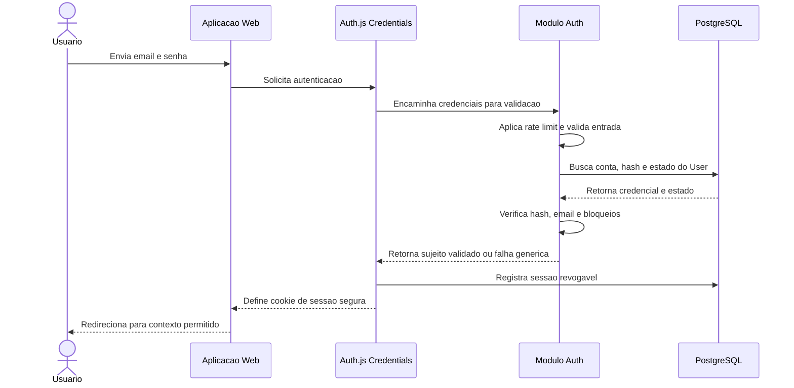
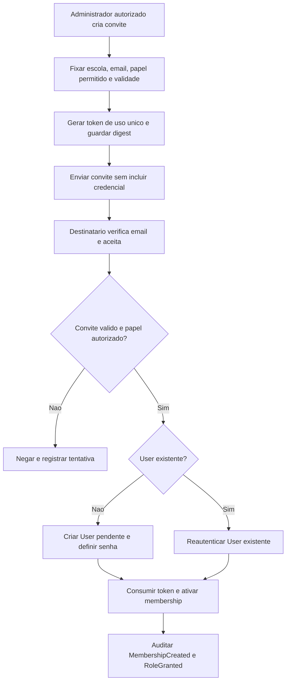

# ADR-0004 - Authentication and Authorization Strategy

**Date**: 2026-09-29  
**Status**: Proposed (aguardando revisao e aprovacao)  
**Deciders**: Architecture Lead, Security Lead, Tech Lead e Product (a confirmar)  
**Affects**: Auth, Users, Schools, Classes, `apps/web`, `packages/database`, `packages/events`, Analytics e integracoes futuras de identidade

---

## 1. Contexto

O MateMagico Champions precisa de uma identidade global capaz de atuar em diversas escolas e em diferentes funcoes, alem de papeis globais de administracao e curadoria. O Documento Mestre descreve Auth.js, mas mistura autenticacao e autorizacao, propoe `jsonwebtoken` separadamente, associa um unico `role` e `schoolId` diretamente a User e trata verificacao de permissao como responsabilidade vaga de um servico RBAC. Isso nao atende ao modelo multi-escola e aos limites de ownership estabelecidos nos ADR-0002 e ADR-0003.

A V1 deve aceitar email e senha, sem implementar um protocolo de autenticacao proprio. Google, Magic Link e MFA devem poder ser adicionados por providers/fluxos suportados e avaliados, sem mudar a identidade interna nem confiar em credenciais vindas de dominios consumidores.

### Restricoes

- Auth.js e o framework de autenticacao; o projeto nao criara protocolo proprio de sessao, token, OAuth ou autenticacao federada.
- V1: email + senha via Auth.js Credentials Provider; senha nunca e guardada em `User` nem em texto puro.
- Uma conta `User` e global, nao pertence a uma unica escola. Associacoes e papeis escolares vivem em memberships.
- Um usuario pode pertencer a varias escolas e ter papeis diferentes em cada uma.
- Dados tenant-owned sao isolados por `schoolId`, conforme ADR-0003; banco/schema por escola nao e permitido.
- Autenticacao, autorizacao, perfil e ciclo de vida institucional sao responsabilidades distintas.
- Nao gerar codigo, schema Prisma, SQL, APIs ou implementacao neste ADR.
- A plataforma atende estudantes menores de idade; privacidade, consentimento, minimizacao e retencao precisam de revisao juridica antes da producao.

### Requisitos

- Formalizar User global, Profile, SchoolMembership, Role e Permission.
- Cobrir os sete papeis solicitados, escopos global/escola/turma/pessoal e permission matrix.
- Definir login, registro, verificacao de email, recuperacao de senha, convite, sessao, logout e revogacao.
- Definir defesas contra brute force, account takeover, CSRF, XSS, session fixation e enumeracao de contas.
- Produzir eventos de auditoria e de ciclo de vida, sem vazar credenciais.
- Restringir eventos de autenticacao enviados a Analytics e dados enviados a provedores de IA.

---

## 2. Decisao

**DECLARACAO DA DECISAO**: A identidade canonica e um `User` global com um perfil unico; o acesso institucional e concedido por `SchoolMembership` e atribuicoes de papeis limitadas a um `schoolId`. Papeis globais sao atribuicoes separadas e nao decorrem de membership. Auth.js Credentials Provider sera usado para email/senha na V1 com estrategia de sessao JWT, requisito documentado pelo provider; uma tabela server-side de registro/revogacao por sessao permite revogar sessoes e detectar desativacao sem colocar papeis ou escolas dentro do token. Autorizacao e avaliada no servidor a cada caso de uso, com deny-by-default e escopo explicito.

### 2.1 Modelo de identidade

#### Quem e o usuario?

**Um usuario e uma identidade global unica**, independente de quantas escolas frequenta, de seu papel atual ou do provider utilizado para autenticar. Uma escola nao cria outra identidade. O mesmo User pode ser estudante em uma escola, professor em outra e possuir outras memberships ativas ou encerradas.

A identidade de autenticacao e associada ao User por `auth_accounts`/credenciais. `UserProfile` guarda dados de produto estritamente necessarios; credenciais, hash de senha, tokens, sessoes, `SchoolMembership` e atribuicoes de acesso sao propriedade do contexto Auth/Authorization, conforme o ownership ja reservado a Auth/Security no ADR-0003. Schools possui os dados da instituicao; Classes possui matriculas em turmas, que nao sao memberships de acesso. A conta nao contem uma unica role nem um `schoolId` principal como fonte de autorizacao.

| Entidade                   | Responsabilidade                                                                             | Regras essenciais                                                                                                                        |
| -------------------------- | -------------------------------------------------------------------------------------------- | ---------------------------------------------------------------------------------------------------------------------------------------- |
| `User`                     | Identidade canonica, estado global e identificador estavel.                                  | Email normalizado e unico globalmente para login por email; estado ativo/suspenso/pendente; nao contem hash de senha nem role escolar.   |
| `Profile`                  | Nome de exibicao e atributos de produto minimizados.                                         | Um perfil por User; campos demograficos opcionais so com finalidade e base aprovadas; nunca fonte de permissao.                          |
| `AuthAccount`              | Vinculo entre User e uma identidade de provider (local, Google futuro ou Magic Link futuro). | Provider + subject/account id unicos; vinculo externo somente apos verificacao forte de propriedade.                                     |
| `PasswordCredential`       | Segredo derivado para login por email/senha.                                                 | Hash Argon2id, metadados de algoritmo/custo e instante de alteracao; nunca senha reversivel, logada ou publicada em evento.              |
| `SchoolMembership`         | Vinculo de User com uma escola e ciclo de vida institucional.                                | Unico vinculo ativo por User/escola; contem `schoolId`; papeis podem ser varios e independentes dentro do vinculo.                       |
| `Role`                     | Conjunto nomeado de responsabilidades e escopo permitido.                                    | Catalogo controlado, com scope class; atribuicao e concessao, nao claim confiavel do browser.                                            |
| `Permission`               | Acao atomica sobre recurso (por exemplo `class.create`).                                     | Nome estavel resource/action; sempre avaliada junto ao escopo e ao recurso.                                                              |
| `RolePermission`           | Relacao entre papel e permissoes.                                                            | Alteracao versionada/auditada; nenhuma role deve receber permissoes implicitas fora da matriz.                                           |
| `MembershipRoleAssignment` | Concessao de papel de escola a uma membership.                                               | Leva `schoolId`, membership, role, grantedBy, validFrom/Until e estado; papel nunca ultrapassa a escola.                                 |
| `GlobalRoleAssignment`     | Concessao de papel global de plataforma.                                                     | Sem schoolId; ator e justificativa obrigatorios; concessao de papeis globais privilegiados requer segundo aprovador, sem auto-concessao. |

`membershipId`, `schoolId`, `roleId` e `permissionId` sao identificadores distintos. `schoolId` escolhe o limite institucional; `membershipId` identifica a relacao user-escola; `roleId` e `permissionId` descrevem autoridade, nao identificam o usuario nem a escola.

#### Exemplo de memberships e papeis

User X possui um `User` e um `Profile`. Na Escola A, uma `SchoolMembership` ativa tem papel `TEACHER`, limitado as turmas para as quais existe atribuicao docente. Na Escola B, outra membership tem papel `COORDINATOR`, com acesso pedagogico institucional da Escola B. Uma tentativa de usar o `membershipId`/`schoolId` de B em uma operacao de A e negada, ainda que o mesmo usuario possa operar nas duas.

A membership representa vinculacao; uma tabela associativa de role assignments permite multiplos papeis por membership. Remover um papel nao apaga a membership. Encerrar uma membership nao apaga historico de auditoria nem transfere papeis para outra escola.

### 2.2 Modelo RBAC e papeis oficiais

RBAC decide se o ator pode executar uma acao; a politica ABAC/contextual limita qual recurso, schoolId, classId, estado e finalidade estao autorizados. Ter uma role significa apenas candidatar-se as permissoes associadas: o caso de uso ainda verifica escopo, membership ativa, ownership e estado do recurso.

| Papel             | Escopo de atribuicao                                      | Responsabilidades                                                                                             | Permissoes e limites                                                                                                                                                                         |
| ----------------- | --------------------------------------------------------- | ------------------------------------------------------------------------------------------------------------- | -------------------------------------------------------------------------------------------------------------------------------------------------------------------------------------------- |
| `STUDENT`         | Escola (via membership); dados pessoais no escopo proprio | Praticar, acompanhar seu progresso e participar de atividades permitidas.                                     | Le apenas os proprios dados e conteudo publicado; nao lista outros estudantes nem administra turma/escola.                                                                                   |
| `TEACHER`         | Escola; classes explicitamente atribuidas                 | Conduzir atividades, acompanhar estudantes das turmas associadas e consultar analytics pedagogico autorizado. | Nao acessa outra escola, turmas nao atribuidas, configuracao escolar, concessao de papeis ou dados administrativos globais.                                                                  |
| `COORDINATOR`     | Escola                                                    | Coordenar turmas/equipe pedagogica e acompanhar indicadores de sua escola.                                    | Nao altera configuracao financeira/identidade global, nao concede roles globais e nao visualiza dados de outra escola.                                                                       |
| `SCHOOL_ADMIN`    | Escola                                                    | Administrar configuracao escolar, usuarios/memberships, turmas e politicas institucionais locais.             | Limitado a propria escola; nao concede `GLOBAL_ADMIN`, `CONTENT_CURATOR` ou `EDITOR_OPERATOR`; sem acesso automatico a segredos de autenticacao.                                             |
| `GLOBAL_ADMIN`    | Global                                                    | Operar governanca da plataforma, escolas e acesso administrativo global.                                      | Acoes globais privilegiadas; acesso a PII/dados academicos detalhados e excepcional, justificado, temporario e auditado (break-glass). Nao pode auto-conceder privilegios nem apagar trilha. |
| `CONTENT_CURATOR` | Global/conteudo                                           | Criar, editar, classificar e importar conteudo educacional em rascunho.                                       | Sem acesso a dados pessoais, memberships, turmas ou resultados individuais; nao aprova/publica o proprio conteudo.                                                                           |
| `EDITOR_OPERATOR` | Global/conteudo                                           | Revisar, aprovar, publicar, retirar e administrar fluxo editorial.                                            | Sem acesso a dados de escola/aluno; nao deve editar conteudo aprovado sem nova versao; publicacao requer autoria/revisao separadas.                                                          |

`GLOBAL_ADMIN`, `CONTENT_CURATOR` e `EDITOR_OPERATOR` sao roles globais, mas suas permissoes continuam diferenciadas: escopo global nao significa acesso universal a qualquer dado. A V1 deve ter ao menos dois operadores globais nominativos e MFA obrigatoria para papeis de alto privilegio antes de habilitar acesso administrativo de producao. Nao usar conta compartilhada de superadmin.

### 2.3 Permission Matrix

`X` indica permissao potencial para o papel; a decisao final ainda depende do escopo e das regras acima. `D` indica criar/alterar rascunho; `A` indica revisar/aprovar/publicar. Ausencia de X e negacao explicita. `Self`, `Assigned`, `School` e `Global` qualificam a celula.

| Acao                               | STUDENT                    | TEACHER                                               | COORDINATOR                               | SCHOOL_ADMIN         | GLOBAL_ADMIN                                       | CONTENT_CURATOR | EDITOR_OPERATOR            |
| ---------------------------------- | -------------------------- | ----------------------------------------------------- | ----------------------------------------- | -------------------- | -------------------------------------------------- | --------------- | -------------------------- |
| Ver/editar perfil proprio          | X Self                     | X Self                                                | X Self                                    | X Self               | X Self                                             | X Self          | X Self                     |
| Ver progresso/analytics individual | X Self                     | X Assigned                                            | X School                                  | X School             | X Global agregado; detalhe break-glass             | -               | -                          |
| Criar/editar turma                 | -                          | -                                                     | X School (criar)                          | X School             | X Global                                           | -               | -                          |
| Matricular/remover estudante       | -                          | X Assigned (propor/solicitar)                         | X School                                  | X School             | X Global (break-glass)                             | -               | -                          |
| Gerenciar escola/configuracao      | -                          | -                                                     | -                                         | X School             | X Global                                           | -               | -                          |
| Administrar usuarios da escola     | -                          | -                                                     | X School (membership limitada)            | X School             | X Global                                           | -               | -                          |
| Administrar usuarios globais       | -                          | -                                                     | -                                         | -                    | X Global                                           | -               | -                          |
| Conceder/remover roles escolares   | -                          | -                                                     | -                                         | X School (allowlist) | X Global, com dupla aprovacao em privilegiadas     | -               | -                          |
| Conceder/remover roles globais     | -                          | -                                                     | -                                         | -                    | X Global, sem auto-concessao e com dupla aprovacao | -               | -                          |
| Criar/editar questao               | -                          | D Assigned (rascunho pessoal, se habilitado)          | D School (se habilitado)                  | -                    | D Global (break-glass editorial)                   | X D Global      | -                          |
| Importar questoes/fontes           | -                          | -                                                     | -                                         | -                    | X Global (operacao auditada)                       | X D Global      | X conforme fluxo editorial |
| Revisar/aprovar/publicar questao   | -                          | -                                                     | -                                         | -                    | X Global (emergencia auditada)                     | -               | X A Global                 |
| Criar campeonato                   | -                          | X School (solicitar/criar local se politica permitir) | X School                                  | X School             | X Global                                           | -               | -                          |
| Gerar/verificar certificados       | X Self (consultar proprio) | X Assigned (consultar)                                | X School                                  | X School             | X Global (detalhe auditado)                        | -               | -                          |
| Consultar audit log                | -                          | -                                                     | X School (eventos pedagogicos permitidos) | X School             | X Global (dados minimizados; break-glass em PII)   | -               | -                          |

As permissoes de criar conteudo por professor/coordenador sao configuraveis por politica, desabilitadas por padrao na V1 ate existir fluxo de autoria/revisao. A matrix nao substitui o catalogo atomico `Permission`; antes da implementacao, cada `X` deve ser convertido em permissao nomeada com testes positivos e negativos.

### 2.4 Escopos de autorizacao e regra de avaliacao

| Escopo   | Quem pode atuar                                                                                      | Limite obrigatorio                                                                                                               |
| -------- | ---------------------------------------------------------------------------------------------------- | -------------------------------------------------------------------------------------------------------------------------------- |
| Global   | `GLOBAL_ADMIN` para administracao; `CONTENT_CURATOR`/`EDITOR_OPERATOR` somente para conteudo global. | Permissao global especifica; role editorial nao herda acesso escolar; acesso de administrador a dado sensivel usa break-glass.   |
| School   | Qualquer papel escolar com `SchoolMembership` ativa e permissao correspondente.                      | `schoolId` da membership precisa corresponder ao recurso; nao aceitar tenant escolhido pelo cliente sem validar.                 |
| Class    | `TEACHER` com atribuicao ativa a turma; `COORDINATOR`/`SCHOOL_ADMIN` segundo permissao escolar.      | `class.schoolId == membership.schoolId`; estudante so entra na propria matricula; contexto de turma nao amplia para toda escola. |
| Personal | O proprio usuario; representantes apenas por fluxo de consentimento/mandato formal.                  | Recurso deve pertencer ao `userId` autenticado; troca de ID na URL nao muda ownership.                                           |

Nao ha heranca automatica de papeis pessoais para escola nem de escola para global. Uma role escolar sempre restringe ao `schoolId` da concessao. Uma acao so e autorizada quando todos os predicados forem verdadeiros:

1. Sessao Auth.js valida, nao expirada e nao revogada.
2. `User` ativo e email verificado quando a acao exigir conta ativada.
3. Permissao `resource:action` atribuida a role vigente do ator.
4. Escopo solicitado resolvido no servidor; membership/atribuicao de turma vigente.
5. Recurso existe, pertence ao school/class/user esperado e esta no estado que permite a operacao.
6. Para acao privilegiada, motivo/aprovacao adicional e audit trail quando definidos.

Sessao identifica o sujeito, nao declara autorizacao permanente. Claims de token contem somente identificador de usuario, identificador da sessao e timestamps necessarios; roles, permissions, `schoolId` e `membershipId` nao sao confiados a partir de JWT antigo. Alteracao/revogacao de papel vale imediatamente nos checks de autorizacao.

### 2.5 Estrategia de sessao

| Estrategia                                                | Vantagens                                                                          | Custos / riscos                                                                                                       | Adequacao                                                                                 |
| --------------------------------------------------------- | ---------------------------------------------------------------------------------- | --------------------------------------------------------------------------------------------------------------------- | ----------------------------------------------------------------------------------------- |
| JWT puro                                                  | Cookie HttpOnly, sem consulta a banco para cada leitura de sessao, escala simples. | Revogacao antes de expirar exige blocklist/consulta; claims de papel ficam obsoletas; token roubado vive ate expirar. | Insuficiente como sessao sem registro para revogacao e mudancas de estado.                |
| Database Session Auth.js                                  | Revogacao/alteracao central, sessoes e sign-out-all naturais.                      | Consulta persistente, custo de round-trip e incompatibilidade com a exigencia do Credentials Provider para V1.        | Reavaliar se V1 migrar para providers com database sessions e compatibilidade confirmada. |
| Hybrid com access JWT + refresh/session token persistente | Revogacao e rotacao controlaveis com access token curto.                           | Protocolo de refresh, replay detection e mais estados/fluxos; pode virar autenticacao proprietaria se mal delimitado. | Nao escolhido para V1; reavaliar somente com requisito demonstrado.                       |

**Escolha V1**: Auth.js com `session.strategy = JWT`, mais registro server-side `auth_sessions`/`session_registry`. A documentacao oficial do Auth.js informa que Credentials nao persiste usuarios no banco e so pode ser usado com JWT sessions; portanto a escolha atende ao provider sem confundir o registro de revogacao com a Database Session do adapter. Auth.js continua responsavel por validar e proteger a sessao/cookie; `auth_sessions` apenas permite revogacao, limite de sessao e auditoria.

**Duracao e renovacao**:

- Validade absoluta inicial: 8 horas por sessao.
- Inatividade maxima: 30 minutos; atividade autenticada renova a janela ociosa ate o limite absoluto.
- Sem “lembrar deste dispositivo” na V1. Duracoes maiores exigem decisao de risco separada e MFA.
- Rotacao de identificador de sessao em login, elevacao de privilegio, reset/troca de senha e mudanca de fator de autenticacao.
- `auth_sessions` guarda `sessionId`/identificador nao secreto, `userId`, `createdAt`, `lastSeenAt`, `absoluteExpiresAt`, `idleExpiresAt`, `revokedAt`, `revocationReason` e metadados de dispositivo minimizados. Nunca guarda JWT/cookie em claro.

**Revogacao e logout**:

- Logout desta sessao: Auth.js limpa cookie e Auth marca registro atual como revogado.
- “Sair de todos”: revoga todos os registros ativos do usuario e incrementa um marcador de credenciais/sessao consultado na validacao.
- Password reset, suspensao de conta, suspeita de takeover e revogacao de MFA revogam todas as sessoes.
- A cada acesso protegido, verificar expiracao/estado da sessao e estado atual do usuario; acoes sensiveis tambem consultam memberships/roles atuais. Cache so pode ser usado se invalida imediatamente em revogacao/role change; permissoes privilegiadas nao usam cache permissivo stale.
- Falha de banco ao verificar revogacao em acao protegida resulta em fail-closed.

### 2.6 Fluxos de identidade e login

#### Registro e primeiro acesso

1. Usuario informa email, senha e dados minimos de perfil; servidor valida formato e politica, normaliza email e aplica rate limit.
2. Criar User em estado `PENDING_EMAIL`, profile minimo e password credential com hash. Resposta externa nao revela se email ja existe.
3. Enviar link de verificacao com token aleatorio de uso unico, armazenando somente digest e expiracao; email verificado ativa a conta.
4. Conta estudante nao ganha membership automaticamente. Vinculo escolar ocorre por convite ou fluxo institucional autorizado; autoinscricao so pode existir como permissao de produto separada.
5. Antes de coletar dados de menor, definir fluxo de idade/consentimento e bases aplicaveis; nao inferir idade com analytics nem liberar perfil completo sem necessidade.

#### Login

1. Formulario submete email/senha por fluxo protegido de Auth.js Credentials; validacao e sempre server-side.
2. Rate limiter avalia conta normalizada e origem; erros sao genericos para usuario inexistente, senha errada ou conta pendente.
3. Auth procura identidade/credential, verifica status, email e hash Argon2id com comparacao apropriada; usuario/senha invalidos nao criam sessao.
4. Auth.js conclui login e emite cookie JWT HttpOnly; registrar sessao ativa para expiracao/revogacao.
5. O usuario escolhe uma escola ativa apenas entre memberships autorizadas; selecao define contexto da proxima operacao, nao concede acesso.
6. Cada caso de uso verifica permissao e recurso/escopo novamente. Trocar escola nao muda a role ou dados presentes no JWT.

#### Recuperacao e troca de senha

- Solicitacao sempre responde de forma generica e com latencia semelhante, exista ou nao a conta.
- Token de reset e aleatorio, de alta entropia, uso unico, validade inicial de 30 minutos e armazenado somente como digest. Limitar envios por conta/origem.
- Consumo do token troca o hash, marca tokens anteriores como invalidos, revoga todas as sessoes, emite `PasswordChanged` e notifica o usuario.
- Troca a partir de sessao ativa requer senha atual ou reautenticacao recente; nao basta ter uma sessao longa aberta.
- Nunca enviar senha, hash ou token em logs, Analytics, audit diff, notificacao de terceiro ou contexto de IA.

#### Convite institucional

- Convite e criado por papel autorizado, limitado a `schoolId`, email normalizado, papeis allowlisted e prazo de validade.
- Convite nao e membership ativa nem credencial. Token e uso unico, armazenado como digest, expira em 7 dias como valor inicial e pode ser revogado pelo emissor/administrador.
- Destinatario confirma controle do email, autentica/cria User e aceita o convite. O servidor revalida escola, estado e permissao do emissor antes de ativar a membership.
- Convite nao pode atribuir papel global, ampliar papel do emissor, trocar de escola ou ser reaproveitado em outra conta/email.

#### Verificacao de email e providers futuros

- Email primario precisa estar verificado antes de login com privilegio escolar e antes de receber/resetar senha; conta pendente nao ganha membership efetiva.
- Google Login futuro: validar callback/issuer/audience/nonce/state via provider Auth.js, exigir email verificado conforme evidencias do provider e nao vincular conta apenas por igualdade de email sem prova de controle/reautenticacao.
- Magic Link futuro: usar provider de email Auth.js, token de uso unico/digest/expiracao e limitacao de envio; evitar enumeracao.
- MFA futuro: planejar fator por usuario e recuperacao com codigos de uso unico guardados como hash; exigir step-up para `GLOBAL_ADMIN`, `SCHOOL_ADMIN` que gerencie acesso e operadores editoriais privilegiados antes de liberar em producao. Preferir mecanismo suportado/auditado, nao criptografia de fator feita pelo produto.

### 2.7 Estrategia de seguranca (OWASP)

| Ameaca/controle                 | Decisao normativa                                                                                                                                                                                                                                                                                                 |
| ------------------------------- | ----------------------------------------------------------------------------------------------------------------------------------------------------------------------------------------------------------------------------------------------------------------------------------------------------------------- |
| Senhas                          | Minimo 15 caracteres para login apenas com senha; aceitar passphrases, Unicode e password managers; tamanho maximo minimo 128; bloquear senhas comuns/comprometidas; sem regras arbitrarias de composicao nem rotacao periodica forçada. Troca forcada apenas por suspeita/compromisso, requisito legal ou risco. |
| Armazenamento de senha          | Argon2id com salt unico e parametros calibrados em hardware de producao conforme orientacao OWASP vigente; rehash gradual quando parametro mudar. Hash e salt nunca exportados. Nao usar criptografia reversivel ou hash rapido (MD5/SHA simples).                                                                |
| Rate limiting                   | Limite combinado por conta normalizada, IP/rede e sinal de risco, com limites diferentes para login, registro, verificacao, convite e reset. Armazenamento distribuido compartilhado entre instancias; respostas nao expoem contador sensivel.                                                                    |
| Lockout                         | Atraso progressivo/temporario e desafio adaptativo apos abuso; evitar bloqueio permanente por tentativas para impedir negacao de servico contra vitimas. Desbloqueio exige periodo ou verificacao forte e gera evento de seguranca.                                                                               |
| Brute force/credential stuffing | Mensagem uniforme, rate limit, monitoracao por padrao de falha, protecao de origem/rede, validacao de senha comprometida e alerta em comportamento anomalo. CAPTCHA somente como defesa adaptativa, acessivel e apos sinais de abuso.                                                                             |
| Account takeover                | Verificar email, notificacao de reset/troca/novo fator, revogacao geral de sessoes, reautenticacao para acoes sensiveis, vinculo seguro de provider e fluxo de recuperacao que nao degrade MFA.                                                                                                                   |
| CSRF                            | Usar protecoes do Auth.js para actions/callbacks; mutacoes exigem origem confiavel, protecao anti-CSRF adequada ao mecanismo e metodos HTTP corretos. Cookie SameSite=Lax e defesa adicional, nao unico controle.                                                                                                 |
| Cookie/session                  | HTTPS; cookie host-only, `Secure`, `HttpOnly`, `SameSite=Lax`, `Path=/` e prefixo `__Host-` quando compatibilidade permitir; nunca expor token a JavaScript, URL, localStorage ou logs. Secret/Auth.js keys fortes, rotacionaveis e fora do repositorio.                                                          |
| Session fixation                | Auth.js emite sessao nova apos login; rotacionar sessionId em elevacao de privilegio/reauth; ignorar session id fornecido pelo cliente; cookies antigos sao invalidados no logout/rotacao.                                                                                                                        |
| XSS                             | CSP restritiva com nonce/hash quando possivel, encoding contextual, sanitizacao de HTML rico/editorial, dependencias seguras e proibicao de interpolar conteudo de questao sem sanitizacao. Defesa XSS nao substitui HttpOnly.                                                                                    |
| Email verification              | Tokens unicos, digest no banco, expiracao, limite de envio e consumo atomico; email nao verificado nao realiza operacoes institucionais privilegiadas; resend nao confirma existencia da conta.                                                                                                                   |
| Recuperacao de conta            | Fluxo mais forte que pergunta secreta (perguntas de seguranca proibidas); canal verificado, token curto/uso unico e revogacao das sessoes; suporte administrativo nao pode revelar senha nem bypassar MFA sem auditoria/duplo controle.                                                                           |
| MFA                             | Planejar agora; ativacao obrigatoria para papeis globais/privilegiados antes de liberar esses papeis em producao. MFA e step-up em concessao de role, exportacao sensivel, mudanca de fatores e break-glass.                                                                                                      |
| Segredos e dados                | Separar segredos por ambiente, menor privilegio, rotacao; eliminar senha/token/hash de logs, traces, audit payload, eventos e prompts de IA. Tratar PII de estudante segundo minimizacao/retencao e LGPD.                                                                                                         |
| Erros                           | Usuario recebe erro generico e correlation id; detalhes tecnicos ficam em observabilidade com redacao. Nao revelar existencia de email, membership, escola ou role.                                                                                                                                               |

### 2.8 Auditoria e eventos de seguranca

`audit_logs` e trilha append-only de seguranca/governanca; nao substitui eventos de dominio nem e atualizado para sobrescrever acao passada. Cada registro inclui, conceitualmente:

- **Quem**: actorUserId ou identificador de sistema/servico; indicar operacao automatizada.
- **Quando**: timestamp UTC confiavel e correlation/request id.
- **Onde**: schoolId/membershipId quando escolar; scope global/class/personal; recurso e identificador; origem de rede/dispositivo minimizada conforme retencao aprovada.
- **O que**: acao normalizada, resultado (success/denied/failure), motivo/codigo, campos alterados e referencia ao objeto.
- **Governanca**: impersonation/break-glass, approver, justificativa, versao da regra e contexto de correlacao quando aplicavel.

Audit diff registra nomes de campos e valores nao sensiveis quando realmente necessario; password, hash, token, cookie, segredo MFA e payload de resposta privada nunca entram no diff. Acesso a audit log e tambem auditado, com visibilidade tenant-scoped e retencao alinhada ao ADR-0003 e revisao juridica.

| Evento              | Produtor                                        | Consumidores                                                  | Payload conceitual minimo                                                          |
| ------------------- | ----------------------------------------------- | ------------------------------------------------------------- | ---------------------------------------------------------------------------------- |
| `UserCreated`       | Users (apos `UserRegistered` originado em Auth) | Audit, notification, Analytics agregado se permitido          | userId, occurredAt, origem, estado inicial; sem email/senha no evento analitico    |
| `UserInvited`       | Auth/Authorization (convite escopado a escola)  | Audit, Notifications                                          | actorId, inviteId, schoolId, papel solicitado, emailRef/digestRef, expiracao       |
| `UserActivated`     | Users (apos evento de email verificado de Auth) | Audit, Analytics agregado                                     | userId, ocorreuEm, metodo de verificacao                                           |
| `PasswordChanged`   | Auth                                            | Audit, revogacao de sessoes, alerta ao usuario                | userId, occurredAt, sessionCountRevoked; nunca hash ou senha                       |
| `RoleGranted`       | Auth/Authorization                              | Audit, invalidacao de cache, Analytics agregado               | actorId, targetUserId, roleId, scope, schoolId/membershipId, validade, approverRef |
| `RoleRevoked`       | Auth/Authorization                              | Audit, invalidacao de cache e sessoes elevadas                | actorId, targetUserId, roleId, scope, schoolId/membershipId, motivo categorizado   |
| `MembershipCreated` | Auth/Authorization                              | Audit, provisionamento permitido, Analytics                   | userId, membershipId, schoolId, origem/convite, estado                             |
| `MembershipRemoved` | Auth/Authorization                              | Audit, revogacao de contexto e invalidação de cache           | actorId, userId, membershipId, schoolId, motivo, effectiveAt                       |
| `UserSuspended`     | Users (suspensao global da conta)               | Auth (revoga sessoes), audit, notifications conforme politica | actorId, userId, motivo categorizado, escopo global, effectiveAt                   |
| `UserReactivated`   | Users (reativacao global da conta)              | Auth, audit                                                   | actorId, userId, escopo global, effectiveAt, aprovacaoRef                          |

Eventos adicionais de seguranca: `LoginSucceeded`, `LoginFailed`, `Logout`, `PasswordResetRequested`, `PasswordResetCompleted`, `EmailVerified`, `SessionRevoked`, `MFAEnrolled`, `MFARecoveryUsed`, `PrivilegedAccessUsed`. Eventos de falha sao agregados/rate limited; nao criar um evento detalhado contendo senha, email bruto ou token por tentativa.

### 2.9 Integracao com Analytics

Analytics pode receber apenas eventos necessarios para metricas de acesso, engajamento e retencao:

| Uso                   | Eventos/dimensoes permitidos                                                   | Minimizacao                                                                                                                     |
| --------------------- | ------------------------------------------------------------------------------ | ------------------------------------------------------------------------------------------------------------------------------- |
| Acesso                | LoginSucceeded/Failed, Logout, UserActivated, PasswordResetCompleted           | Contagens por periodo, provider/categoria e resultado; sem senha, token, email bruto ou fingerprint persistente.                |
| Engajamento/retencao  | Usuario ativo por dia/semana, membership ativa, inicio de atividade pedagogica | ID pseudonimo rotativo ou agregacao; schoolId somente para metrica institucional autorizada e com controle de celulas pequenas. |
| Seguranca operacional | Rate limit, bloqueio temporario, SessionRevoked, MFARecoveryUsed               | Fluxo primeiro-party restrito; ferramentas analiticas externas recebem no maximo contagem/coorte agregada.                      |
| Acesso administrativo | RoleGranted/Revoked, MembershipCreated/Removed e break-glass                   | Auditoria de seguranca e dashboards autorizados; nao usar dados de login para perfil comercial ou publicidade.                  |

`audit_logs` e a evidencia detalhada; Analytics recebe projecao minima e eventualmente consistente. Definir consentimento, retencao, anonimização e base legal antes de ligar PostHog/servico externo a eventos de identidade, sobretudo para menores. `schoolId` precisa ser incluido em todo agregado escolar e nao pode ser deduzido de IP/email.

### 2.10 Integracao com IA futura

`RecommendationProvider`, `TutorProvider` e `StudyAdvisor` recebem somente contexto pedagogico minimo necessario, fornecido pelo modulo chamador por porta explicita. Nenhum contrato de IA aceita credenciais, senha/hash, cookie, JWT, token Auth.js, email de login, MFA secret ou URL de reset/convite. Identidade deve ser substituida por referencia pseudonima scoped quando nao indispensavel; tenant e finalidade seguem politica e consentimento. Provedores nao fazem login, criam User, concedem role, validam membership ou recebem acesso direto ao Auth/Users DB.

| Contrato conceitual      | Contexto de entrada permitido                                                                                   | Resultado esperado                                                                                   | Limites                                                                                                                                                                        |
| ------------------------ | --------------------------------------------------------------------------------------------------------------- | ---------------------------------------------------------------------------------------------------- | ------------------------------------------------------------------------------------------------------------------------------------------------------------------------------ |
| `RecommendationProvider` | Topicos/habilidades elegiveis, nivel e progresso agregado pseudonimo, objetivo e versao da politica pedagogica. | Itens/temas recomendados, ordenacao, justificativas legiveis, confianca e referencia de versao.      | Nao recebe identidade de login, membership nem tentativa bruta que nao seja necessaria; recomendacao nao concede permissao nem altera trilha sem validacao do modulo chamador. |
| `TutorProvider`          | Snapshot publicado da questao, resposta/duvida minimizada e contexto pedagogico permitido.                      | Explicacao gradual, dicas e referencias ao conteudo-fonte, com sinal de incerteza quando apropriado. | Nao recebe gabarito oculto antes de submissao autorizada; nao substitui avaliacao oficial, nao persiste perfil nem acessa conversa historica sem politica aprovada.            |
| `StudyAdvisor`           | Objetivo do aluno, janela de estudo, progresso agregado e conjunto permitido de recursos/skills.                | Plano sugerido com etapas, rationale, prioridades e versao do modelo/politica.                       | Nao recebe email, credencial, papel, dados de colegas ou PII desnecessaria; plano e sugestao ate ser validado/aceito por Study Paths.                                          |

As tres portas sao provider-neutral e invocadas pelo dominio pedagogico com escopo de finalidade; erros/timeouts nao bloqueiam login, autorizacao ou fluxo transacional de estudo. A autenticacao nao passa contexto de sessao ao provedor de IA.

### 2.11 Estrategia Prisma: entidades conceituais

| Entidade/tabela conceitual           | Owner              | Papel                                                                                                                                                         |
| ------------------------------------ | ------------------ | ------------------------------------------------------------------------------------------------------------------------------------------------------------- |
| `users`                              | Users              | Identidade global, email normalizado/unico, estado e timestamps; sem passwordHash/role/schoolId.                                                              |
| `profiles` / `user_profiles`         | Users              | Perfil minimo, relacao um-para-um com User. ADR-0003 usa o nome `user_profiles`; alinhar nomenclatura antes do schema inicial.                                |
| `school_memberships`                 | Auth/Authorization | Vínculo de acesso user-school, `schoolId`, estado, validade e referencia ao emissor; nao mistura roles num campo unico. Schools continua dono da instituicao. |
| `membership_role_assignments`        | Auth/Authorization | Papeis vinculados a `membershipId`, `schoolId`, role e concessor/validade.                                                                                    |
| `global_role_assignments`            | Auth/Authorization | Papeis sem tenant, concessor, aprovador, justificativa e validade.                                                                                            |
| `roles`                              | Auth/Authorization | Catalogo oficial de roles e classe de escopo (global, school, class, personal).                                                                               |
| `permissions`                        | Auth/Authorization | Catalogo atomico `resource:action` e metadado de escopo/criticidade.                                                                                          |
| `role_permissions`                   | Auth/Authorization | Associacao role-permission, versionada/auditada.                                                                                                              |
| `auth_accounts`                      | Auth               | Vinculos de provider (provider + subject) para Auth.js/adapters futuros; nao confundir com User nem com membership.                                           |
| `password_credentials`               | Auth               | Hash Argon2id, versao de algoritmo e passwordChangedAt; acesso restrito ao Auth.                                                                              |
| `sessions` / `auth_sessions`         | Auth               | Registro de revogacao/expiracao por JWT session id; **nao** tabela de Database Session nativa do Auth.js na V1. Sem token em claro.                           |
| `email_verification_tokens`          | Auth               | Digest, expiracao, consumo e destino associado, com acesso restrito.                                                                                          |
| `password_reset_tokens`              | Auth               | Digest de token de uso unico e expiracao; invalidado apos reset.                                                                                              |
| `school_invitations`                 | Auth/Authorization | Convite com schoolId, emailRef, roles permitidas, expiracao, emissor e estado; secret nunca em claro.                                                         |
| `audit_logs`                         | Security/Auth      | Trilha append-only, scope escolar/global e diff redigido.                                                                                                     |
| `login_security_events`              | Security/Auth      | Eventos agregados de abuso/autenticacao; retencao curta conforme ADR-0003.                                                                                    |
| `mfa_factors` / `mfa_recovery_codes` | Auth (futuro)      | Fatores e hashes de recovery codes; MFA secret protegido e nunca exportado.                                                                                   |

IDs seguem UUID PostgreSQL do ADR-0003. Constraints compostas devem garantir que role assignment escolar, membership, User e `schoolId` correspondam; um ID valido isoladamente nao autoriza acesso. Prisma e apenas persistencia, e objetos Prisma nao sao exportados como contrato publico.

### 2.12 Atualizacoes necessarias nos ADRs existentes

| Documento                     | Inconsistencia atual                                                                                                                                                                                                      | Atualizacao recomendada                                                                                                                                                              |
| ----------------------------- | ------------------------------------------------------------------------------------------------------------------------------------------------------------------------------------------------------------------------- | ------------------------------------------------------------------------------------------------------------------------------------------------------------------------------------ |
| ADR-0001 em `ARCHITECTURE.md` | O exemplo User/password/role/schoolId foi substituido por User global e refs de UUID; grafos e tabelas antigas permanecem apenas como historico explicitamente nao normativo.                                             | Antes de aceitar ADR-0001, validar a estrategia JWT/Auth.js em vertical slice e retirar qualquer exemplo legado ainda apresentado como regra.                                        |
| ADR-0002                      | `schoolId` e o identificador oficial; ownership Auth/Authorization, Users, Schools e Classes foi explicitado. Produtores/consumidores e semantica dos eventos de identidade exigem contract tests e registry operacional. | Manter um unico registry versionado; distinguir `UserRegistered` (Auth identity) de `UserCreated`/`UserActivated` (Users lifecycle), e membership events de class enrollment events. |
| ADR-0003                      | Data Map separa Auth/Authorization, `school_memberships` e `class_enrollments`; schema fisico, constraints compostas e compatibilidade Auth.js adapter continuam conceituais.                                             | Congelar `membership_role_assignments`, `auth_sessions` revocation registry, constraints tenant-aware e adapter mapping antes do schema inicial.                                     |

### 2.13 Alternativas consideradas

#### Autenticacao e sessao proprias

**Descricao**: implementar protocolo proprio de senha, cookies, JWT, refresh e federacao.

**Vantagens**: controle total do ciclo.

**Desvantagens**: alto risco de falha em criptografia, CSRF, rotacao, abuso e compatibilidade; contraria requisito de usar Auth.js.

**Rejeicao**: Auth.js e obrigatorio; o modulo implementa somente a verificacao de credencial que Credentials requer e deixa gestao do protocolo/cookie ao framework.

#### Apenas Auth.js Database Sessions

**Descricao**: utilizar session ID opaco gerido integralmente pelo adapter.

**Vantagens**: revogacao central e estado de sessao mutavel no banco.

**Desvantagens**: Credentials Provider exige JWT sessions segundo a documentacao oficial atual; nao e compativel com a V1 escolhida sem mudar provider/requisito.

**Rejeicao para V1**: manter como opcao futura se login mudar para provider compatível e teste de compatibilidade confirmar o fluxo.

#### JWT sem registro server-side

**Descricao**: aceitar sessao ate `exp` e apenas limpar cookie no logout.

**Vantagens**: menor numero de leituras e estado operacional.

**Desvantagens**: nao revoga token roubado antes do prazo, nao reage imediatamente a suspensao e complica logout geral.

**Rejeicao**: registro de revogacao da sessao e validacao do estado de conta sao obrigatorios para esse produto.

#### Uma role e uma escola dentro de User/JWT

**Descricao**: guardar role/school no perfil/token e usar para todas as autorizacoes.

**Vantagens**: simples para uma escola e acesso rapido.

**Desvantagens**: nao representa papel contextual/multi-escola e cria permissoes stale e tenant leakage.

**Rejeicao**: memberships e atribuicoes independentes sao fonte de autorizacao.

### Por que esta escolha

Auth.js reduz superficie de implementacao do protocolo de sessao e viabiliza providers futuros. O provider Credentials, requerido para login email/senha na V1, implica JWT sessions e delega ao projeto a validacao e persistencia segura de credenciais; isso e uma responsabilidade delimitada do modulo Auth, nao uma implementacao de protocolo proprio. Registro server-side de sessoes resolve revogacao e logout geral, enquanto a avaliacao de roles atuais no banco evita claims de acesso stale. User global e memberships por escola refletem a realidade de usuarios com multiplas afiliacoes sem misturar identidade, contexto e privilegio.

| Decisao                              | Ganho                                                             | Custo/risco aceito                                                                             |
| ------------------------------------ | ----------------------------------------------------------------- | ---------------------------------------------------------------------------------------------- |
| Auth.js Credentials + JWT session V1 | Compatibilidade com V1 e cookies/protocolo geridos pelo framework | Validacao de password e risco de abuso permanecem sob responsabilidade operacional do produto. |
| JWT + registro revogavel de sessao   | Revogacao antes do expiry e estado de conta atual                 | Consulta/estado adicional por request protegido; potencialmente menos stateless.               |
| RBAC + escopo contextual             | Papel reutilizavel com isolamento forte multi-escola              | Mais checks/testes e necessidade de catalogo governado.                                        |
| User global + memberships            | Uma identidade para qualquer numero de escolas                    | Provisionamento/convites precisam ser precisos e auditados.                                    |

---

## 3. Consequencias

### Positivas

1. A mesma identidade pode atuar em varias escolas sem misturar permissoes ou dados.
2. Auth.js controla a sessao/cookie e providers futuros podem ser integrados sem alterar User.
3. Roles e permissoes atuais nao ficam presas a claims JWT desatualizadas.
4. Auditoria consegue atribuir acoes a ator, escola, membership, recurso e instante sem registrar segredo.
5. Curadoria editorial e administracao de escola ficam separadas de acesso a PII e dados de aprendizagem.

### Negativas

1. V1 ainda exige armazenamento e validacao cuidadosa de password credential; Auth.js Credentials nao fornece password hashing, rate limiting, reset ou armazenamento por conta propria.
2. O registro server-side reduz o beneficio de stateless puro e adiciona consulta/retencao operacional.
3. RBAC com role assignments e memberships e mais complexo que uma role global em User.
4. Google/Magic Link/MFA nao estao habilitados automaticamente pela decisao; providers, linking e recovery exigem revisao/protecao separadas.
5. Mudancas em papeis/sessao exigem propagacao consistente para cache, outbox e Analytics.

### Trade-offs aceitos

| Trade-off                                    | Aceito porque                                              | Monitorar                                   |
| -------------------------------------------- | ---------------------------------------------------------- | ------------------------------------------- |
| Consulta de revogacao server-side            | Revogacao de acesso precisa ser rapida                     | latencia, falhas e disponibilidade do store |
| JWT curto em vez de refresh duradouro        | Reduz janela de token comprometido e evita protocolo extra | taxa de novo login e falhas de renovacao    |
| Roles globais separadas das escolares        | Evita elevacao e vazamento entre escolas                   | tentativas negadas e grants privilegiados   |
| Auditoria append-only com payload minimizado | Fornece evidencia sem copiar segredos                      | completude, retencao e acesso ao audit log  |

---

## 4. Riscos

| ID  | Risco                                                              | Severidade | Probabilidade | Mitigacao                                                                                               |
| --- | ------------------------------------------------------------------ | ---------- | ------------- | ------------------------------------------------------------------------------------------------------- |
| R1  | Falha de hashing, verificacao ou reset de senha                    | Critica    | Media         | Argon2id, bibliotecas mantidas, revisao de seguranca, testes de fluxo e rotacao/revogacao.              |
| R2  | Permissao avaliada sem schoolId correto ou membership ativa        | Critica    | Media         | Contexto tenant server-side, deny-by-default, constraints e testes negativos de cross-tenant.           |
| R3  | JWT comprometido permanece valido depois de logout/suspensao       | Alta       | Media         | Ledger de sessao, consulta a cada request protegido, expiracao absoluta curta e revogacao geral.        |
| R4  | Cache de RBAC mantem papel revogado                                | Alta       | Media         | Sem claims de role; invalidacao imediata e cache fail-closed para papeis sensiveis.                     |
| R5  | Abuso de login/reset causa brute force ou enumeracao               | Alta       | Alta          | Rate limits distribuidos, resposta generica, atraso progressivo, deteccao e monitoracao.                |
| R6  | Convite concede papel/escola indevida ou e reutilizado             | Alta       | Media         | Token digest de uso unico, email + escola + papel fixos, emissor autorizado e revalidacao na aceitacao. |
| R7  | GLOBAL_ADMIN/operador editorial comprometido                       | Critica    | Media         | MFA obrigatoria, contas nominativas, dupla aprovacao, step-up e break-glass auditado.                   |
| R8  | Dados de menores/credenciais vazam em logs, analytics ou IA        | Critica    | Media         | Minimizacao, redacao automatizada, segregacao de acesso e revisao LGPD/retencao antes do go-live.       |
| R9  | Vinculo de provider social por igualdade de email permite takeover | Alta       | Media         | Linking somente com prova de controle, reautenticacao e validacao de email/provider.                    |
| R10 | Desalinhamento de schema Auth.js adapter com entidades conceituais | Media      | Media         | Testar a versao escolhida e manter adapter mapping documentado sem alterar ownership de User.           |

### Sinais de revisao

- Qualquer autorizacao aceita sem registrar scope validado, ou uma acao escolar sem `schoolId`/membership correspondente.
- Uma sessao continua autorizada apos revogacao, password reset, suspensao ou role removal.
- Aumento anormal de falhas/login/reset, bloqueios por conta ou concessoes de papeis privilegiados.
- MFA indisponivel para papel privilegiado em producao, ou evento break-glass sem justificativa/aprovador.
- Segredo, hash, token ou PII de estudante encontrado em log, evento externo ou payload de Analytics/IA.

---

## 5. Implementacao (diretriz, nao codigo)

1. Aprovar este ADR e confirmar politica de privacidade, consentimento, idade minima/consentimento parental e retencao com assessoria juridica.
2. Resolver alinhamento de nomes/ownership com ADR-0003 (`user_profiles`, `auth_sessions`, `school_memberships`, assignments) e definir o contrato Auth.js adapter para a versao escolhida.
3. Antes de habilitar login publico, aprovar threat model, politica de senha/hash, rate limiter distribuido, email de verificacao/reset, secrets e plano de resposta a incidente.
4. Antes de habilitar papeis privilegiados em producao, disponibilizar MFA, contas nominativas, dupla aprovacao e break-glass auditavel.
5. Converter permission matrix em catalogo atomico e testes de autorizacao por papel/escopo, incluindo casos negativos cross-school/class/personal.
6. Exercitar cadastro, verificacao, login, reset, convite, revogacao, logout-all, troca de escola, suspensao e role change com testes de integracao/seguranca.
7. Revisar eventos encaminhados ao Analytics e provedores externos com minimizacao e retencao; manter auth event stream restrito.
8. Documentar runbooks de incidente, revogacao global, recuperacao de conta, rotacao de secrets e reconciliacao de memberships.

### Componentes afetados

- `packages/modules/auth`: adaptacao Auth.js, credential verification, lifecycle e sessao.
- `packages/modules/users`: User/Profile, estado e preferencias, sem senha ou role escolar.
- `packages/modules/schools` e `classes`: memberships, convites e atribuicoes de turma.
- `packages/database`: entidades conceituais do ADR-0003 e constraints tenant-aware.
- `packages/events`: eventos minimizados e revogacao/cache invalidation.
- `apps/web`: formularios/fluxos de entrada, contexto ativo e guards; UI nao decide autorizacao.
- `packages/analytics`: projecoes aprovadas, sem segredos ou identificadores desnecessarios.

### Observabilidade

Adotar o baseline comum de `ADR-TEMPLATE.md`: OpenTelemetry, Correlation ID, structured logging redigido, error tracking, metrics e tracing. Auth/Authorization mede login success/failure agregado, rate-limit, reset, sessao/revocacao, decision latency e negacoes por categoria; nunca envia senha, token, email bruto ou MFA secret a logs/telemetria. Traces atravessam Auth.js adapter, Authorization/Application e persistencia com identificadores pseudonimos; eventos de auditoria continuam separados de logs operacionais.

### Estrategia de testes

Aplicar a matriz comum de `ADR-TEMPLATE.md`: Unit Tests para password policy/RBAC decision rules; Integration Tests para Auth.js adapter, credential/session registry, revogacao e memberships; Contract Tests para `RoleGranted`, `MembershipCreated` e DTOs de sessao; E2E Tests para registro, login, reset, convite, troca de escola e logout-all; Load Tests para login/rate limiter e verificacao de sessao sob concorrencia. Security/tenant negative tests sao obrigatorios em Integration e E2E.

### Migracao / rollback

Nao ha migracao de codigo neste ADR. Se ja existirem usuarios com `role` ou `schoolId` diretamente em User, mapear para memberships/role assignments em backfill auditavel, verificar conflitos e fazer cutover expand/contract. Em falha, reverter a leitura para fluxo anterior somente durante janela controlada, sem conceder roles mais amplas; manter os novos dados e audit trail. Sessao expirada/revogada e invalida por seguranca, nao deve ser restaurada como parte de rollback.

### Estimativa

Fora de escopo ate a versao Auth.js, adapter, fluxo de email, MFA e requisitos legais serem aprovados.

---

## 6. ADRs relacionados

- ADR-0001 - Arquitetura base e stack, em `ARCHITECTURE.md`.
- ADR-0002 - Module Boundaries and Domain Communication.
- ADR-0003 - Database Strategy and Domain Data Model.
- ADR de privacidade/consentimento de menores, caso tenha escopo alem da politica de retencao documentada em ADR-0003.

---

## 7. Referencias

- [Auth.js Credentials Provider](https://authjs.dev/getting-started/authentication/credentials) - responsabilidade de `authorize`, persistencia de credenciais e limitacoes do provider.
- [Auth.js Credentials API Reference](https://authjs.dev/reference/core/providers/credentials) - requisito de estrategia JWT e ausencia de persistencia automatica.
- [Auth.js Session Strategies](https://authjs.dev/concepts/session-strategies) - JWT versus database sessions, cookie e revogacao.
- [OWASP Authentication Cheat Sheet](https://cheatsheetseries.owasp.org/cheatsheets/Authentication_Cheat_Sheet.html).
- [OWASP Password Storage Cheat Sheet](https://cheatsheetseries.owasp.org/cheatsheets/Password_Storage_Cheat_Sheet.html).
- [OWASP Authorization Cheat Sheet](https://cheatsheetseries.owasp.org/cheatsheets/Authorization_Cheat_Sheet.html).
- [OWASP Session Management Cheat Sheet](https://cheatsheetseries.owasp.org/cheatsheets/Session_Management_Cheat_Sheet.html).
- [OWASP Forgot Password Cheat Sheet](https://cheatsheetseries.owasp.org/cheatsheets/Forgot_Password_Cheat_Sheet.html).
- `ARCHITECTURE.md`, `docs/architecture/ADRs/ADR-0002-module-boundaries.md`, `docs/architecture/ADRs/ADR-0003-database-strategy.md` e `docs/architecture/ADRs/ADR-TEMPLATE.md`.

---

## 8. Aprovacao

- [ ] Architecture Lead
- [ ] Security Lead
- [ ] Tech Lead
- [ ] Product Manager
- [ ] CTO / patrocinador do produto
- [ ] Revisao juridica/privacidade (dados de menores, consentimento e retencao)

Este ADR permanece **Proposed** ate aprovacao formal. Nomes dos aprovadores nao constam nos documentos atuais.

---

## 9. Reconsideracao futura

Revisar este ADR quando:

- V1 deixar de usar Credentials ou o Auth.js alterar compatibilidade/suporte a estrategia de sessao;
- passkeys, Google Login, Magic Link ou MFA forem priorizados para producao;
- houver requisito de SSO/SAML, federacao escolar ou politica de identidade gerenciada;
- requisitos legais de identidade, consentimento, menoridade, retencao ou direito de exclusao mudarem;
- volume/latencia tornar o registro de revogacao ou consulta de membership incompatível com SLO;
- papeis, escopos ou ownership de Auth/Users/Schools mudar substancialmente.

**Data de revisao**: antes do primeiro login publico e antes de atribuir roles privilegiadas em producao.
