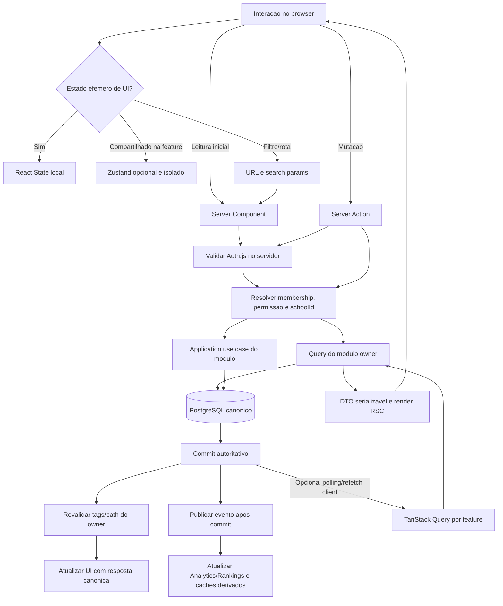

# ADR-0005 - State Management Strategy (Superseded)

**Date**: 2026-09-29  
**Status**: Superseded  
**Deciders**: Architecture Lead, Tech Lead, Frontend Lead e Product (a confirmar)  
**Affects**: `apps/web`, todos os `packages/modules/*`, Server Components, Client Components, Server Actions, Auth.js, cache de servidor e UI Shadcn

> Esta versao foi substituida pelo [ADR-0005 - Frontend Architecture, State Management and BFF Strategy](ADR-0005-frontend-architecture-state-management-bff.md). Mantida para historico; nao usar como decisao normativa independente.

---

## 1. Context

O MateMágico Champions combina Next.js 15 App Router, React 19 e um Modular Monolith com DDD/Clean Architecture, multi-escola logico, sessoes Auth.js e dados academicos que pertencem a bounded contexts. O Documento Mestre cita Zustand + Context API como escolha ampla e inclui pastas `stores` em modulos, mas nao distingue estado transitorio de UI, dados remotos/cacheados, sessao de identidade e estado de dominio. Essa ambiguidade tende a criar uma segunda fonte de verdade no browser, duplicar cache do servidor, vazar contexto entre escolas e produzir dependencias cruzadas.

O App Router favorece renderizacao no servidor, composicao de Server Components e mutacoes por Server Actions. O ADR-0002 proibe estado global de negocio compartilhado; o ADR-0003 define PostgreSQL como fonte canonica, `schoolId` como isolamento e analytics como projecao; o ADR-0004 define Auth.js como fonte de sessao/identidade e exige autorizacao atual no servidor.

### Constraints

- Preservar Modular Monolith, DDD e separacao Domain/Application/Infrastructure/UI.
- Preferir Server Components e Server Actions; Client Components sao usados somente onde interacao/browser exige.
- Nao permitir estado global de negocio compartilhado entre modulos.
- Estado de dominio canonico pertence ao modulo e ao PostgreSQL conforme ADR-0003, nao ao Zustand, Context ou cache do browser.
- `schoolId`, membership, role e permissao nunca sao inferidos de store client-side; autorizacao e validada no servidor por request/mutacao.
- Nao existe no workspace implementacao real que justifique ativar uma biblioteca de cache client-side para todos os dominios.
- Decisoes de cache precisam definir escopo, frescor, invalidacao e comportamento multi-instancia/tenant.

### Requirements

- Classificar UI, formulario, autenticacao, sessao, cache, server data, dominio e estado derivado.
- Definir os limites de React State, Context, Zustand, TanStack Query, Server Components e Server Actions.
- Cobrir os modulos Auth, Schools, Classes, Questions, Study Paths, Attempts, Mock Exams, Championships, Rankings e Analytics.
- Evitar state explosion, prop drilling, renders excessivos, memory leaks e stores compartilhadas.
- Definir cache, revalidacao, optimistic updates, loading/error, Suspense e streaming.
- Comparar Zustand, Redux Toolkit, Jotai, React Context e TanStack Query; justificar a decisao sobre Zustand.
- Preparar escala para varias escolas e 100 mil alunos sem presumir capacidade sem teste de carga.

---

## 2. Decision

**DECISION STATEMENT**: Server Components e o caminho padrao para leitura/renderizacao; Server Actions sao o caminho preferido para mutacoes da UI no mesmo produto, sempre com autenticacao, autorizacao, validacao e revalidacao no servidor. Estado de dominio e dados remotos canonicos permanecem no servidor. Client State deve ser local e efemero; Context e restrito a dependencias estaveis de subtree; Zustand e adotado de forma opt-in, apenas para estado compartilhavel de interface sem semantica de negocio; TanStack Query nao e dependencia global e so pode ser introduzido em um modulo quando sincronizacao client-side, polling, invalidacao fina ou cache de navegacao justificar esse custo. React Context, Zustand e TanStack Query nunca substituem ownership de modulo nem autorizacao.

### 2.1 Taxonomia de estado

| Tipo                          | Exemplos                                                                 | Fonte de verdade                               | Local de estado preferido                                                                             | Regra                                                                                          |
| ----------------------------- | ------------------------------------------------------------------------ | ---------------------------------------------- | ----------------------------------------------------------------------------------------------------- | ---------------------------------------------------------------------------------------------- |
| UI local                      | Modal aberto, tab selecionada, menu expandido, foco e selecao temporaria | Componente/DOM                                 | `useState`, `useReducer`, estado nativo do DOM                                                        | Vida limitada ao componente/fluxo; nao persistir sem requisito de produto.                     |
| Formulario                    | Valores editaveis, touched/dirty, validacao, envio pendente              | Formulario ate submissao; depois servidor      | React Hook Form/Zod e estado local do formulario; `useActionState`/`useFormStatus` quando apropriado  | Nao espelhar no store global; limpar/resetar ao trocar entidade/tenant; servidor revalida.     |
| Autenticacao                  | Identidade autenticada, estado de conta e provider                       | Auth.js/Auth                                   | Servidor; contexto client-read-only minimo quando UI precisa                                          | Nunca manter tokens/credenciais em Zustand, Context global ou localStorage.                    |
| Sessao                        | Sessao JWT/Auth.js, validade, revogacao, identidade do ator              | Auth.js mais registro de revogacao do ADR-0004 | Cookie seguro HttpOnly no transporte e verificacao server-side                                        | Client recebe apenas campos de apresentacao estritamente necessarios; nunca autoriza operacao. |
| Estado de servidor            | Perfil, turma, questao, tentativas, ranking etc.                         | Bounded context/PostgreSQL                     | Buscar no Server Component; Server Action/route para mutar                                            | Client recebe DTO serializavel minimizado; nao expor Prisma model.                             |
| Cache de servidor             | Conteudo publicado, projecoes, requests repetidos                        | Politica do servidor por recurso/tag           | Cache Next.js/Data Cache quando explicitamente seguro; `React.cache` apenas memoizacao request-scoped | Cache key inclui `schoolId`/versao quando tenant-scoped; invalidacao pertence ao modulo owner. |
| Cache client-side             | Dados remotos usados em interacoes intensivas/polling                    | Servidor continua canonico                     | TanStack Query opt-in por modulo                                                                      | Nao manter paralelo ao payload RSC sem politica de hidratacao, frescor e invalidacao.          |
| Estado de dominio             | Membership, matricula, tentativa, trilha, campeonato, concessao          | Modulo owner e banco                           | Servidor e agregados do dominio                                                                       | Proibido em estado global de negocio compartilhado no browser.                                 |
| Estado derivado               | Total, filtros aplicados, progresso calculado para visualizacao          | Dados de origem                                | Calculo puro no render/hook local; query no servidor se pesado/autoritativo                           | Evitar duplicar campo derivavel; memoizar apenas apos medir custo.                             |
| Preferencia persistente de UI | Idioma/tema/densidade, se requisito aprovado                             | Preferencia explicitamente definida            | Cookie/preferencia de User ou localStorage nao sensivel                                               | Chave e escopo declarados; nunca usar storage client como autoridade de tenant ou acesso.      |
| Estado de navegacao           | Filtros compartilhaveis, pagina, ordenacao, selected resource            | URL                                            | Search params/segmentos de rota                                                                       | URL serializavel e copiavel; validar parametros no servidor e incluir contexto necessario.     |

### 2.2 Next.js App Router: modelo mental

- A arvore e Server Component por padrao. `'use client'` marca uma fronteira client bundle; usar no menor subtree interativo possivel, nao por convencao global.
- Server Components podem buscar dados com ORM diretamente por funcao de acesso server-only. Checagem de autenticacao, permissao e `schoolId` ocorre junto a cada query/caso de uso, nao apenas em layout, middleware ou componente.
- Props Server -> Client devem ser serializaveis, minimas e livres de entidades Prisma, segredo, gabarito nao autorizado e dados que o cliente nao precisa.
- Componentes de layout compartilhados nao devem armazenar estado de negocio mutavel nem cache de request em singleton de modulo. Renderizacao pode ocorrer em paralelo e em instancias serverless diferentes.
- Requests identicos durante render podem ser deduplicados/memoizados conforme Next/React; memoizacao de render nao equivale a cache persistente entre requests. React `cache` e request-scoped; qualquer cache duravel exige politica explicita.
- Server Actions sao endpoints POST invocaveis diretamente, nao “funcoes privadas de UI”. Cada action autentica, autoriza e valida entrada/resource/tenant, aplica idempotencia em operacoes repetiveis e nao confia em dados de interface.
- Mutacao retorna resultado tipado e/ou UI atualizada; a action invalida tags/paths do modulo owner apos commit, ou executa redirect/refresh quando apropriado. TanStack Query nao deve ser invalidado como substituto de revalidacao de cache do servidor.
- Streaming e Suspense delimitam segmentos independentes de leitura; boundaries devem corresponder a blocos de conteudo que podem carregar/errar independentemente.

### 2.3 Uso das ferramentas

| Ferramenta                            | Utilizar quando                                                                                                                                                        | Evitar quando                                                                                                                                                                                                    |
| ------------------------------------- | ---------------------------------------------------------------------------------------------------------------------------------------------------------------------- | ---------------------------------------------------------------------------------------------------------------------------------------------------------------------------------------------------------------- |
| Server Components                     | Leitura inicial, paginas de detalhe/listagem, composicao de dados, renderizacao acessivel e conteudo que nao precisa de browser API.                                   | Interacao continua, handlers DOM, estado local ou APIs exclusivas do browser.                                                                                                                                    |
| Server Actions                        | Form submissions e mutacoes first-party no App Router, com validacao e autorizacao server-side.                                                                        | Streaming de alto volume, polling, endpoint externo/publico, protocolo independente ou comando que nao deva ser invocado como action. Usar Route Handler/worker conforme caso.                                   |
| React State (`useState`/`useReducer`) | Estado efemero de componente, estado complexo contido em um fluxo e transicoes locais.                                                                                 | Dados remotos canonicos, estado compartilhado entre features ou estado que precisa ser autoritativo entre requests.                                                                                              |
| Context API                           | Dependencia estavel limitada a subtree: tema, locale, provider de formulario, capability/config nao sensivel.                                                          | Store grande/frequente, servidor como fonte de dados, permissao/tenant autoritativo ou provider global para todas as features.                                                                                   |
| Zustand                               | Estado client-only de UI compartilhado por mais de um componente distante dentro de uma feature e com ciclo de vida de pagina/feature definido.                        | Entidades de dominio, session tokens, dados server-side como cache paralelo, dados cross-school, stores globais universais. Store deve ser isolada por feature e instancia/subtree quando houver SSR/hidratacao. |
| TanStack Query                        | Query client-side que requer refetch/focus/reconnect, polling, paginação infinita client-driven, cache de mutacao ou sincronizacao com interacao rica e API explicita. | CRUD simples servido e mutado por RSC/Server Actions; duplicar RSC payload, substituir Next Data Cache ou armazenar identidade/permissao.                                                                        |
| URL/search params                     | Estado navegavel/compartilhavel como filtros, pagina, ordenacao e identificador de recurso selecionado.                                                                | Segredos, PII, valores efemeros de formulario, credenciais ou permissao.                                                                                                                                         |
| Browser storage                       | Preferencia nao sensivel e explicitamente persistente (ex. tema/densidade).                                                                                            | Sessao/credential, role, schoolId de autorizacao, progresso canonico, resposta de exame ou qualquer dado privado sem threat model.                                                                               |

### 2.4 Decisao sobre Zustand

Zustand sera adotado como ferramenta disponivel, mas nao como arquitetura de dados da aplicacao nem dependencia obrigatoria de todos os modulos. Seu escopo e estado efemero e client-only de UI quando React local/Context nao atende a compartilhamento da mesma feature.

**Permitido**: selecao temporaria de item em canvas/interacao complexa, estado de command palette, filtros locais nao refletidos na URL quando restritos a uma sessao de UI, estado de wizard em memoria, preferencias de apresentacao ainda nao persistidas.

**Proibido**:

- User, roles, permissions, memberships, `schoolId` como prova de acesso ou qualquer estado de autorizacao.
- Token Auth.js, cookie, session id secreto, senha, MFA secret, PII sensivel ou dado de menor sem finalidade.
- Questao/resposta canonica, tentativa, resultado, progresso de trilha, simulado, campeonato, ranking, analytics ou qualquer agregado de dominio.
- Cache duplicado de query server-side ou uma store de dominio compartilhada entre bounded contexts.
- Singleton mutavel de store no processo Node/server compartilhado entre requests, usuarios ou tenants.

**Modularizacao**:

- Store vive dentro da feature dona (`packages/modules/<module>/ui` ou `apps/web/src/features/<feature>`), nao em `packages/shared-types` ou pacote global `stores`.
- Exporta apenas selectors/actions de UI atraves da fronteira publica da propria feature; nenhum outro modulo importa a store diretamente.
- Uma store por necessidade de UI e escopo pequeno; preferir factory/provider que crie instancia por subtree/request e nao estado singleton global em SSR.
- Store nao chama Prisma nem aplica regra de dominio; eventos da store terminam em Server Action/contrato de aplicacao.
- Atualizacao e selectors granulares; estado derivado e computado, nao copiado em varios slices.
- Reset no unmount/fim do wizard, logout, troca de escola/contexto e navegacao quando o estado nao deve sobreviver. Dados persistidos em localStorage exigem aprovacao, versao e politica de migracao, excluindo dados sensiveis/de negocio.

### 2.5 Comparacao de alternativas

| Alternativa    | Pontos fortes                                                                                                   | Custos/risco                                                                                                                          | Decisao neste projeto                                                                                                                      |
| -------------- | --------------------------------------------------------------------------------------------------------------- | ------------------------------------------------------------------------------------------------------------------------------------- | ------------------------------------------------------------------------------------------------------------------------------------------ |
| Zustand        | API pequena, baixo boilerplate, selectors e stores por feature; adequado a estado efemero client-side.          | Incentiva singleton/global store e duplicacao de server state se limites forem fracos; nao fornece modelo de dominio nem autorizacao. | Adotado opcionalmente para UI local compartilhada, com restricoes desta decisao.                                                           |
| Redux Toolkit  | Fluxo explicito, tooling, reducers previsiveis, middleware e boa governanca para estado client complexo grande. | Boilerplate/cerimonia e serializacao/store ampla; tende a virar repositorio paralelo de entidades.                                    | Nao adotar agora; reconsiderar se houver workflows client-only complexos, muitas transicoes/eventos e necessidade real de tooling central. |
| Jotai          | Atomos composaveis e granularidade de subscricao; bom para grafos de estado client local.                       | Dependencias entre atomos podem ocultar fluxo e criar grafo dificil de governar; nao resolve server state ou ownership.               | Nao adotar como padrao; Zustand cobre o caso eventual com padrao mais simples para a equipe.                                               |
| React Context  | Nativo, apropriado a valor estavel e dependencia de subtree sem pacote externo.                                 | Mudancas frequentes podem renderizar consumidores; provider amplo acopla arvore e e facil compartilhar dado demais.                   | Usar para dependencias/config estaveis e escopo de componente; nao para store de alta frequencia.                                          |
| TanStack Query | Cache client-side, dedupe, revalidation, retries, mutation lifecycle e polling.                                 | Duplica cache Next/RSC, exige query keys tenant-aware, hydration/invalidation e memoria client; nao e fonte de verdade.               | Opt-in por modulo/fluxo com requisitos client-side concretos; nao instalar/ativar globalmente antes do caso.                               |

### 2.6 Cache, revalidacao e invalidacao

**Camadas distintas**:

| Camada                              | Escopo                                                                      | Conteudo indicado                                                                                  | Invalidacao/limites                                                                                                                                               |
| ----------------------------------- | --------------------------------------------------------------------------- | -------------------------------------------------------------------------------------------------- | ----------------------------------------------------------------------------------------------------------------------------------------------------------------- |
| React render memoization            | Um render/request                                                           | Deduplicacao de leitura identica e computacao reutilizada em Server Components (`React.cache`)     | Expira ao fim do request; nao usar para compartilhar estado entre usuarios/requests.                                                                              |
| Next Data Cache / cache de servidor | Potencialmente entre requests/instancias conforme deployment e configuracao | Catalogo global publicado, taxonomia, assets/metadados publicos e leitura explicitamente cacheavel | Opt-in por politica; tags/keys incluem owner, versao e escopo. Nunca cachear resposta privada sem tenant/ator suficiente na chave e protecao contra cross-tenant. |
| Next Full Route/Router Cache        | Rota/RSC payload no modelo do framework                                     | Conteudo renderizado conforme politicas Next                                                       | Nao assumir comportamento sem teste na versao/config do Next 15; dados privados devem ser dynamic/no-store onde apropriado; invalidar apos mutation.              |
| Browser/Router cache                | Navegacao e estado da aba                                                   | Snapshot recente de UI; nao autoridade canonica                                                    | Limpar/atualizar em logout, troca de escola, role change, tentativa enviada e mutacao relevante.                                                                  |
| Zustand memory                      | Instancia UI/feature                                                        | Estado temporario visual                                                                           | Desmontagem/reset; jamais share entre request/tenant.                                                                                                             |
| TanStack Query cache                | Client query client, opt-in                                                 | Recursos lidos no cliente com refetch/polling/paginacao                                            | query keys tenant-aware; invalidate/update apos resultado autoritativo; limpar ao logout/troca de escopo.                                                         |
| Cache distribuido futuro            | Entre processos/instancias, como Redis do ADR-0001/0003                     | Rankings/read models/cache global ou por escola medido                                             | TTL, invalidação por evento/tag, quotas e isolamento de key; nao fonte canonica.                                                                                  |

**Regras de chave**: qualquer recurso condicionado por `schoolId`, `classId`, usuario, papel, visibilidade, idioma ou versao de conteudo inclui dimensoes relevantes na chave. A chave nao autoriza acesso: o servidor valida membership e permissao antes de ler mesmo que cache retorne hit. Nao reutilizar cache compartilhado para dados de Request/Session privados se o deployment adapter nao garantir particionamento correto.

**Invalidacao**:

1. Escrita valida command e permissao; modulo owner persiste commit.
2. Action recebe resultado autoritativo e emite evento/outbox quando relevante.
3. Owner revalida tags/paths Next e atualiza/invalida cache client permitido; consumidor de outro modulo reage por evento e mantem sua projecao.
4. Falha de invalidacao nao reverte commit; gerar observabilidade/retry e UI deve reconhecer que pode haver projeção desatualizada.
5. Logout, troca de `schoolId` ativo, membership/role revogada e suspensao limpam caches client relacionados; dados privados sempre sao reautorizados no servidor.

Nao fixar TTL universal. Configurar frescor por semantica: taxonomia/conteudo publicado pode ter cache longo invalidado por versao; ranking/analytics aceita consistencia eventual declarada; tentativas/sessao/autorizacao exigem leitura canonica ou invalidacao forte; dados de exame em andamento nao devem usar cache stale que altere criterio/resultado.

### 2.7 Regras por modulo

| Modulo        | Leitura                                                                                                | Escrita/mutacao                                                                                 | Estado client permitido                                                                                                       | Cache/invalidation                                                                                                |
| ------------- | ------------------------------------------------------------------------------------------------------ | ----------------------------------------------------------------------------------------------- | ----------------------------------------------------------------------------------------------------------------------------- | ----------------------------------------------------------------------------------------------------------------- |
| Auth          | Sessao via Auth.js no servidor; UI recebe estado de apresentacao minimo.                               | Auth.js/Server Action de login/logout/credential flow e casos Auth autorizados.                 | Menu/avatar e estado de dialogo apenas; sem token ou role autoritativa.                                                       | Sem cache publico para sessao; limpar query/UI ao logout e invalidar sessao server-side conforme ADR-0004.        |
| Schools       | Server Components consultam escolas acessiveis a partir de memberships autorizadas.                    | Server Action chama contrato Schools/Auth para configuracao/membership.                         | Escola ativa como contexto de navegacao pode estar em URL/UI; nunca prova de autorizacao.                                     | Dados publicos/config globais podem cachear; privado inclui `schoolId`; trocar escola limpa dados da anterior.    |
| Classes       | Ler roster/listas no servidor com autorizacao por `schoolId` e turma atribuida.                        | Server Action para criar turma/enrollment; valida ator e escopo no servidor.                    | Selecao/filtro de turma em URL ou UI efemera; roster canonico nao fica em store global.                                       | Revalidar tags da escola/turma apos commit; membership invalidada remove acesso client.                           |
| Questions     | Server Components buscam questoes publicadas e DTO autorizado.                                         | Server Actions para rascunho/publicacao/import com policy editorial e versionamento.            | Resposta em edicao/formulario antes de submit; nao copiar gabarito/versao para store global.                                  | Conteudo publicado cacheavel por `questionId + version`; invalidar quando nova versao publica/retirada.           |
| Study Paths   | SSR/RSC para lista e resumo inicial; leitura atualizada por owner.                                     | Server Actions iniciam/avancam/concluem percurso; aceite de recomendacao e mutation de dominio. | Expansao, filtro, painel aberto; progresso visual otimista somente como pending overlay.                                      | Projecao progress pode ser eventual; invalidar ao `StudyPathUpdated/Completed`.                                   |
| Attempts      | Carregar atividade/snapshot permitido no servidor e confirmar escopo.                                  | Submissao por Server Action com idempotency key, regra Question Engine e persistencia Attempts. | Resposta local nao submetida, timer visual sincronizado com deadline server-side; limpar ao finalizar/sair conforme politica. | Nao guardar resposta em cache persistente/browser storage; resposta final e resultado canonicos do servidor.      |
| Mock Exams    | Carregar blueprint/session no servidor, incluindo snapshot/version.                                    | Start/answer/complete por actions/fluxo dedicado com validacao de janela e idempotencia.        | Resposta em edicao e navegacao local; deadline e estado de sessao revalidados server-side.                                    | Sem cache stale para sessao ativa/gabarito; apos conclusao, resultado versionado e cache conforme politica.       |
| Championships | RSC para informacao publica/escopo acessivel; ranking/estado com frescor declarado.                    | Mutacoes por action/contrato Championships; resultado elegivel pelo dominio.                    | Aba/filtro/pagina; inscricao otimista somente se reversivel e confirmada.                                                     | Invalidar por evento Championship/Participant; leaderboard eventual, nunca usar cache como elegibilidade.         |
| Rankings      | Server Component ou TanStack Query opt-in se polling/paginacao live pedir.                             | Ranking atualiza por projeccao/eventos, nao mutacao client.                                     | Filtro de periodo/escopo e UI de refresh.                                                                                     | TTL curto/configurado pela janela; mostrar `asOf`; key inclui scope/period; invalidate por `RankingUpdated`.      |
| Analytics     | Server Components/Server Actions para pedir relatorio, acompanhar status e renderizar autorizadamente. | Job/Server Action pede relatorio; consumidor de eventos atualiza projecao.                      | Filtros e selecao visual; resultado sensivel nao persiste localmente.                                                         | Projecoes com lag/asOf e schoolId; relatorios pesados fora de OLTP; invalidate quando report/status event chegar. |

### 2.8 Regras de organizacao do codigo

| Superficie              | Regra                                                                                                                                                                                                                                                                                             |
| ----------------------- | ------------------------------------------------------------------------------------------------------------------------------------------------------------------------------------------------------------------------------------------------------------------------------------------------- |
| `packages/modules/*`    | Dono de contratos de aplicacao e politicas de cache/invalidation de seus dados. `domain` e `application` sao puros de React/Next/Zustand/TanStack; `infrastructure` implementa repositorio/cache; `ui` pode usar Client State local. Store/query cache nunca exposto como contrato entre modulos. |
| `apps/web`              | Composicao de rotas, Server Components, Server Actions/adaptadores e layout. Nao consulta Prisma direto fora de boundary de modulo, nao orquestra repositorios e nao possui global business store.                                                                                                |
| `components`            | Componentes puros/presentacionais por padrao; nao leem DB, session diretamente nem escolhem tenant. Client component so se precisa de interacao/browser API. Componentes partilhados recebem dados serializaveis/handlers explicitos.                                                             |
| `hooks`                 | Hooks client co-localizados a feature; hooks server sao funcoes de aplicacao/data access sem prefixo React obrigatorio e marcados server-only quando cabivel. Nao criar hooks globais que leiam/escrevam stores de varios modulos.                                                                |
| `stores`                | Permitidas apenas sob UI de modulo/feature; sem store global em `apps/web/src/stores` para dominio/auth. Factory/provider por subtree quando compartilhamento de UI for real; selectors pequenos e reset lifecycle definido.                                                                      |
| `packages/shared-types` | Tipos serializaveis de contrato/DTO minimo, nao entidades Prisma, store state ou catalogo de todos os estados.                                                                                                                                                                                    |
| `packages/database`     | Persistencia server-side; cliente Prisma nao entra em bundle client nem em store; cache database nao muda fonte de verdade.                                                                                                                                                                       |

### 2.9 Regras de UX de mutacao

- **Optimistic update**: permitido apenas para acao de baixo risco, reversivel e local (por exemplo, favorito/preferencia visual) com rollback garantido em erro. Tentativa submetida, membership/role, permissao, inscricao competitiva, certificado, resultado de prova e qualquer mutacao de seguranca sao pessimistas: mostrar pending, esperar servidor e refletir resultado autoritativo.
- **Pending/loading**: usar estado de formulario/action e React transition para acao acionada, indicador local por bloco e skeleton para segmento de leitura. Evitar spinner global que bloqueie partes independentes. Desabilitar apenas controle afetado; prevenir double submit com idempotencia no servidor.
- **Error states**: erro de validacao retorna mensagem estruturada junto ao campo; erro de autorizacao/escopo nao revela existencia de objeto; erro inesperado recebe correlation id, boundary local ou `error.tsx`. Permitir retry apenas para operacao idempotente ou com chave de idempotencia.
- **Suspense/streaming**: boundary proximo ao componente de leitura lenta, fallback que reserva dimensoes e nao mente que transacao foi completada. Erros isolados em boundary de segmento; nao envolver toda app num unico Suspense para toda requisicao.
- **Server Actions**: toda action autentica e autoriza por dentro, valida payload, limita tamanho, revalida estado do recurso e executa regras pelo modulo owner. Server Actions nao sao chamadas paralelas em lote do cliente; leituras independentes devem iniciar em paralelo nos Server Components ou ser agregadas num use case server-side.
- **Race/concurrency**: UI nao substitui optimistic concurrency/version/unique constraint. Submit duplicado, stale form e deadline competitivo sao resolvidos no servidor.

### 2.10 Evitar problemas de estado

| Problema                 | Regras preventivas                                                                                                                                                                                                                     |
| ------------------------ | -------------------------------------------------------------------------------------------------------------------------------------------------------------------------------------------------------------------------------------- |
| State explosion          | Classificar tipo/fonte/escopo antes de criar state; manter uma fonte canonica; usar URL para estado navegavel; nao copiar resposta de query para state; remover estado que possa ser derivado.                                         |
| Prop drilling            | Colocar estado no menor ancestral comum que realmente precisa; compor Server Components e passar slots/children; usar Context somente para dependencias subtree estaveis; store de UI modular se houver varios consumidores distantes. |
| Re-render excessivo      | Client boundary pequena; Context de valor estavel; Zustand selectors; evitar objetos/callbacks instaveis apenas se medicao mostrar problema; virtualizar listas grandes; paginar server-side.                                          |
| Memory leak              | Cancelar requests/timers/subscriptions no unmount; usar AbortSignal quando suportado; limpar query/store ao logout/troca de tenant; limites de cache e GC; evitar listeners globais sem cleanup.                                       |
| Store compartilhada      | Nao exportar uma store comum de dominio; dependencias entre modulos via DTO/fachadas/eventos; ownership e cache tags por owner.                                                                                                        |
| Cross-school stale state | `schoolId` na chave de query/cache, invalidar ao trocar contexto e autorizar todo request; nao confiar no `schoolId` do store/URL.                                                                                                     |
| Hydration mismatch       | Server render e initial client state devem concordar; persistencia local nao pode sobrescrever markup inicial de forma assincrona sem estrategia; storage nao sensivel e aplicado apos hidratacao quando apropriado.                   |
| Cache duplication        | RSC payload e query cache nao armazenam o mesmo recurso sem plano de hydration/update; escolher uma camada por fluxo e documentar sincronizacao.                                                                                       |

### 2.11 Fluxo de estado

O diagrama separa o caminho padrao (RSC + Server Action) do Client Store/Query opcional. TanStack Query nao e cache do dominio; eventos/projecoes mantem consumers asincronos desacoplados.

### 2.12 Matriz de responsabilidade por tipo de estado

| Tipo         | Owner                                    | Server/Client                               | Persistencia                          | Tecnologia padrao                                     | Proibicao principal                              |
| ------------ | ---------------------------------------- | ------------------------------------------- | ------------------------------------- | ----------------------------------------------------- | ------------------------------------------------ |
| UI           | Feature UI                               | Client local                                | Nenhuma por padrao                    | React State; Zustand se shared UI                     | Store cross-module/global business.              |
| Form         | Form/feature                             | Client ou progressive server form           | So apos comando aceito                | React Hook Form/Zod; `useActionState`/`useFormStatus` | Valores de formulario em singleton/global cache. |
| Auth         | Auth                                     | Server; UI recebe snapshot minimo           | Auth.js/session registry              | Auth.js e leitura server-side                         | Token/role como autoridade client.               |
| Sessao       | Auth.js/Auth                             | Cookie HttpOnly e validação server          | Registro revogavel ADR-0004           | Auth.js + validacao server                            | Persistir sessao em localStorage/Zustand.        |
| Server data  | Modulo owner                             | Server por padrao; client DTO se necessario | PostgreSQL owner                      | Server Components/Actions                             | DTO amplo ou Prisma model no client.             |
| Cache server | Modulo owner/infrastructure              | Server                                      | Next cache/Redis apenas com politica  | Next revalidation/React cache request-scoped          | Cache sem scope/key/TTL/invalidation.            |
| Cache client | Feature que requer interatividade        | Client                                      | Memoria com GC                        | TanStack Query opt-in                                 | Duplicar fonte de verdade ou misturar tenant.    |
| Dominio      | Bounded context                          | Server                                      | PostgreSQL/eventos/projecoes do owner | Use cases e repositories                              | Zustand/Context/URL como canonico.               |
| Derivado     | Componente ou owner se caro/autoritativo | Local ou server                             | Em geral nenhum; read model se caro   | Calculo puro/selectors/query server                   | Armazenar copia redundante sem invalidacao.      |

### 2.13 Estrategia de escalabilidade ate 100 mil alunos

| Fase         | Orientacao de estado/cache                                                                                                                                                                                                                                                                                         | Evidencia/gatilhos                                                                                                                                                                     |
| ------------ | ------------------------------------------------------------------------------------------------------------------------------------------------------------------------------------------------------------------------------------------------------------------------------------------------------------------ | -------------------------------------------------------------------------------------------------------------------------------------------------------------------------------------- |
| 0-10K alunos | RSC/Server Actions para fluxo principal; Prisma/PostgreSQL como autoridade; React State local; Zustand somente UI justificada; sem cache distribuido prematuro; memoizacao por request e cache Next opt-in para catalogo seguro; paginas e listagens paginadas.                                                    | Baseline de p95/p99, volume por escola, bundles/client JS, query count, cache hit/fail e testes de isolamento tenant.                                                                  |
| 10K-50K      | Tag/revalidation disciplinada; cache de conteudo publicado e read models; TanStack Query apenas para rankings/polling/paginacao que necessitem; Redis/queue conforme ADR-0001/0003 para dados derivados medidos; separar tarefas e invalidacao por evento.                                                         | Lag de projecao e invalidacao, saturacao DB/pool, request waterfalls, memoria/client cache e latencia de RSC.                                                                          |
| 50K-100K     | Multi-instancia exige caches coerentes e invalidacao distribuida; Server Actions continuam validando em cada instancia; dados grandes/polling migram para endpoints/streaming dedicados quando preciso; Analytics/Rankings projetados fora do caminho OLTP; impor limites de cache, pagina, cardinalidade e query. | Load test com pico por tenant desbalanceado, troca de escola, simultaneidade de exame, cache stale/revocation e backlog; sem declarar capacidade baseada apenas em alunos cadastrados. |

**Regra para 100 mil alunos**: nenhum store client ou cache de processo e mecanismo de escalabilidade para dominio. Escala vem de limites de leitura/escrita, indices e queries do ADR-0003, cache com chave tenant-aware, paginacao/streaming e projecoes assincronas. A UI deve carregar somente a pagina/segmento necessario e nunca baixar todos estudantes, tentativas, rankings ou analytics para filtrar no browser.

### Why This Choice

Server Components mantem segredo, consulta e renderizacao no servidor e reduzem JavaScript/client state. Server Actions oferecem fluxo de mutacao integrado ao App Router e progressive enhancement, mas continuam sendo fronteiras publicas que precisam de autorizacao. Zustand resolve uma lacuna pequena de estado compartilhado de interface sem promover uma store de negocio; TanStack Query e reservado para fluxos explicitamente client-driven. Essa estrategia evita duas fontes de verdade e respeita ownership e `schoolId` dos ADRs anteriores.

| Option                                           | Pros                                                                                | Cons                                                                                                | Why Chosen?                                                                         |
| ------------------------------------------------ | ----------------------------------------------------------------------------------- | --------------------------------------------------------------------------------------------------- | ----------------------------------------------------------------------------------- |
| **RSC + Server Actions como padrao**             | Menos estado duplicado/client JS, acesso server-side a dados e autorizacao central. | Exige delimitar client islands e conhecer limites/caching do App Router.                            | ✅ Selecionada como caminho principal.                                              |
| **Zustand global para a aplicacao**              | Rapida composicao e acesso em qualquer componente.                                  | Estado global de negocio, SSR leakage, tenant contamination e duplicacao de server cache.           | ❌ Rejeitada; Zustand apenas UI por feature.                                        |
| **TanStack Query em toda tela**                  | Cache client uniforme e ergonomia de refetch.                                       | Duplica RSC/Data Cache e introduz invalidacao/hidratacao em todo fluxo, sem necessidade confirmada. | ❌ Rejeitada como padrao global; opt-in por caso justificado.                       |
| **Redux Toolkit como store canonica**            | Fluxo central e tooling forte.                                                      | Armazena dados server/dominio no client, maior boilerplate e nao resolve ownership por si.          | ❌ Nao escolhido nesta fase.                                                        |
| **React Context para todo estado compartilhado** | Nativo, simples para providers.                                                     | Re-render e escopo muito amplo quando o valor muda frequentemente; facil virar singleton global.    | ❌ Rejeitado como store generalista; usar somente para dependencia subtree estavel. |

### Rationale

A fonte de verdade deve ficar junto do modulo que possui o dominio. A estrategia distingue server state/cache de client UI state, em vez de escolher uma unica biblioteca como solucao universal. O padrao minimiza superficie client e evita expor sessao, `schoolId` e regras de autorizacao; quando uma feature requer cache client rico, seu uso e local, auditable e sujeito a teste de cross-tenant.

---

## 3. Consequences

### ✅ Positive Consequences

1. Estado de negocio, autorizacao e dados de sessao nao podem divergir entre store client e banco.
2. Server Components e Server Actions usam o App Router como modelo primario e reduzem JavaScript enviado ao cliente.
3. Zustand e TanStack Query deixam de ser dependencias generalizadas e sao adicionados somente por necessidade demonstrada.
4. Contexto de escola e invalidacao aparecem explicitamente nas keys, caches e lifecycle do cliente.
5. Limites de modulo ficam refletidos em stores, hooks, cache tags e DTOs, apoiando testes e extracao futura.

### ⚠️ Negative Consequences

1. Parte das interacoes exige round-trip ao servidor e a UI precisa comunicar pending/erro com clareza.
2. Cache Next, memoizacao React e eventual TanStack Query exigem distinguir escopos e testar comportamento da versao/config Next.js 15 realmente adotada.
3. Opt-in de TanStack Query por modulo pode criar variacoes locais; guidelines e revisao arquitetural precisam assegurar consistencia.
4. O estado efemero de formularios de exames exige politica de recuperacao/saída sem salvar respostas sensiveis em storage, o que deve ser decidido pelo produto.

### 🔧 Trade-offs Accepted

| Trade-off                                          | Accept Because                                                        | Monitor                                                        |
| -------------------------------------------------- | --------------------------------------------------------------------- | -------------------------------------------------------------- |
| Mutacoes server-first em vez de UI sempre otimista | Integridade de tentativa, autorizacao e consistencia sao prioritarias | Latencia percebida, pending duration e drop-off de formularios |
| Zustand limitado a UI                              | Compartilhamento visual eventual sem store de dominio                 | Crescimento de stores, resets esquecidos e imports cruzados    |
| TanStack Query opt-in                              | Evita cache/hydration em fluxos simples                               | Duplicacao de dados, query key scope e memoria por aba         |
| Cache explicitamente configurado                   | Evita vazamento de tenant e stale authorization                       | Hit/miss, lag de invalidacao, cross-tenant tests               |

---

## 4. Risks

### Risk Assessment

| ID  | Risk                                                                              | Severity | Likelihood | Mitigation                                                                                                                          |
| --- | --------------------------------------------------------------------------------- | -------- | ---------- | ----------------------------------------------------------------------------------------------------------------------------------- |
| R1  | Server Action invocada diretamente sem auth/authorization suficiente              | Critical | Medium     | Validar usuario, permissao, `schoolId`, ownership e estado do recurso dentro de cada action/use case; teste negativo.               |
| R2  | Cache client/server mistura resposta entre escolas/usuarios                       | Critical | Medium     | Keys tenant-aware, sem cache privado implicitamente compartilhado, invalidar troca de school e executar testes cross-tenant.        |
| R3  | Store Zustand singleton vaza estado entre requests SSR/tenants                    | Critical | Low/Medium | Nunca criar estado de usuario em singleton server; factory/provider scoped, Client-only e reset; revisar bundles.                   |
| R4  | RSC payload ou DTO expoe PII, gabarito ou modelo Prisma                           | High     | Medium     | DTO minimizado, boundary server-only, authorization antes de serializar e testes de payload.                                        |
| R5  | RSC e TanStack Query tornam-se duas fontes de verdade                             | High     | Medium     | Por fluxo escolher uma estrategia; se hidratar, definir staleTime, mutation/invalidation e teste de reconciliacao.                  |
| R6  | Optimistic update em tentativa/inscricao cria falso sucesso                       | High     | Medium     | Proibir em comandos criticos; rollback/reconciliacao; servidor continua autoritativo e idempotente.                                 |
| R7  | Context value frequente causa render em arvore ampla                              | Medium   | High       | Provider proximo do consumidor, separar contextos estaveis/dinamicos, usar local state/selectors; profiling antes de memoizacao.    |
| R8  | Cache framework muda entre Next 15 minor/config e invalida premissas              | High     | Medium     | Testar versao/config real, declarar cache policy por query, testes de revalidation e upgrade review.                                |
| R9  | State local de exame perdido em navigation/reload ou armazenado de forma insegura | High     | Medium     | Definir UX de recuperacao, persistir apenas no backend conforme regras do exame; nunca assumir cache/browser storage como registro. |

### Monitoring & Alerting

- Latencia p95/p99 de leitura/mutation por fluxo; alertar em degradacao dos SLOs definidos pelo produto.
- Taxa de erro de invalidacao e idade de read model/cache versus `asOf`; alertar atraso superior ao SLO do ranking/analytics.
- Bundle JS por rota e proporcao de Client Components; investigar crescimento sem beneficio UX.
- Render count/long tasks em formularios de exame, listas de turma e dashboards; otimizar apenas com profiling reproduzivel.
- Teste automatizado de troca Escola A/B, logout, revogacao de role e rota privada verifica que nenhum dado anterior persiste no client cache.
- Memory usage/cache cardinality/GC em sessoes longas, polling e ranking ao vivo.

---

## 5. Alternatives Considered

### Store client canonica (Redux Toolkit)

**Description**: manter estado global normalizado de dominio e dados remotos em Redux e projetar a UI a partir dele.

**Pros**:

- DevTools, reducers explicitos e fluxo previsivel.
- Middleware/ecossistema maduro para workflows client complexos.

**Cons**:

- Duplicaria a fonte canonica do servidor e cache do App Router.
- Incentiva entidade global compartilhada e aumenta payload/estado client.
- Nao fornece autorizacao nem isolamento multi-tenant por si.

**Why not chosen**: os fluxos centrais sao server-first e nao justificam uma store canonica do browser. Reconsiderar somente com requisito de workflow client-only complexo e ownership local claro.

### React Context como store universal

**Description**: compartilhar estado global por providers React para reduzir prop passing.

**Pros**:

- Nativo e sem dependencia adicional.
- Adequado a theme, locale e dependencias estaveis de subtree.

**Cons**:

- Updates propagam a consumidores do contexto e podem renderizar arvore grande.
- Providers globais encorajam acoplamento e criam estado sem owner.

**Why not chosen**: Context nao e mecanismo geral de cache/query/store; seu escopo e valor estavel e local a uma subtree.

### TanStack Query global para todo server state

**Description**: carregar toda entidade por queries client-side e manter um query cache global como espelho do servidor.

**Pros**:

- Refetch, retry, polling e mutation lifecycle padronizados.
- Funciona bem para produtos altamente client-driven.

**Cons**:

- Duplica fetch/cache/revalidation do App Router, hydration e invalidacao em todos os fluxos.
- Aumenta risco de query key sem `schoolId` e dados stale de permissao.

**Why not chosen**: nao ha necessidade transversal demonstrada. Adotar por bounded context apenas quando polling, infinite scroll ou interacao client justificar.

---

## 6. Implementation

### Timeline

1. **Antes da implementacao de UI**: alinhar memoria legada e regras de arquitetura; definir convencoes de Server/Client boundary, DTO e cache tags.
2. **Fase inicial**: implementar leitura por Server Components, mutacoes por Server Actions e testes de auth/tenant; usar React state/form state local.
3. **Por feature**: aprovar Zustand/TanStack Query somente com justificativa, owner, escopo, reset/invalidation e teste de isolamento definidos.
4. **Antes de escala**: instrumentar perf/render/cache e rodar carga representativa das rotas de tentativa, ranking e analytics; ajustar com medicao.

### Affected Components

- `apps/web/app`: Server Components, loading/error boundaries, composition e Server Actions.
- `packages/modules/*`: funcoes de aplicacao/query, invalidacao dos dados sob ownership e UI state local.
- Auth.js/Auth: leitura de sessao server-side conforme ADR-0004; nenhum token no client store.
- `packages/database`: acesso Prisma server-only e queries tenant-aware conforme ADR-0003.
- `packages/events`: invalidacao/rebuild de projecoes por consumidor apos eventos do owner.
- UI compartilhada/Shadcn: apresentacao e comportamento local, sem armazenar estado de dominio.

### Migration Plan (if applicable)

Nao ha migracao de codigo neste ADR. Para futuras features com stores existentes:

1. Classificar cada valor por tipo, owner, escopo e fonte canonica.
2. Mover estado canonico para o modulo/server e substituir acesso global por DTO/fachada.
3. Manter localmente apenas estado UI; extrair URL quando estado for navegavel.
4. Adicionar cache client somente se requisito funcional exigir e cobrir key por tenant, invalidacao, logout e stale permission.
5. Validar paridade com testes de integracao e remover espelho antigo em release separado.

Rollback: desligar a query/store opt-in por feature e voltar a leitura server-first; nunca restaurar cache client como fonte canonica. Preservar estado de formulario de dominio somente se politica do fluxo permitir, sem recuperar estado de autorizacao/sessao.

### Effort Estimation

Estimativa de implementacao fora do escopo; depende do inventario de rotas/componentes existente (o workspace atual e documental, sem app implementado).

---

## 7. Related ADRs

- [[ADR-0001]] - Base Architecture (Next.js, React, Zustand/Context legados e escalabilidade).
- [[ADR-0002]] - Module Boundaries and Domain Communication (proibe estado global de negocio e define ownership).
- [[ADR-0003]] - Database Strategy and Domain Data Model (PostgreSQL, `schoolId`, analytics e cache de dominio).
- [[ADR-0004]] - Authentication and Authorization (Auth.js, JWT/sessao revogavel e RBAC server-side).

---

## 8. References & Research

- [Next.js App Router: Fetching Data](https://nextjs.org/docs/app/getting-started/fetching-data) - Server Components, request memoization, direct database access, streaming e Client Component libraries.
- [Next.js App Router: Caching and Revalidating](https://nextjs.org/docs/app/guides/caching) - Cache de fetch/servidor e revalidation APIs; confirmar comportamento na versao/config adotada (Next.js 15).
- [Next.js: Server Actions and Mutations](https://nextjs.org/docs/app/building-your-application/data-fetching/server-actions-and-mutations) - seguranca, pending, refresh e invalidacao.
- [React `cache`](https://react.dev/reference/react/cache) - memoizacao request-scoped de Server Components.
- `ARCHITECTURE.md` - convencoes de modulos, dependencias Zustand/Context e roadmap de escala.
- `memory/decisions.md` - decisao legada “Zustand + Context API”, refinada por este ADR.
- `docs/architecture/ADRs/ADR-0002-module-boundaries.md`, `ADR-0003-database-strategy.md`, `ADR-0004-authentication-authorization.md` e `ADR-TEMPLATE.md`.
- Prompt 005 - ADR-0005 State Management.

---

## 9. Sign-Off

Decision approved by:

- [ ] Architecture Lead
- [ ] Tech Lead
- [ ] Product Manager
- [ ] CTO

Este ADR permanece **Proposed** ate aprovacao formal; nomes dos aprovadores nao estao definidos nos documentos atuais.

---

## 10. Future Reconsideration

This decision should be revisited if:

- um fluxo se tornar uma SPA client-heavy com requisitos de sincronizacao/cache/polling que RSC/Actions nao atendam adequadamente;
- TanStack Query se tornar padrao em mais de um modulo com necessidades semelhantes e plano comprovado para coexistir com RSC;
- stores Zustand de UI crescerem em numero, dependencias ou estado persistente, justificando Redux Toolkit ou outro modelo;
- necessidade de offline-first, colaboracao em tempo real, drafts long-lived ou sincronizacao entre dispositivos mudar a fonte de verdade;
- mudança de Next.js 15 para nova major alterar cache, Server Actions, Router Cache ou comportamento de memoizacao;
- testes de carga representativos mostrarem p95/p99, bundle, memoria ou invalidacao incompatíveis com metas aprovadas.

**Review Date**: antes da primeira feature interativa com dados de negocio e na migracao de Next.js major.

---

**Template Version**: 1.0  
**Based on**: Nygard ADR Format
